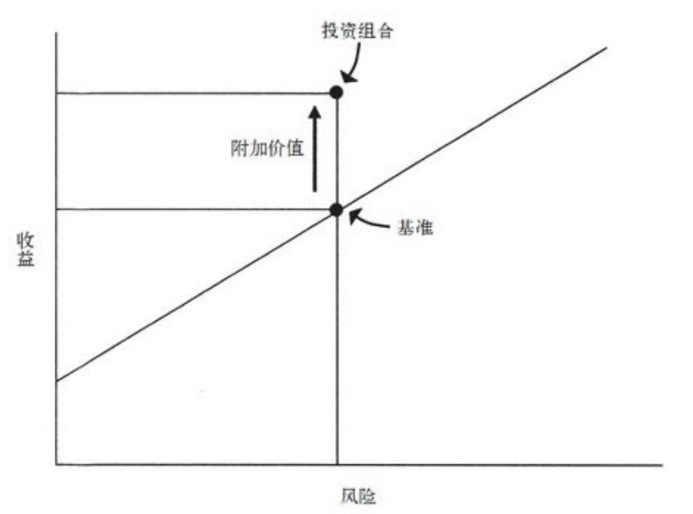
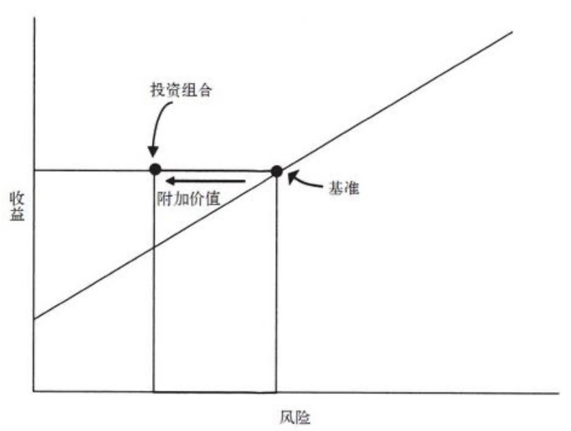

<!--more-->
# 投资最重要的事

*by [霍华德·马克斯](https://www.douban.com/personage/30074821/)*
>
- > “为简化（或高度简化）起见，所有投资公司证券的方法均可被划分为两种基本类型：基于公司特性即“基本面”分析的，以及基于证券自身价格行为研究的。换言之，投资者有两种基本选择：判断证券的内在价值并在价格偏离内在价值时买进或卖出证券，或者将决策完全建立在对未来价格走势预期的基础之上。”
- > “价值投资者的目标是得出证券当前的内在价值，并在价格低于当前价值时买进，成长型投资者的目标则是寻找未来将迅速增值的证券。”
- > “价值投资强调的是有形因素，如重资产和现金流。无形因素如人才、流行时尚及长期增长潜力所占的比重较小。”
- > “价值投资追求的是低价”
- > “真正的选择似乎并不在价值和成长之间，而在当前价值和未来价值之间。成长型投资赌的是未来可能实现也可能无法实现的公司业绩，而价值投资主要建立在分析公司当前价值的基础之上。”
- > “在人气最旺的时候买进是最危险的。在那个时候，一切利好因素和观点都已经被计入价格中，而且再也不会有新的买家出现。
- > “在以低于价值买进证券的时候，高收益、低风险是可以同时实现的”
- > “风险意味着即将发生的结果的不确定，以及不利结果发生时损失概率的不确定”
- > “到期日较长时，投资者会要求更高的利率，因为他们关心购买力风险”
- > “如果10年期国库券的利率是6%，那么除非A级企业承诺7%的利率，否则我是不会买进它的10年期债券的。”这就引入了信用利差的概念。”
- > “预期收益随着每单位风险的增加而提高的幅度，决定了风险溢价的量”
- > “当人人都相信某种东西没有风险的时候，价格通常会被哄抬至蕴涵巨大风险的地步。没有风险担忧，因此也就不提供或不要求风险承担的回报—“风险溢价”。这可能会使受人们推崇的最好资产成为风险最高的资产。
- > “无效市场的优势在于投资经理可以将特定风险作为基准，并在此基础上取得更好的收益率”
- > “一个训练有素的投资者在无效市场中取得与基准相同的收益，同时承担更低的风险，我认为这才是了不起的成就”

- > “投资的主要风险归结为两个：亏损的风险和错失机会的风险。大幅消除其中任何一个都是有可能的，但二者是不可能被同时消除”
- > “投资者心理改变（而不是基本面改变）所致的市场评估指标的改变，是引起大多数证券价格短期变化的原因。投资者心理的变化也呈钟摆式摆动。”
- > “我们必须考虑两件事：第一，可能发生的事件；第二，实际发生的概率。”
- > “非系统性风险。既然这种风险可以通过多元化来消除，投资者就不应为承担这种风险得到额外的收益补偿。”
- > “根据理论，投资组合表现（y）的计算公式如下：  y=α+βx”
| 风险类型 | 定义 | 特性 | 例子 |
| --- | --- | --- | --- |
|系统性风险 | 投资中内在的、不可避免的风险 | 不可通过多元化消除 | 利率、宏观政策、地缘政治等影响整体市场的风险 |
| 非系统性风险 | 源自具体的持股决策 | 可以通过多元化投资来消除 | 管理层决策失误、产品召回等仅影响个别公司的风险 |

***为什么系统风险无法通过多元化消除**：多元化投资的原理是利用不同资产之间波动的“抵消”来降低风险。然而，当系统性事件发生时（如市场整体下跌 15%），绝大多数股票都会随之同步下跌。由于所有资产都暴露在同一个宏观系统之下，它们之间存在共同的联动性，这种共性波动是无法通过互相组合来抵消的。*
