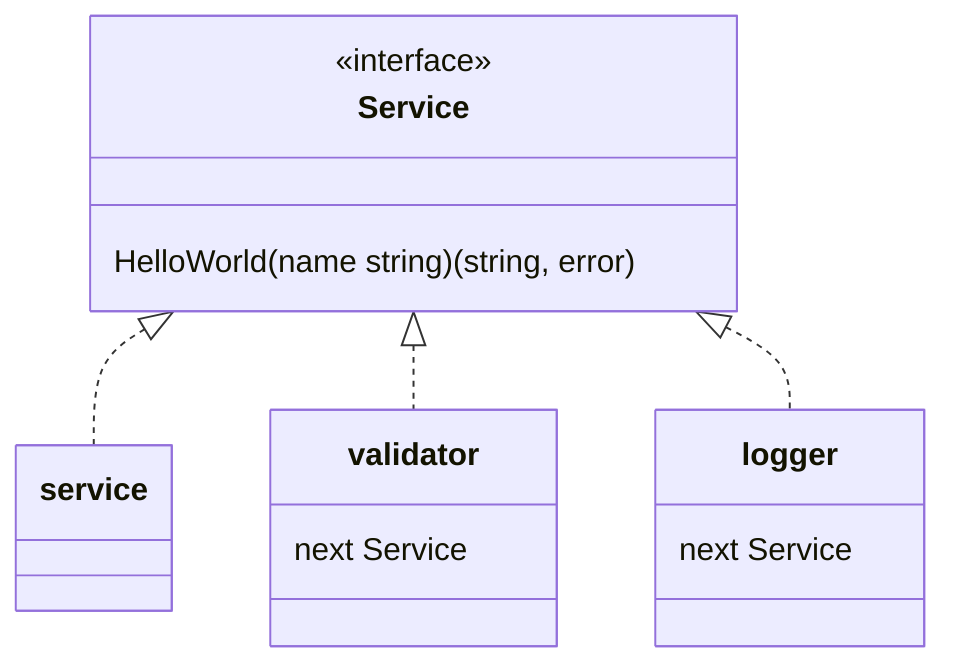
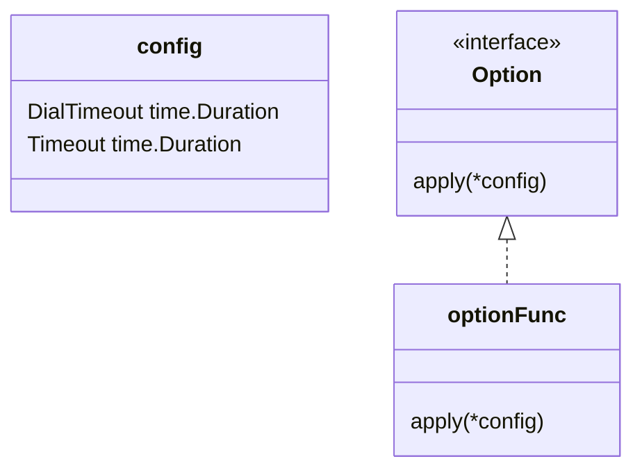

<!--more-->

# 判断结构体是否符合接口

```go
// pointer
var _ Buffer = (*StringBuffer)(nil) // 检查 *StringBuffer 是否实现 Buffer 接口


// struct
var _ Buffer = SomeBuffer{}
```

# 封装time.Time

> kubebuilder

```go
// CronJobReconciler reconciles a CronJob object
type CronJobReconciler struct {
	client.Client
	Scheme *runtime.Scheme
	Clock
}

/*
We'll mock out the clock to make it easier to jump around in time while testing,
the "real" clock just calls `time.Now`.
*/
type realClock struct{}

func (realClock) Now() time.Time { return time.Now() }

// Clock knows how to get the current time.
// It can be used to fake out timing for testing.
type Clock interface {
	Now() time.Time
}
```

> yi_exporter

```go
type FirstRevstartTime struct{}

func (FirstRevstartTime) String(latency, tripLatency, interval time.Duration) string {
	return time.Now().Add(-latency).Add(-tripLatency).Add(-interval).Format("2006-01-02:15:04:05")
}

// Calculate RevStartTime based on time.Now()
func (FirstRevstartTime) Time(latency, tripLatency, interval time.Duration) time.Time {
	return time.Now().Add(-latency).Add(-tripLatency).Add(-interval)
}
```

# 责任链 Chain of Responsibility

用于事件处理、日志记录和错误处理等类似拦截器注入的用法

```go
// 业务代码
type Service interface {
    HelloWorld(name string) (string, error)
}

type service struct {}

func (s service) HelloWorld(name string) (string, error) {
    return fmt.Sprintf("Hello World from %s", name), nil
}

// 拦截器一：验证
type validator struct {
    next Service
}

func (v validator) HelloWorld(name string) (string, error) {
    if len(name) <= 3 {
        return "", fmt.Errorf("name length must be greater than 3")
    }

    return v.next.HelloWorld(name)
}

// 拦截器二：打印日志
type logger struct {
    next Service
}

func (l logger) HelloWorld(name string) (string, error) {
    res, err := l.next(name)

    if err != nil {
        fmt.Println("error:", err)
        return res, err
    }

    fmt.Println("HelloWorld method executed successfuly")
    return res, err
}

func New() Service {
    return logger{
        next: validator {
            next: service{},
        },
    }
} 
```



# option

函数选项模式允许添加新的选项，而无需更改函数签名或破坏现有代码

```go
type config struct {
	DialTimeout time.Duration
	Timeout     time.Duration
}

// 
type Option interface {
	apply(*config)
}

// optionFunc wraps a func so it satisfies the Option interface.
type optionFunc func(*config)

func (f optionFunc) apply(c *config) {
	f(c)
}

// 返回接口
func WithDialTimeout(d time.Duration) Option {
	return optionFunc(func(c *config) {
		c.DialTimeout = d
	})
}

func WithTimeout(d time.Duration) Option {
	return optionFunc(func(c *config) {
		c.Timeout = d
	})
}
```



简化版

```go

// 不定义接口，定义新的函数类型实现修改 Client 字段
type ClientOption func(*Client)

type Client struct {
	lastRevStartTime time.Time
	s                *Scrape // chan *http.Request producer

	client *http.Client

	MeterDataCh chan *red.MeterData
}

func NewClient(opts ...ClientOption) *Client {
	c := &Client{
		s: &Scrape{
			chReq: make(chan *http.Request, 10),
		},
		MeterDataCh: make(chan *red.MeterData, 10),
	}
	for _, opt := range opts {
		opt(c)
	}
	return c
}

// 返回的是一个具体类型
func WithTimeout(timeout time.Duration) ClientOption {
	return func(c *Client) {
		c.client.Timeout = timeout
	}
}
```

两者最主要的区别是，第一种每一个WithXXX函数都返回的是一个interface，
