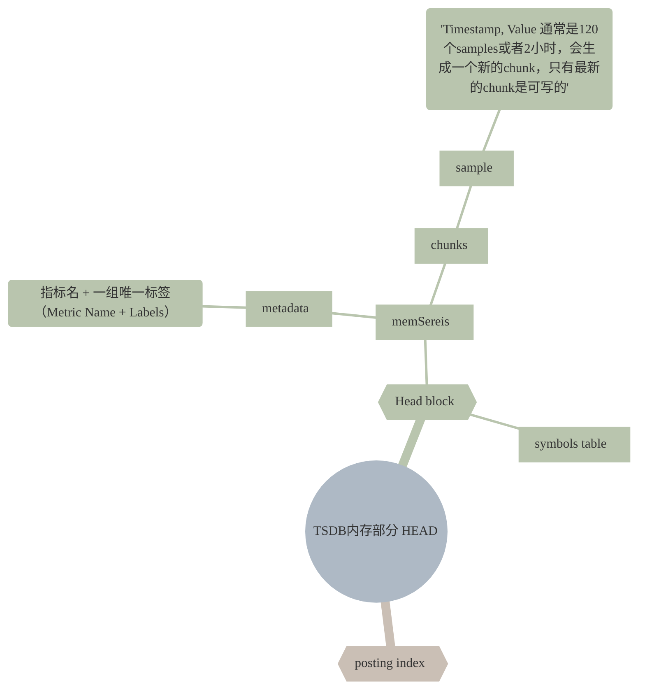

Prometheus TSDB 其本质是一个 LSM 树，为了极致的写入性能，采用先写入内存后整理的方式，把随机写转化为顺序写，牺牲了磁盘空间和短期内的读性能。本文介绍 TSDB 内存部分，主要涉及 head block、倒排索引。

<!--more-->

Prometheus TSDB 是一个 LSM 树，其内存部分有 `tsdb.Head` 管理，主要包括 `Head block` 和 `Posting index`（倒排索引）组成。

# 内存容量估算
