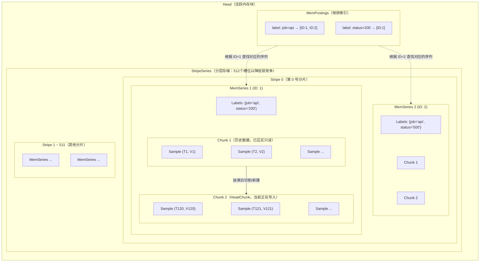

Prometheus TSDB 其本质是一个 LSM 树，为了极致的写入性能，采用先写入内存后整理的方式，把随机写转化为顺序写，牺牲了磁盘空间和短期内的读性能。本文介绍 TSDB 内存部分，主要涉及 head block、倒排索引。

<!--more-->

Prometheus TSDB 是一个 LSM 树，其内存部分由 `tsdb.Head` 管理，承载了活跃时间序列，主要由 `Head block` 和 `Posting index`（倒排索引）组成。

# Head block

逻辑层面，指标是由多个  labels 和一系列 sample 组成，比如`{__name__="http_request_total",k1=v1,k2=v2,...} 3 @timestamp`。其中 labels 就是多个 key-value，内部会由一个 string 表示:

```go
type Labels struct {
	data string // 按字母升序排列
}
```

而 sample 则是一个数据点，由时间和值组成 `(t, v)`：

```go
type sample struct {
	t  int64
	f  float64
	h  *histogram.Histogram
	fh *histogram.FloatHistogram
}
```

Labels + samples 构成一个 Series，每次抓取指标时，都会在对应 Series 新增一个 sample。

在 Prometheus 代码内部，一个逻辑上的 Sereis 对应一个 memSeries 对象，一个 memSeries 主要包含 Labels 和多个 chunk，chunk 存储着一个个 sample。

Prometheus 无论是 scrape 指标还是 query 指标，都伴随着大量并发读写 memSeries 操作，为了提升 memSeries 并发性能，stripeSeries 内部会把大量 memSeries 分组，不同组的 memSeries 访问由不同的锁控制。

当你使用 PromQL 通过 label selector 查询某些指标时，倒排索引会根据 label 查出对应的 SeriesID，多个 label selector 条件会查出的多个 SeriesID 数组，对这些数组并集操作后得到需要加载的 SeriesID。有了 SeriesID 就可以根据 stripeSeries 中的正向索引获取对应 memSeries 对象。

上面介绍的索引、stripeSeries、memSeries 和 chunk 之间的关系如下图所示：


```mermaid
flowchart TB
    subgraph HEAD["Head（活跃内存块）"]
        direction TB

        subgraph POSTINGS["MemPostings（倒排索引）"]
            direction TB
            P_L1["label: job=api → [ID:1, ID:2]"]
            P_L2["label: status=200 → [ID:1]"]
        end

        subgraph STRIPESERIES["StripeSeries（分层存储：512个槽位以降低锁竞争）"]
            direction TB
            
            subgraph STRIPE_0["Stripe 0（第 0 号分片）"]
                direction TB
                
                subgraph MS_1["MemSeries 1 (ID: 1)"]
                    direction TB
                    LBL_1["Labels: {job='api', status='200'}"]
                    
                    subgraph CHUNK_1_1["Chunk 1（历史数据，已压实只读）"]
                        direction LR
                        S1_1["Sample (T1, V1)"]
                        S1_2["Sample (T2, V2)"]
                        S1_3["Sample ..."]
                        S1_1 ~~~ S1_2 ~~~ S1_3
                    end
                    
                    subgraph CHUNK_1_2["Chunk 2（HeadChunk，当前正在写入）"]
                        direction LR
                        S2_1["Sample (T120, V120)"]
                        S2_2["Sample (T121, V121)"]
                        S2_N["Sample ..."]
                        S2_1 ~~~ S2_2 ~~~ S2_N
                    end
                    
                    LBL_1 ~~~ CHUNK_1_1
                    CHUNK_1_1 -->|"装满后切割/新建"| CHUNK_1_2
                end

                subgraph MS_2["MemSeries 2 (ID: 2)"]
                    direction TB
                    LBL_2["Labels: {job='api', status='500'}"]
                    C2_1["Chunk 1"]
                    C2_2["Chunk 2"]
                    LBL_2 ~~~ C2_1 ~~~ C2_2
                end
            end
            
            subgraph STRIPE_N["Stripe 1 ~ 511（其他分片）"]
                direction TB
                MS_N1["MemSeries ..."]
                MS_N2["MemSeries ..."]
            end
            
        end
    end

    %% 索引引用关系
    POSTINGS -.->|"根据 ID=1 查找对应的序列"| MS_1
    POSTINGS -.->|"根据 ID=2 查找对应的序列"| MS_2
```

接下来我们自下而上详细介绍 Head block 的组成。

## memSeries

一个 Sereis 在编码中对应一个 memSeries 对象：

```go
type memSeries stuct {
  ......
  ref uint64 // 其id
  lset labels.Labels // 存储了这个时间序列的标签集，是其唯一标识。
  mmappedChunks []*mmappedChunk
  headChunk *memChunk // 正在被写入的chunk
  ooo *memSeriesOOOFields
  app chunkenc.Appender // 是当前活跃的 headChunk 的写入器。所有新的样本都通过它来追加。当一个数据块被切割后，会为新的 headChunk 创建一个新的 appender
  ......
}
```

memSeries 主要由几个 chunk 链表和 lset 组成，其中 lset 保存了所有 key-value，mmappedChunks 保存已被 mmap 系统调用到硬盘但是还没进入 block 的chunks。为了避免随机写，所有已写入的数据都是不可变的，只有 memChunk 链表中第一个 chunk （headChunk）可写入，其余 chunk 都不可写：

```go
type memChunk struct {
	chunk            chunkenc.Chunk // 接口，底层是 xorchunk（除了 histogram）。
	minTime, maxTime int64
	prev             *memChunk // Link to the previous element on the list.
}
```

### chunk

**chunk 是真正存储 samples 的地方，写入 sample 的过程如下：**

每次 scrape 指标接口，Prometheus 都会一行行解析接口返回的所有指标，每解析一行调用一次 `storage.Appender.Append()`，其本质是 `head.Append()`，在 `head.Append()` 中会先把每个 samples 存到 `appendBatch` 中，等到这个接口所有指标都解析完成后再调用 `head.Commit()`，批量的把所有 samples 存储 head chunk。这个步骤中会把  `appendBatch` 存的所有 sample 都一个个调用 `memSeries.append()`，其底层实际上调用的是`xorAppender.Append()`，通过 xor 算法压缩后把 sample 存入到 xorchunk 中。

**head chunk 内存占用计算：**

因为 memSereis 占用内存的主要是 chunk 链表，计算一个 series 占用多少内存，就要弄清楚内存中有多少个 chunk，每个 chunk 多大。就如上面所说，只有 headChunk 是可写入的，其他 chunk 都等待被 mmap 到硬盘，一旦被 mmap，相应的 Go 堆内存就会释放。所以会长期占用内存的就是 chunk 链表中第一个 chunk，即 headChunk。要弄清楚 headChunk 占用内存多少，需要知道 headChunk 中最多存有多少个 samples，及新的 headChunk 被创建时，上一个 headChunk 中有多少 samples。

上面说到，Prometheus 每次抓取指标，最后都会调用`headAppender.Commit()` 把数据存储 headChunk，判断是否需要新建  headChunk 的逻辑就在 `headAppender.Commit()` 中的 `memSeries.appendPreprocessor()`。创建新的 headChunk 的硬性基础条件如下：

1.  `headChunk` 满 1KB（`chunkenc.MaxBytesPerXORChunk - 19`） 时
2.  `headChunk` 超过 2小时（`chunkRange`）
3.  `headChunk` 超过 120 * 2 个 sample。

另外当突然增加采样频率，为了保证每个 chunk 的指标数量大致相当，会在 headChunk 中有 30 个 sample 时判断是否需要提前创建新的 headChunk，何时创建新的 headChunk。

```go
func (s *memSeries) appendPreprocessor(t int64, e chunkenc.Encoding, o chunkOpts) (c *memChunk, sampleInOrder, chunkCreated bool) {
	const maxBytesPerXORChunk = chunkenc.MaxBytesPerXORChunk - 19

	c = s.headChunks

	if c == nil {
		if len(s.mmappedChunks) > 0 && s.mmappedChunks[len(s.mmappedChunks)-1].maxTime >= t {
			return c, false, false
		}
		c = s.cutNewHeadChunk(t, e, o.chunkRange)
		chunkCreated = true
	}

	if c.maxTime >= t {
		return c, false, chunkCreated
	}

	if !chunkCreated && len(c.chunk.Bytes()) > maxBytesPerXORChunk {
		c = s.cutNewHeadChunk(t, e, o.chunkRange)
		chunkCreated = true
	}

	if c.chunk.Encoding() != e {
		c = s.cutNewHeadChunk(t, e, o.chunkRange)
		chunkCreated = true
	}

	numSamples := c.chunk.NumSamples()
	if numSamples == 0 {
		c.minTime = t
		s.nextAt = rangeForTimestamp(c.minTime, o.chunkRange)
	}

	if numSamples == o.samplesPerChunk/4 { // o.samplesPerChunk = 120
		s.nextAt = computeChunkEndTime(c.minTime, c.maxTime, s.nextAt, 4)
	}
	if t >= s.nextAt || numSamples >= o.samplesPerChunk*2 {
		c = s.cutNewHeadChunk(t, e, o.chunkRange)
		chunkCreated = true
	}

	return c, true, chunkCreated
}
```

headChunk 满后会创建新的 headChunk，新 headChunk 会接在旧 headChunk 前面。Prometheus TSDB 后台会有一个异步的协程，每隔 1分钟遍历所有 memSeries，把所有非 headChunk 都 mmap 到硬盘。

```go
func (db *DB) run(ctx context.Context) {
	defer close(db.donec)

	backoff := time.Duration(0)

	for {
		select {
		case <-db.stopc:
			return
		case <-time.After(backoff):
		}

		select {
		case <-time.After(1 * time.Minute):
			db.cmtx.Lock()
			if err := db.reloadBlocks(); err != nil {
				db.logger.Error("reloadBlocks", "err", err)
			}
			db.cmtx.Unlock()

			select {
			case db.compactc <- struct{}{}:
			default:
			}
			// We attempt mmapping of head chunks regularly.
			db.head.mmapHeadChunks()
		case <-db.compactc:
			db.metrics.compactionsTriggered.Inc()

			db.autoCompactMtx.Lock()
			if db.autoCompact {
				if err := db.Compact(ctx); err != nil {
					db.logger.Error("compaction failed", "err", err)
					backoff = exponential(backoff, 1*time.Second, 1*time.Minute)
				} else {
					backoff = 0
				}
			} else {
				db.metrics.compactionsSkipped.Inc()
			}
			db.autoCompactMtx.Unlock()
		case <-db.stopc:
			return
		}
	}
}

func (h *Head) mmapHeadChunks() {
	var count int
	for i := 0; i < h.series.size; i++ {
		h.series.locks[i].RLock()
		for _, series := range h.series.series[i] {
			series.Lock()
			count += series.mmapChunks(h.chunkDiskMapper)
			series.Unlock()
		}
		h.series.locks[i].RUnlock()
	}
	h.metrics.mmapChunksTotal.Add(float64(count))
}
```

这里大致可以估算下一个100万 series 的 Prometheus 实例，sample会占用多少内存：

1. **1个sample**：每个 sample 存入 chunk 时都会经过 xor 算法压缩，平均下来每个 sample 只会占用 1.37 byte 的内存容量。
2. **1个chunk：**一个 headChunk 中最多会有 120 * 2 个 samples（中途提高采集频率），正常是 120 个 samples，所以单个 chunk 占 164.4 - 328.8 byte < 1KB。

极限情况，假设 chunk 都是因为满 1KB 被切割，如果有100万 Sereis，所有series的chunk占用的最大内存=100万*1KB/1024=976.6MB。接近1GB。

如果是一般情况，每个 chunk 有 120 个 sample，一个 chunk 占用 120 * 1.37 = 164.4 byte。每个 memSeries 只有一个 chunk 在内存中，100万 Sereis 占用：100万 * 164.4 byte = 156.8 MB。

以上计算都是在没有加载 mmapchunk 到内存中的情况。

## stripeSereis

> stripeSeries 的核心思想是通过逻辑分片，把 memSeries 打散到 `16383` 个分片中，实现高并发的通过 id 或 hash（labels）正向查找 memSeries。

因为 memSeries 每次采集都会有大量的 append 操作，同时查询也会有大量并发读，如果使用全局 Head 锁统一控制写入和查询会导致大量的竞态。为了提升并发性能，stripeSeries 把 memSeries 分成多个组，每个组有一个独立的锁控制，这样不同组的 memSeries 就互不干扰，可以安全并行读写。stripeSeries 的结构如下：

```go
type stripeSeries struct {
	size                    int
	series                  []map[chunks.HeadSeriesRef]*memSeries // Sharded by ref. A series ref is the value of `size` when the series was being newly added.
	hashes                  []seriesHashmap                       // Sharded by label hash.
	locks                   []stripeLock                          // Sharded by ref for series access, by label hash for hashes access.
	seriesLifecycleCallback SeriesLifecycleCallback
}

type seriesHashmap struct {
	unique    map[uint64]*memSeries 
	conflicts map[uint64][]*memSeries // 存放 hash 冲突的 memSeries
}
```

其中 size 就是分组的数量，默认是 `16383`，series, hashes 和 locks 都是 size=16384 的数组。

stripeSeries 维护着两个访问 memSeries 的映射关系，一个是 seriesID -> memSeries（series），另一个是 hash -> memSeries（hashes），分别用于查询和写入。

当有一个查询请求，通过倒排索引查询到 seriesID，通过 series 即可访问当对应的 memSeries，访问前会先通过 `ref(seriesID) & 16383` 计算出 index，去 locks 拿到获取锁 `[index]locks`，再去访问 `[index]series[seriesID]` 即可。

当一个写入请求（append）需要查询对应 memSeries，首先要判断是否是新的 memSeries，由于指标采集时没有 seriesID，只有 labels，需要通过 labels 判断是否存在对应的 memSeries。此时会先通过 `h=hash(labels)` 计算出哈希值 h，然后 `h & 16383` 计算出 index，`[index]locks` 获取锁后访问 `[index]hashes[h]` 获取 memSeries，如果获取不到就会创建一个新的 memSeries，此时会分配一个 SeriesID，更新 series 和 hashes 两个数组。

## 索引

> Prometheus TSDB 的索引是一个由 `map[string]map[string][]storage.SeriesRef` 构造的倒排索引


数据库除了能高效存储数据外，还需要提供高性能的查询功能，索引必不可少。很多数据库的性能开销大都来自维护索引，比如 B+树结构的数据库，每次写入数据都需要整理 B+树，影响写入性能。Prometheus TSDB 作为 LSM 树的一个实现，其使用倒排索引实现通过 labels 查询对应的 memSeries，其本质是 labels -> []seriesID 的映射关系。不像 B+树，Prometheus Head block 中的倒排索引只在新 Series 创建时需要 append，如果是已有 Series 写入新 sample，索引无需变动。

### 索引的数据结构

本文主要介绍 TSDB 内存部分，其内存部分的倒排索引如下：

```go
type Head struct {
	...
	postings *index.MemPostings // Postings lists for terms.
	...
}

type MemPostings struct {
	mtx sync.RWMutex
  // 倒排索引的核心字典：标签名 -> 标签值 -> 包含该标签的 Series ID 列表
  // key=value -> []seriesID
  // map[key]map[value][]seriesID
	m map[string]map[string][]storage.SeriesRef
  
  // 记录每个标签名下对应的所有标签值（用于正则匹配或范围匹配时快速遍历）
  // map[key][]values
	lvs map[string][]string
	ordered bool
}
```

其中 `m` 是倒排索引本体，记录所有 Labels（[key=value,...]） -> [seriesID, ...] 的映射关系。`lvs` 用于记录所有 key -> [value, ...] 的映射关系，主要用于正则表达式等快速计算出符合条件的 Labels（[key=value,...]）。

### 新增索引

只有当新 Series 创建时才需要更新索引，在 `headAppender.Append()` 中会通过 `stripeSeries.getByID()` 判断 series 是否存在，如果不存在，就会创建 memSeries，并分配一个递增的 seriesID：

```go
func (h *Head) getOrCreateWithOptionalID(id chunks.HeadSeriesRef, hash uint64, lset labels.Labels, pendingCommit bool) (*memSeries, bool, error) {
	...
	shardHash := uint64(0)
	if h.opts.EnableSharding {
		shardHash = labels.StableHash(lset)
	}
  // 创建 memSeries
	optimisticallyCreatedSeries := newMemSeries(lset, id, shardHash, h.opts.IsolationDisabled, pendingCommit)

  // 更新 stripeSeries
	s, created := h.series.setUnlessAlreadySet(hash, lset, optimisticallyCreatedSeries)
	...

	h.metrics.seriesCreated.Inc()
	h.numSeries.Inc()

	h.postings.Add(storage.SeriesRef(id), lset) // 更新索引
	h.series.postCreation(lset)

	return s, true, nil
}


```

创建某个 series 的索引本质是更新 `MemPostings` 中的 `m` 和 `lvs` 两个结构，基本逻辑如下：拿到一个key=value，先判断 `MemPostings.m` 中是否存在，存在就只会只会 append 到对应的 `[]seriesID`，不存在就创建后 append。

> 索引创建只涉及 append，查询 O(1)

```go
func (p *MemPostings) Add(id storage.SeriesRef, lset labels.Labels) {
	p.mtx.Lock()

	lset.Range(func(l labels.Label) {
		p.addFor(id, l)
	})
	p.addFor(id, allPostingsKey)

	p.mtx.Unlock()
}

func (p *MemPostings) addFor(id storage.SeriesRef, l labels.Label) {
	nm, ok := p.m[l.Name]
	if !ok { // key 是否存在
		nm = map[string][]storage.SeriesRef{}
		p.m[l.Name] = nm
	}
	vm, ok := nm[l.Value]
	if !ok { // value 是否存在
		p.lvs[l.Name] = appendWithExponentialGrowth(p.lvs[l.Name], l.Value)
	}
  
  // 把新 seriesID 存储倒排索引的
	list := appendWithExponentialGrowth(vm, id) 
	nm[l.Value] = list

	if !p.ordered {
		return
	}
	// 保证[]seriesID 升序排列
	for i := len(list) - 1; i >= 1; i-- {
		if list[i] >= list[i-1] { // 已经sorted了，直接退出
			break
		}
		list[i], list[i-1] = list[i-1], list[i]
	}
}
```

### 删除索引

在 head block 中索引的删除代价极高，需要把整个 `[]seriesID` 删除再替换一个重建后的 `[]seriesID`：

```go
process := func(l labels.Label) {
  orig := p.m[l.Name][l.Value]
  repl := make([]storage.SeriesRef, 0, len(orig)) // 新的 list
  for _, id := range orig {
    if _, ok := deleted[id]; !ok {
      repl = append(repl, id) // 把无需删除的元素添加到新 list
    }
  }
  if len(repl) > 0 {
    p.m[l.Name][l.Value] = repl // 整个替换 list
  } else {
    delete(p.m[l.Name], l.Value)
    affectedLabelNames[l.Name] = struct{}{}
  }
}
```

这么高的代价，一定不会频繁触发，只有在刚启动 Prometheus 完成 WAL 重放后和 compact 时才会触发。

WAL 重放只在刚启动 Prometheus 时发生，常规需要删除索引只发生在 compact 操作时，何时会触发 compact 操作？如下所示：

```go
func (h *Head) compactable() bool {
	if !h.initialized() {
		return false
	}
	// h.chunkRange 默认是 2h
	return h.MaxTime()-h.MinTime() > h.chunkRange.Load()/2*3
}
```

DB 会每分钟检查一次是否可以 compact，同时每次采集结束 Commit 时也会检查一次，当 head 的时间跨度超过 3h，就会触发 compact，把这段 chunkrange 落盘到 block 文件中。对head block 中现有的 chunks，会删除符合 `chunk maxTime < compact mint ` 的 chunk，如果经过删除后 memSeries 已经没有 chunks，则会把 memSeries 对象和对应在 MemPostings 中 seriesID 一起删除。之后会触发 `Head.truncateMemory()` 删除 head block 中所有已经落盘的 chunks、series 和 postings。

对于 compact 的 chunk range，由如下代码计算：

```go
func (db *DB) Compact(ctx context.Context) (returnErr error) {
  	...
		mint := db.head.MinTime()
		maxt := rangeForTimestamp(mint, db.head.chunkRange.Load())
		rh := NewRangeHeadWithIsolationDisabled(db.head, mint, maxt-1)
		db.head.WaitForAppendersOverlapping(rh.MaxTime())
		if err := db.compactHead(rh); err != nil {
			return fmt.Errorf("compact head: %w", err)
		}
  	...
}

func rangeForTimestamp(t, width int64) (maxt int64) {
	return (t/width)*width + width
}

```

`rangeForTimestamp` 把时间按照 2h 一个 bucket 切分，取整点，compact 的 chunk range 就是最接近 `db.head.MinTime()` 的某个整点 t 到 t+2h。因为触发条件是 `h.MaxTime()-h.MinTime() > 3h`，所以一般情况 compact 每隔 2h 进行一次，每次会把 head block 中 3h chunks 中的 2h 写入 block，compact 完成后 head block 还有 1h 的chunks 数据，再过 2h 后达到 chunkrange = 3h，进行下一次 compact。


> 对于索引维护成本来说，删除 memSeries 造成的 index 维护成本远大于新建 memSeries，因为删除会导致 `[]seriesID` 替换重建。删除的时机时在 compact 后，因为 compact 后会触发 `DB.Compact()` ->  `Head.truncateMemory()` -> `Head.gc()`，`Head.gc()` 会先调用 `stripeSeries.gc()` 删除 chunks 和 memSeries，在根据删除了哪些 memSeries 调用`MemPostings.Delete()` 删除对应索引。

# 总结

Prometheus TSDB 作为 LSM 树的实现，有着高写入性能，本文解析了其内存部分 Head block，对于 sample 写入，其高写入性能来源于以下几点优化：

1. 顺序写：写入 sample 只是内存中的 append 操作，异步落盘。
2. 批量写：每次采集会把所有 sample 先存储到 batch 结构，最后一次新写入 headChunk。
3. 分片：stripeSeries 通过把 memSeries 分片，每一个分片都有独立的lock，提升并发性能。

得益于 chunk 的不可变性（append-only），对于索引，其在 sample 写入时无需更新，只有在新 memSeries 创建时需要执行低成本的 append 操作。

天下没有免费的午餐，高写入性能不是没有代价，而是把一部分代价延后到 block 持久化（compact）和 Head GC 阶段。


