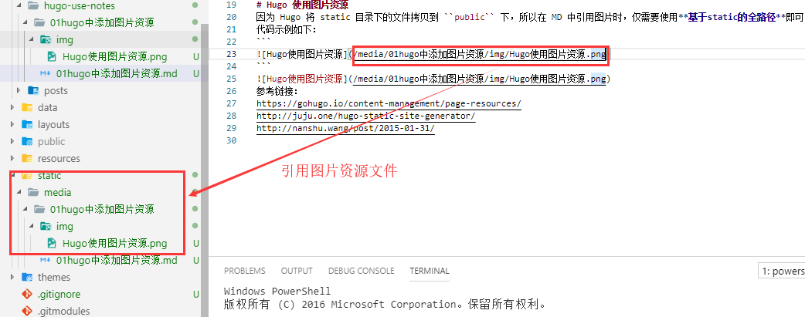

这里介绍两种在文章中插入图片的方式，各有利弊，可以根据情况选择。

<!--more-->

- 把图片放到`static/`下，在文章中使用绝对路径引用图片
- 把图片放到和文章同级目录下，通过相对路径引用图片

从最终效果来看，两种方法在构建后都能正确显示图片，但第一种方法的问题在于使用`hugo server -D`预览时无法正确加载图片，第二种方法可以在预览时正确加载图片，但会导致`content/{{section}}/`下多嵌套一层目录。

之所以把图片放到`static/`下，是因为hugo在构建时会把`static/`下所有内容移到`public/`下。构建后`content/`下的内容也会被移到`public/`下，这样相当于文章和图片有共同的根目录，在文章中使用绝对引用即可正确显示图片。



第二种方法是把图片和文章放在同级目录，比如`content/{{section}}/{{article_name}}/`，这样虽会显得`content/`下略显冗余，但可以在预览或构建后都正确显示图片。

```powershell
content/
│  about.md
│
└─post
    ├─21年9月书摘/
    │      index.md
    │
    ├─hugo处理图片的方式/
    │      image-20210913173736916.png
    │      index.md
    │
    └─hugo如何选择正确的模板进行渲染/
            index.md
            layouts.svg
            list_page.svg
            list_page_html.svg
            page.svg
            single_page.svg
            single_page_html.svg
            term_page.svg
```

