对于刚接触hugo的人，阅读本文你将会了解hugo组织内容的方式和模板渲染的规律，掌握CONTENT、URL、TEMPALTE三者的关系，从结构上理解hugo。本文介绍内容模板，baseof模板规律也大同小异。作者在学习hugo过程中同样有过类似疑惑，故在此总结，如有错误欢迎指正。

<!--more-->

# 一个典型的访问流程


当访问一个静态网页，游览器会通过URL定位我们所需页面，如上图。hugo生成的页面由两部分组成，一部分是页面的框架，另一部分是页面的内容，分别对应模板和文章。所以我们使用hugo搭建blog时，需要设计两层对应关系：

- 模板和内容的对应关系
- URL和内容的对应关系

我们的内容可以是我们所写的一篇文章，即一个md文件，也可以是一个文章列表，列出一系列的文章。hugo为我们自动生成两种列表页面，一个是分类页面(category page)，一个是标签页面(taxonomy page)。我们无需人工定义这两个页面的内容和模板，只需在文章的扉页(front matter)，给定categories和tags，hugo自动为我们分类并创建列表页面。

还有一种列表页面需要我们定义，即section page。section为我们提供了一种组织文章的方式，通过构建content的目录结构，我们可以任意分类文章。文章和section的关系类似文件和文件夹的关系。

## section用法

### 定义section

>  section的元数据由其下的_index.md定义，内容由其下文章构成。

```go
content
└── blog        <-- Section, content下的一级目录
    ├── funny-cats
    │   ├── mypost.md
    │   └── kittens         <-- Section, 含有 _index.md
    │       └── _index.md
    └── tech                <-- Section, 含有 _index.md
        └── _index.md
```

- `content/`下一级目录为section
- 其他目录中包含_index.md即为section

section决定文章扉页模板和页面模板的位置，如`archetypes/{{section}}/default.md`和`layouts/{{section}}/single.html`。

### section使用的例子

创建`content/posts/_index.md`，内容如下

```yaml
---
title: My Go Journey
date: 2017-03-23
publishdate: 2017-03-24
---

I decided to start learning Go in March 2017.

Follow my journey through this new blog.
```

在模板中展示section：`layouts/_default/list.html`

```html
{{ define "main" }}
<main>
    <article>
        <header>
            <h1>{{.Title}}</h1> <!--如果_index.md没定义，Title为section name，即posts-->
        </header>
        {{.Content}} <!-- "{{.Content}}" 为_index.md中的内容，如果没定义则为空 -->
    </article>
    <ul>
    <!-- Ranges through content/posts/*.md -->
    {{ range .Pages }}
        <li>
            <a href="{{.Permalink}}">{{.Date.Format "2006-01-02"}} | {{.Title}}</a>
        </li>
    {{ end }}
    </ul>
</main>
{{ end }}
```


# 内容和URL的对应关系

content的目录结构决定了内容和URL的对应关系，其中section起着重要作用。

section在content目录下是一个文件夹，在页面中为一个列表页面。

不同页面类型和内容类型对应的URL如下表所示：

| 页面类型 | 内容类型 | 说明         | URL                       |
| -------- | -------- | ------------ | ------------------------- |
| single   | regular  | 常规内容页面 | `/{{section}}/{{title}}/` |
|          | home     | 主页         | `/`                       |
| list     | section  | section页面  | `/{{section}}/`           |
|          | taxonomy | 分类页面     | `/tags/`                  |
|          | term     | 特定类别页面 | `/tags/{{term}}/`         |
|          | category | 分类页面     | `/categories/`            |


# 内容和模板的对应关系


> hugo会根据页面的类型寻找对应的模板

模板位置在layouts目录下，如果使用主题，则在`themes/{{theme}}/layouts/`。其目录结构根据页面的**内容类型**进行划分，每个类型一个文件夹，如下图。其中`_default/`是默认模板的存放位置，如果没有对应内容类型的模板，则在此下寻找模板。`{{type}}/`根据文章的类型进行匹配，type由扉页来定义，默认值为文章所在目录的名称，所以如果没设置，其值和`{{section}}`一致。


hugo选择渲染的模板主要依据是内容的类型，这里比较特殊的是主页，其模板就位于layouts根目录下，一般为`layouts/index.md`。下面分别介绍single page和list page的模板选择规律。

## single page

> 由单一的文章或者非列表内容组成的页面称为single page。

### 模板名称

常规页面内容就是一篇文章的内容，模板名称为`single.html`。`index.html`和`home.html`为主页的模板。


### 模板路径

single page的模板路径和模板名称的对应关系如下图，优先级关系如编号所示。


## list page

> 许多文章标题和摘要组成的页面称为列表页面(list page)。

### 模板名称

列表页面的模板名称根据列表页面的类型不同而不同，默认是`list.html`，其优先级也是最低的。


### 模板路径

section page

taxonomy page





term page


其中taxonomy和term页面由hugo根据每个文章front matter定义自动生成页面。

section是hugo用来组织Content的方式，而hugo中的内容由markdown文件组成

section和markdown文件的关系可以类比于文件夹和文件的关系


自定义front matter

- layout
- type


# 典型的例子

这里以[Aozaki's Blog](https://github.com/aozaki-kuro/Aozaki)为例，并进行了部分简化

```powershell
content/
└─posts # section
    │  about.md
    ├─2020-08-04 Ghost of Tsushima
    │      0002.jpg
    │      0004.jpg
    │      0005.jpg
    │      0006.jpg
    │      0007.jpg
    │      0008.jpg
    │      0009.jpg
    │      0011.jpg
    │      0013.jpg
    │      0015.jpg
    │      0019.jpg
    │      0020.jpg
    │      0023.jpg
    │      0024.jpg
    │      0027.jpg
    │      0029.jpg
    │      0030.jpg
    │      index.md
    │
    ├─2020-08-05 Why Blogging
    │      0001.jpg
    │      index.md
    │
    ├─2020-08-09 troubled hugo
    │      0001.jpg
    │      index.md
    │
    └─Suisei - Rankings
            0002.jpg
            index.md
```


```powershell
layouts/
│  404.html
│  index.html
│
├─posts # section
│      rss.xml
│      single.html
│
├─taxonomy
│      list.html
│      rss.xml
│      terms.html
│
└─_default
       baseof.html
       section.html
       single.html
       single.md
       summary.html               
```


# 参考

[hugo官网](https://gohugo.io/templates/lookup-order/)

[Aozaki](https://github.com/aozaki-kuro/Aozaki)

