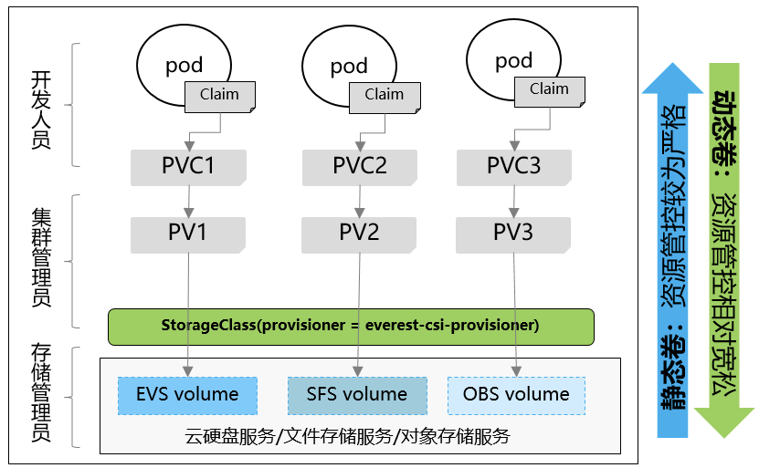
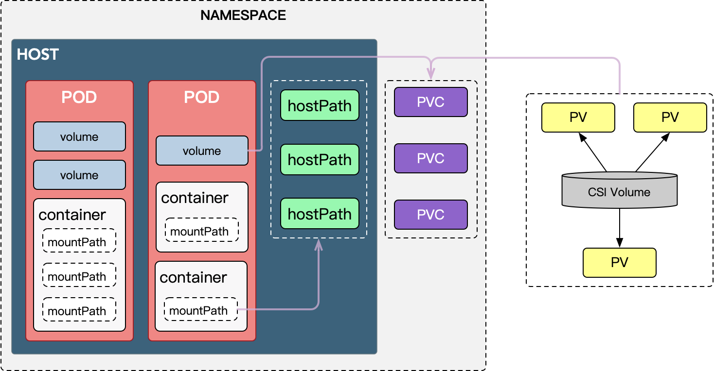

<!--more-->


# k8s存储概念

## volume

volume是k8s对存储资源的抽象，一个逻辑存储对象。我们在pod的定义中，container代表计算资源，volume代表存储资源。volume屏蔽了存储的具体实现，可直接由container挂载使用，类似linux中的逻辑卷（LV）。container中根目录结构由镜像决定，任何volume都必须挂载在container根目录结构上。

从上述描述可以看出，volume的使用可以减少计算资源和存储资源间的耦合，为持久volume提供基础，同时能很容易的扩展和共享。

使用volume分为两步：

1. **在pod中定义volume**

   `pod.spec.volumes.`

   - CSI
   - downwardAPI
   - emptyDir
   - hostPath
   - nfs
   - pvc
   - configMap
   - secret

2. **在container中挂载volume**

   > 挂载volume卷不能挂载到其他卷之上（不过存在一种使用 subPath 的相关机制），也不能与其他卷有硬链接。

   `pod.spec.containers.volumeMounts`

k8s中，volume分为临时和永久，临时volume在pod中定义，一般由k8s本身实现，同pod同生命周期，pod销毁临时volume也会被销毁。

持久volume根据存储介质不同有不同的服务商，k8s通过CSI接口对其进行调用，其中涉及pv，pvc和storageClass对象，如下图。



## pvc

- k8s资源对象，描述pod需要使用的pv的属性，如大小、读写权限
- 必须属于特定namespace
- 类似接口，pod通过pvc来获取pv

```yaml
# pvc例子
apiVersion: v1
kind: persistentVolumeClaim
metadata:
  name: pvc
spec:
  accessModes:    #访问模式
  selector:    #采用标签对PV选择
  storageClassName: "" #此处须显式设置空字符串，否则会被设置为默认的 StorageClass
  resources:    #请求空间
    request:
      storage: 1Gi
```

## pv

- 物理volume在k8s中的资源对象，持久化volume的具体实现，用来描述持久化volume属性
- 集群中的资源，无namespace

```yaml
# pv例子
apiVersion: v1
kind: PersistentVolume
metadata:
  name: nfs
spec:
  capacity: #容量
    storage: 10Gi
  accessModes: #权限
    - ReadWriteMany
  nfs: #特定类型卷的参数
    server: 10.244.1.4
    path: "/nfs"
```


## StorageClass

> 相当于pv的模版，用来根据pvc自动生成pv

K8S平台为存储提供商提供存储接入的一种声明，通过StorageClass和相应的存储插件(csi/flexvolume)为容器应用提供动态分配存储卷的能力。


```yaml
#例子
apiVersion: storage.k8s.io/v1
kind: StorageClass
metadata:
  name: fast
provisioner: kubernetes.io/rbd
parameters:
  monitors: 10.16.153.105:6789
  adminId: kube
  adminSecretName: ceph-secret
  adminSecretNamespace: kube-system
  pool: kube
  userId: kube
  userSecretName: ceph-secret-user
  userSecretNamespace: default
  fsType: ext4
  imageFormat: "2"
  imageFeatures: "layering"

---
apiVersion: storage.k8s.io/v1
kind: StorageClass
metadata:
  name: example-nfs
provisioner: example.com/external-nfs #存储插件
parameters: #特定类型volume的参数。pv的模版
  server: nfs-server.example.com
  path: /share
  readOnly: "false"
```


# 持久化卷

持久化卷涉及到三个资源对象：pv, pvc, storageClass

## 创建PV过程



- attach阶段

  1. pod调度到某node时，kubelet会为pod的volume在宿主机创建目录，如上图中hostPath，宿主机上具体如今为：

     > `/var/lib/kubelet/pods/<podID>/volumes/kubernetes.io~<volume type>/<volumeName>`

     ```bash
     pwd;ls -rlt # 宿主机路径和内容
     /var/lib/kubelet/pods/8730d279-50b1-4330-8ec7-49caa74cb17d/volumes/kubernetes.io~projected/kube-api-access-5xmwv 
     lrwxrwxrwx. 1 root root 12 Jun 22 08:33 token -> ..data/token
     lrwxrwxrwx. 1 root root 16 Jun 22 08:33 namespace -> ..data/namespace
     lrwxrwxrwx. 1 root root 13 Jun 22 08:33 ca.crt -> ..data/ca.crt
     ```

  2. kubelet依据volume类型不同，采用不同的方法把PV挂载到宿主机上

     > 如果是远程块存储，会把块设备挂载到宿主机 
     > 如果是文件存储（NFS），则无需挂载

- mount阶段

  1. 格式化磁盘
  2. 把磁盘挂载到hostPath目录上，如果是文件存储（NFS）则把目录挂在到hostPath

接下来kubelet通过CRI的Mounts参数把hostPath传递给docker，container就可以挂在到这个volume了。


## local PV

> local pv允许使用宿主机上的磁盘或快设备创造pv 
> 不要把宿主机目录作为pv

下面是一个local pv的例子

pv

```yaml
apiVersion: v1
kind: PersistentVolume
metadata:
  name: example-pv
spec:
  capacity:
    storage: 100Gi
  volumeMode: Filesystem
  accessModes:
  - ReadWriteOnce
  persistentVolumeReclaimPolicy: Delete
  storageClassName: local-storage #设置storageClass
  local: #本地磁盘的路径
    path: /mnt/disks/ssd1
  nodeAffinity: #定义pv和node的绑定关系
    required:
      nodeSelectorTerms:
      - matchExpressions:
        - key: kubernetes.io/hostname
          operator: In
          values:
          - example-node
```

storageClass

```yaml
apiVersion: storage.k8s.io/v1
kind: StorageClass
metadata:
	name: local-storage
provisioner: kubernetes.io/no-provisioner #不支持Dynamic Provisioning
volumeBindingMode: WaitForFirstConsumer #延迟卷绑定
```

pvc

```yaml
apiVersion: v1
kind: persistentVolumeClaim
metadata:
  name: local-claim
spec:
  accessModes:
	- ReadWriteOnce 
  storageClassName: local-storage # 指定storageClass
  resources:    # 请求空间
    request:
      storage: 5Gi
```

pod

```yaml
kind: Pod
apiVersion: v1
metadata:
	name: example-pv-pod
spec:
  volumes: #定义pod的volume 
    - name: example-pv-storage
      persistentVolumeClaim:
        claimName: local-claim
  containers:
    - name:
      image: nginx
      ports:
        - containerPort: 80
          name: "http-server"
      volumeMounts: #挂在pod的volume
        - mountPath: "/usr/share/nginx/html"
          name: example-pv-storage 
```

延迟卷绑定把实时发生的pvc和pv的绑定过程延迟到pod第一次调度时进行，保证不影响pod正常调度。

删除此local pv步骤：

- 删除pod
- 宿主机移除本地磁盘（unmount）
- 删除pvc
- 删除pv


---

*未完待补充*

# 参考

[k8s之数据存储](https://jishuin.proginn.com/p/763bfbd5abde)

[官网](https://kubernetes.io/zh-cn/docs/concepts/storage/volumes/)

[深入剖析Kubernetes](https://book.douban.com/subject/35424872/)
