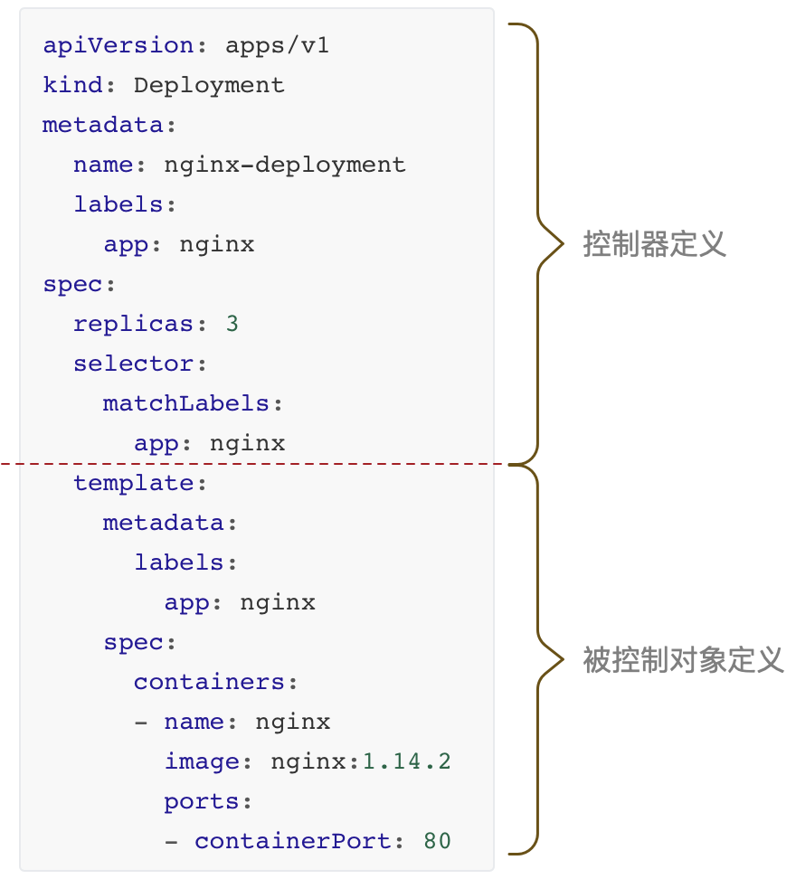
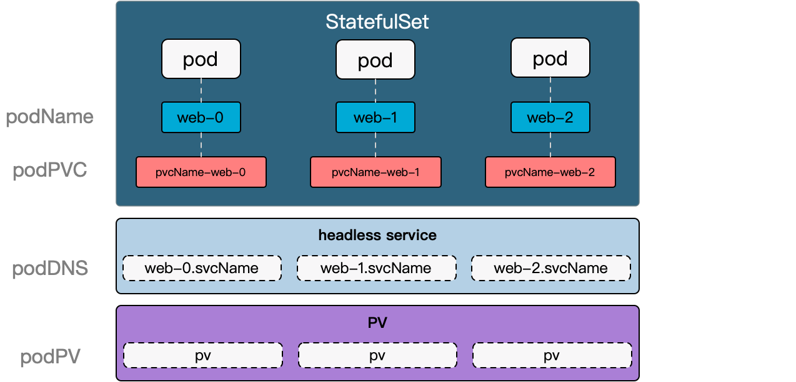

<!--more-->

k8s通过控制器模式实现对容器的编排，管理容器的状态和容器间的关系。

控制器定义包括控制器本身的定义和被控制对象的定义两部分组成，如下图：



下面一一介绍常见控制器。

# Deployment

> Deployment是一个二层控制器，即ReplicaSet controller的控制器、

Deployment控制器适合管理长期运行的无状态应用，其诞生为了解决应用部署的几大难题：

- 副本控制
- 版本控制
- 更新与回退

在ReplicaSet控制器的基础上，Deployment可以进行滚动更新，并且管理应用的历史版本供随时的回退。

## 副本和版本控制

ReplicaSet控制器保证对象的副本数符合预期，当进行滚动升级时，Deployment通过控制新旧两个ReplicaSet对象，不断调整其`ReplicaSet.replicas`值，使全部的pod逐个从旧版本更新到新版本。可以看到，每次升级都会创建一个新的ReplicaSet对象，即一个版本对应一个ReplicaSet对象。

从上述过程可以看到，Deployment不直接控制pod对象，而是通过控制ReplicaSet对象来间接控制pod对象。Deployment通过控制ReplicaSet对象参数实现副本和版本控制：

- `ReplicaSet.replicas` -- 副本控制
- `ReplicaSet`对象个数 -- 版本个数

```bash
kubectl get all -ndeployment

NAME                      READY   UP-TO-DATE   AVAILABLE   AGE
deployment.apps/busybox   1/1     1            1           7d4h
# UP-TO-DATE -- 已更新完成的pod数
# AVAILABLE -- 当前可用的pod数量

NAME                                DESIRED   CURRENT   READY   AGE
replicaset.apps/busybox-c9bc665b7   1         1         1       7d4h
# DESIRED -- Deployment期望的pod数
# CURRENT -- 已创建的pod数量

NAME                          READY   STATUS    RESTARTS       AGE
pod/busybox-c9bc665b7-6rw87   1/1     Running   1 (2d2h ago)   3d16h
```

## 升级与回退

**滚动更新步骤：**

1. Deployment创建新的Replicaset
2. Replicaset创建新的pod
3. 旧`ReplicaSet.replicas` 逐个减1
4. 新`ReplicaSet.replicas` 逐个加1
5. 过程中确保可用pod总数为replica-1
6. 直到旧`ReplicaSet.replicas=0`，新`ReplicaSet.replicas=DESIRED`

在更新时删除的是旧的 pod，老版本的 ReplicaSet 是不会删除的，所以在需要时还可以回退以前的状态。


**回滚步骤**

> `deployment.spec.revisionHistoryLimit`可以控制rollout回滚的历史版本数量，即deployment控制的历史replicaSet数量

```bash
# 创建deployment
k create -f nginx-deploy.yml --record # --record记录下每次版本变更记录，方便rollout history查看

# 更新image
kubectl edit deploy/nginx-deploy # 把image更换
kubectl set image deploy/nginx-deploy nginx=nginx:1.91 # 另一种修改image方法

# 回滚
kubectl rollout status deploy/nginx-deploy # 查看deployment更新过程
kubectl rollout undo deployment/nginx-deploy # 回滚到上一次版本
kubectl rollout history deploy/nginx-deploy # 查看你是版本信息
kubectl rollout undo deploy/nginx-deploy --to-revision=2 # 回退到版本2

# 暂停和恢复
kubectl rollout pause deploy/nginx-deploy # 暂停deployment控制器，此时set image不会触发升级
kubectl rollout resume deploy/nginx-deploy # 恢复deployment控制器，暂停期间的更改会生效
```


# StatefulSet

> StatefulSet是k8s最复杂的控制器

StatefulSet控制器管理有状态的应用，把应用状态抽象为pod的拓扑状态和存储状态，使我们能以接近管理无状态应用复杂度来管理有状态应用。

## 应用状态的抽象

StatefulSet把有状态应用需要保持的状态抽象分为了两种情况：

- 拓扑状态
  - 启动顺序 -- `stsName-n`
  - 网络标识 -- `podName.svcName`
- 存储状态
  - pvc -- `sts.spec.volumeClaimTemplates`

拓扑状态通过固定StatefulSet管理的pod间启动顺序，并给予固定的网络标识，任何访问到pod的请求都通过固定网络标识访问，保证每次访问的都是之前访问的pod。

下面通过一个例子来说明：

```yaml
apiVersion: v1
kind: Service
metadata:
  name: nginx
  labels:
    app: nginx
spec:
  ports:
  - port: 80
    name: web
  clusterIP: None # headless service
  selector:
    app: nginx # statefulSet创建的pod labels
---
apiVersion: apps/v1
kind: StatefulSet
metadata:
  name: web
spec:
  serviceName: "nginx" #绑定headless service
  replicas: 2
  selector:
    matchLabels: # statefulSet管理的pod labels
      app: nginx
  template:
    metadata:
      labels: # pod lables
        app: nginx
    spec:
      containers:
      - name: nginx
        image: k8s.gcr.io/nginx-slim:0.8
        ports:
        - containerPort: 80
          name: web
        volumeMounts:
        - name: www
          mountPath: /usr/share/nginx/html
  volumeClaimTemplates: # pvc
  - metadata:
      name: www # pvcName=www-web-n
    spec:
      accessModes: [ "ReadWriteOnce" ]
      resources:
        requests:
          storage: 1Gi
```

如何有可有pv，上述资源文件会创建出如下资源对象：



```yaml
# pod
NAME      READY     STATUS    RESTARTS   AGE
web-0     1/1       Running   0          1m
web-1     1/1       Running   0          1m

# headless svc
NAME            TYPE        CLUSTER-IP       EXTERNAL-IP   PORT(S)          AGE
nginx           ClusterIP   None             <none>        80/TCP           49d

# pvc
NAME        STATUS    VOLUME                                     CAPACITY   ACCESSMODES   AGE
www-web-0   Bound     pvc-15c268c7-b507-11e6-932f-42010a800002   1Gi        RWO           48s
www-web-1   Bound     pvc-15c79307-b507-11e6-932f-42010a800002   1Gi        RWO           48
```


### pod启动顺序

StatefulSet所管理的所有Pod ，名称的命名规则是：`StatefulSet名-序号`。序号都是从 0 开始累加，与 StatefulSet 的每个 Pod 实例一一对应，绝不重复。如本例pod个数为2，名称分别为web-0, web-1。

这些`Pod`的创建，也是严格按照名称的编号顺序进行的。在`web-0`进入到 Running 状态、并且细分状态成为 Ready 之前，`web-1`会一直处于 Pending 等待状态，重新调度`Pod`也是严格遵守这个顺序，编号在前面的Pod创建完成并且进入Ready运行状态后，下一个编号的`Pod`才会开始创建。

滚动升级时，会按照pod序号相反的顺序逐一更新pod。

### pod唯一网络标识

StatefulSet利用Headless Service为所有pod创建唯一网络标识。Headless Service给Pod添加的DNS的格式为`podName.serviceName.namesapce.svc.cluster.local`，本例中web-0的DNS为`web-0.nginx.namespace`。

### 存储状态


如何保证存储状态不变：

- 通过`StatefulSet.spec.volumeClaimTemplates` 配置和pod绑定的pvc
- pv生命周期和pod分离

当删除StatefulSet的Pod时，挂载到StatefulSet的Pod的PV卷不会被删除。 

## 扩缩容和滚动升级

扩容时会按pod的序号顺序增加pod，缩容时会按pod序号逆序渐少pod。

```bash
kubectl scale sts web --replicas=5 # 扩容
kubectl patch sts web -p '{"spec":{"replicas":3}}' # 缩容
```

StatefulSet通过controllerrevisions对象控制版本，升级时采取逆序逐个更新pod，并且当前pod变为Ready和Running状态才会更新下一个pod。

```bash
kubectl patch statefulset web -p '{"spec":{"updateStrategy":{"type":"RollingUpdate","rollingUpdate":{"partition":3}}}}'
kubectl patch statefulset web --type='json' -p='[{"op": "replace", "path": "/spec/template/spec/containers/0/image", "value":"k8s.gcr.io/nginx-slim:0.7"}]'
```


# DaemonSet

> DaemonSet控制器保准符合条件的node都运行一个pod 直接控制pod

DaemonSet控制器会遍历所有node，根据node上是否存在符合条件的pod来决定是否创建和删除pod。和Deployment非常相似，主要区别是没有replicas字段。

## DaemonSet调度

> DaemonSet配置的pod由其自身负责调度，不由默认scheduler调度。

以下配置可以让DaemonSet只在特定node上运行pod：

**`pod.spec.`**

- **`affinity.`**
  - `nodeAffinity`
  - `podAffinity`
  - `podAntiAffinity`
  
- `nodeSelector`

如果没有配置，则 DaemonSet Controller 将在所有节点上创建 Pod。

DaemonSet会在创建pod时，自动添加以下字段：

**`pod.spec.`**

- `affinity.nodeAffinity`
- `tolerations`

```yaml
# pod.spec.
affinity:
    nodeAffinity:
      requiredDuringSchedulingIgnoredDuringExecution:
        nodeSelectorTerms:
        - matchFields:
          - key: metadata.name
            operator: In
            values:
            - minikubetolerations:
tolerations:
  - operator: Exists
  - effect: NoExecute
    key: node.kubernetes.io/not-ready
    operator: Exists
  - effect: NoExecute
    key: node.kubernetes.io/unreachable
    operator: Exists
  - effect: NoSchedule
    key: node.kubernetes.io/disk-pressure
    operator: Exists
  - effect: NoSchedule
    key: node.kubernetes.io/memory-pressure
    operator: Exists
  - effect: NoSchedule
    key: node.kubernetes.io/pid-pressure
    operator: Exists
  - effect: NoSchedule
    key: node.kubernetes.io/unschedulable
    operator: Exists
  - effect: NoSchedule
    key: node.kubernetes.io/network-unavailable
    operator: Exists
```

## 更新策略

DaemonSet支持两种更新策略：

**`DaemonSet.spec.updateStrategy.type=`**

- `OnDelete`

  > 更新DaemonSet模板后，只有手动删除老的DaemonSet pods后新的DaemonSet Pod*才会*被自动创建

- `RollingUpdate`（默认）

  > 更新DaemonSet模板后， 老的DaemonSet pods将被终止，并且以受控方式自动创建新的DaemonSet pods。更新期间，最多只能有DaemonSet的一个Pod运行

```yaml
# 例子
apiVersion: apps/v1
kind: DaemonSet
metadata:
  name: fluentd-elasticsearch
  namespace: kube-system
  labels:
    k8s-app: fluentd-logging
spec:
  selector:
    matchLabels:
      name: fluentd-elasticsearch
  updateStrategy: # 更新策略
    type: RollingUpdate # 滚动更新
    rollingUpdate:
      maxUnavailable: 1 # 升级过程保证不可用pod数不大于1
  template:
    metadata:
      labels:
        name: fluentd-elasticsearch
    spec:
      tolerations:
      - key: node-role.kubernetes.io/master
        effect: NoSchedule
      containers:
      - name: fluentd-elasticsearch
        image: quay.io/fluentd_elasticsearch/fluentd:v2.5.2
      terminationGracePeriodSeconds: 30
```

```bash
# 滚动更新命令
kubectl apply -f <https://k8s.io/examples/controllers/fluentd-daemonset-update.yaml>
kubectl edit ds/fluentd-elasticsearch -n kube-system
kubectl set image ds/fluentd-elasticsearch fluentd-elasticsearch=quay.io/fluentd_elasticsearch/fluentd:v2.6.0 -n kube-system

# 查看更新进度
kubectl rollout status ds/fluentd-elasticsearch -n kube-system
```


## 版本控制

- 通过controllerrevisions对象控制版本
- DaemonSet可像Deployment一样通过rollout进行版本管理

```yaml
k get controllerrevisions 
k describe controllerrevisions/name
kubectl rollout undo ds ds-name --to-revision=1
```

rollout undo 通过读取controllerRevision对象的data字段，这个字段保存了ds相应版本的完整信息。回滚会再次创建一个controllerRevision。

# Job

> 对非长期运行任务的抽象，直接控制pod

Job并不像其他控制器维护pod的running状态，而是监控pod的完成状态，如pod的成功次数和失败重试次数等。

## 任务重试与超时

Job控制器可以在一个pod作业失败时采取不同的策略：

- 重启pod `pod.spec.restartPolicy=OnFailure`
- 创建新pod `pod.spec.restartPolicy=Never`

当一个job失败，可以设置重试次数或超时时间：

- 重试次数 `job.spec.backoffLimit=6` 每次重试间隔指数增加
- 超时时间 `job.spec.activeDeadlineSeconds=100` 当超过设定时间，所有pod会被终止

```yaml
# 例子
apiVersion: batch/v1
kind: Job
metadata:
  name: pi-with-timeout
spec:
  backoffLimit: 5
  activeDeadlineSeconds: 100
  template:
    spec:
      containers:
      - name: pi
        image: perl
        command: ["perl",  "-Mbignum=bpi", "-wle", "print bpi(2000)"]
      restartPolicy: Never
```

## 并行

通过配置以下两个参数，我们可以调整Job的并行运行：

**`Job.spec.`**

- `completions` *integer* job至少要完成的pod个数
- `parallelism` *integer* 最多可以有多少个pod同时运行

```yaml
*apiVersion: batch/v1
kind: Job
metadata:
  name: pi
spec:
  template:
    spec:
      containers:
      - name: pi
        image: perl
        command: ["perl",  "-Mbignum=bpi", "-wle", "print bpi(2000)"]
      restartPolicy: Never
  backoffLimit: 4 # 失败重新创建pod的次数
  parallelism: 2 # 最大并行数为2
  completions: 4 # 最小完成次数为4*
```

## 查看job执行结果

Job完成后pod和Job控制器都不会被删除，方便后续查看日志。

**`Job.spec.ttlSecondsAfterFinished`** 配置自动清除已完成Job对象

```yaml
apiVersion: batch/v1
kind: Job
metadata:
  name: pi-with-ttl
spec:
  ttlSecondsAfterFinished: 100 # 完成后100s删除Job
  template:
    spec:
      containers:
      - name: pi
        image: perl
        command: ["perl",  "-Mbignum=bpi", "-wle", "print bpi(2000)"]
      restartPolicy: Never
```

可以通过参看pod log方式查看job运行结果

`kubectl logs podName`

# 参考

[官网](https://kubernetes.io/zh-cn/docs/concepts/workloads/controllers/deployment/)

[深入剖析Kubernetes](https://book.douban.com/subject/35424872/)

[详解 Kubernetes DaemonSet 的实现原理](https://draveness.me/kubernetes-daemonset/)
