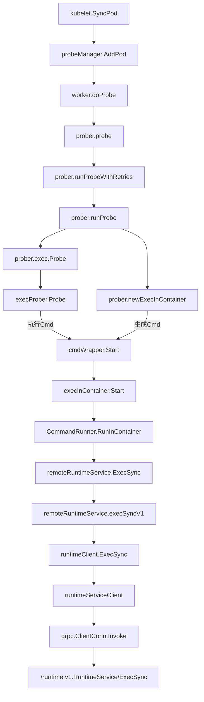
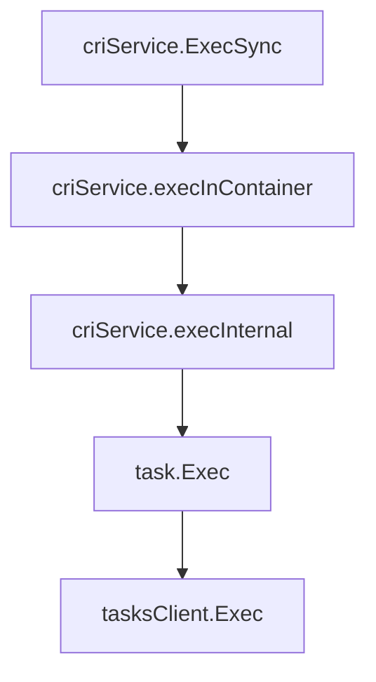

<!--more-->

# 设置探针

我们都知道，livenessProbe是设置在pod.spec.containers.livenessProbe中的，它是用来检测容器是否存活的。如果livenessProbe检测失败，kubelet会杀掉容器，并根据pod.spec.restartPolicy的设置来决定是否重启容器。

```yaml
spec:
  containers:
  - name: my-app-container
    image: my-app-image
    livenessProbe:
      httpGet:
        path: /health
        port: 8080
      initialDelaySeconds: 15
      periodSeconds: 20
      failureThreshold: 3
```

其中 initialDelaySeconds 表示容器启动后多久开始检测，periodSeconds表示检测间隔，failureThreshold表示检测失败多少次后认为容器不存活。periodSeconds和failureThreshold的乘积表示容器在多少秒内检测失败多少次后认为容器不存活。

pod的重启逻辑是在kubelet中实现的，kubelet会定期检查pod的状态，如果发现pod的状态不正常，就会根据pod.spec.restartPolicy的设置来决定是否重启pod。源码如下：

exec



containerd



# 检测探针结果

```go
func (kl *Kubelet) syncLoopIteration(ctx context.Context, configCh <-chan kubetypes.PodUpdate, handler SyncHandler,
 syncCh <-chan time.Time, housekeepingCh <-chan time.Time, plegCh <-chan *pleg.PodLifecycleEvent) bool {
  ...
 case update := <-kl.livenessManager.Updates():
  if update.Result == proberesults.Failure {
   handleProbeSync(kl, update, handler, "liveness", "unhealthy")
  }
  ...
}

func handleProbeSync(kl *Kubelet, update proberesults.Update, handler SyncHandler, probe, status string) {
	// We should not use the pod from manager, because it is never updated after initialization.
	pod, ok := kl.podManager.GetPodByUID(update.PodUID)
  ...
	handler.HandlePodSyncs([]*v1.Pod{pod})
}

func (kl *Kubelet) HandlePodSyncs(pods []*v1.Pod) {
	start := kl.clock.Now()
	for _, pod := range pods {
		pod, mirrorPod, wasMirror := kl.podManager.GetPodAndMirrorPod(pod)
		...
		kl.podWorkers.UpdatePod(UpdatePodOptions{
			Pod:        pod,
			MirrorPod:  mirrorPod,
			UpdateType: kubetypes.SyncPodSync,
			StartTime:  start,
		})
	}
}

```

# 探针触发和重试逻辑

探针的结果

```go
const (
	// Unknown is encoded as -1 (type Result)
	Unknown Result = iota - 1

	// Success is encoded as 0 (type Result)
	Success

	// Failure is encoded as 1 (type Result)
	Failure
)
```

```go
func (w *worker) doProbe(ctx context.Context) (keepGoing bool) {
	...
	result, err := w.probeManager.prober.probe(ctx, w.probeType, w.pod, status, w.container, w.containerID)
	...
	// 更新 lastResult
	if w.lastResult == result {
		w.resultRun++
	} else {
		w.lastResult = result
		w.resultRun = 1
	}

	// 计算失败次数是否到达阈值
	if (result == results.Failure && w.resultRun < int(w.spec.FailureThreshold)) ||
		(result == results.Success && w.resultRun < int(w.spec.SuccessThreshold)) {
		// Success or failure is below threshold - leave the probe state unchanged.
		return true
	}

	// 记录probe的结果
	w.resultsManager.Set(w.containerID, result, w.pod)

	if (w.probeType == liveness || w.probeType == startup) && result == results.Failure {
		w.onHold = true
		w.resultRun = 0
	}

	return true
}
```
