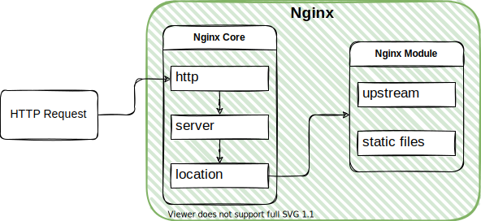

介绍Nginx处理HTTP请求的流程
<!--more-->

# Nginx处理HTTP请求的流程

Nginx使用十分广泛，这主要得益于极高的性能和大量的模块。Nginx处理的请求有以下三种：

- [HTTP](<https://Nginx.org/en/docs/http/ngx_http_core_module.html#http>) – HTTP traffic
- [MAIL](<https://Nginx.org/en/docs/mail/ngx_mail_core_module.html#mail>) – Mail traffic
- [stream](<https://Nginx.org/en/docs/stream/ngx_stream_core_module.html#stream>) – TCP and UDP traffic

其中HTTP和MAIL用来处理对应的应用层协议流量，Nginx有相应模块对接收数据进行解析。stream则更底层，用来处理tcp/ip协议的流量，通过ngx_stream_core_module模块使Nginx可以作为四层负载均衡使用。本文只涉及HTTP流量处理。

HTTP请求处理的大致流程：

- 请求-响应类型的网络协议
- HTTP请求处理流程：请求解析->生成数据->生成响应头和响应体
- 文本协议，请求头会被一行行解析，并根据content-length确定请求体的长度后读取请求体
- 后端得到解析后的请求头和请求体并生成数据，拼接好响应头和响应体和由Nginx返回给客户端
- Nginx通过ngx_http_request_t数据结构保存请求和响应数据

Nginx的特点：

- 模块化
- 多进程
- 事件驱动

这些特点在Nginx处理HTTP请求时得到了充分体现，下面我们就分别以这些角度来理解Nginx如何处理HTTP请求。

## 组成结构角度

Nginx由Core和Modules组成（Nginx= Core + Modules）。Nginx Core实现了底层的通讯协议，为其他模块构建了基本的运行时环境和协作基础。

当Core接到一个HTTP请求时，http模块会一行行的读取请求 Head，解析出Head包含的信息，如URI、method等，通过查找配置文件将此请求映射到一个location块，而此location块中所配置的各个指令则会启动不同的模块去完成工作，因此模块可以看做Nginx真正的劳动工作者。通常一个location中的指令会涉及一个handler模块和多个filter模块，handler模块负责处理请求，完成响应内容的生成，而filter模块对响应内容进行处理。

## 进程模型角度

当一个请求到达master进程监听的socket后，worker进程会去读取socket并开始解析请求。Nginx有机制保证只会有一个worker进程去处理同一条请求，worker进程是请求真正的处理者，master进程只负责管理worker进程。

## 事件驱动角度

从事件的角度看，Nginx接收到HTTP请求后触发一系列事件，相应模块会异步的处理这些事件：

- 接收到一个请求，操作系统使用(epoll等)产生相关事件
- 接收和处理这些事件，如是接受到数据，则产生更高层的request对象。
- 处理request的header和body。
- 产生响应，并发送回客户端。
-  完成request的处理。
- 重新初始化定时器及其他事件。

# 虚拟服务器

## server

Nginx中虚拟服务器的概念是相对物理服务器而言，可以理解为Nginx中的逻辑服务器。这里需要知道ip、域名和主机之间的关系。ip是网络中的节点标识，节点可以是主机也可以是网络设备，在网络中以ip来标识主机。域名和ip可以是一一对应，也可以一个ip对应多个域名。在web的世界里，一个域名通常标识一个web服务器，如Nginx服务器，而通过虚拟服务器，一个Nginx服务器可以作为多个逻辑服务器，Nginx通过域名来选择不同的逻辑服务器处理请求。

服务器的作用是处理客户端发送的数据并返回所需数据，所以每个Nginx顶级配置块中都会包含server块，如HTTP，stream等，Nginx接收到请求后会根据server块中的配置进行处理，并由server块中的location块来路由到真实后端。

Nginx使用server_name标识逻辑服务器：

- url={protocol}+{host}+{path}
- HTTP请求会根据server_name和url中{host}的匹配情况，应用对应server块中的配置

## location

location块根据url中{path}的匹配情况，应用对应location块中的配置。

# 参考

[Nginx Cheatsheet](https://vishnu.hashnode.dev/Nginx-cheatsheet#load-balancing)

[官方文档](http://Nginx.org/en/docs/)

[codesheep](https://mp.weixin.qq.com/s/ePhaYezFblgt0NgbvtWqww)

[浅谈Nginx服务器的内部核心架构设计](https://juejin.cn/post/6844903638570123277)

[一次性弄懂 Nginx 处理 HTTP 请求的 11 个阶段](https://juejin.cn/post/6844903973544001549)
