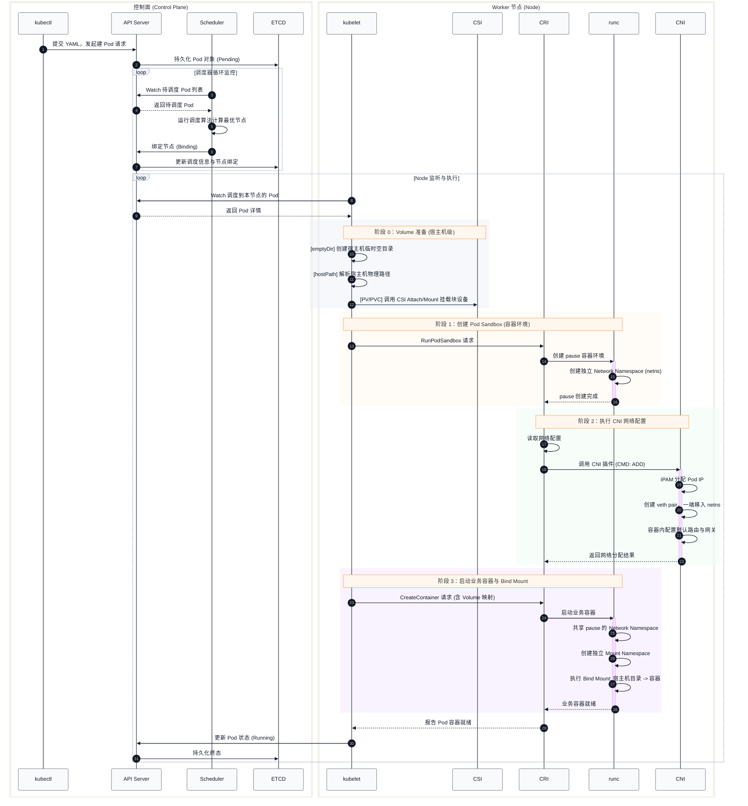

Pod 从 yaml 到成为一个 Node 上的实体，中间涉及多个组件间的协调工作，本文将完整介绍整个创建流程。

<!--more-->

# Pod 创建流程


整个创建过程有众多组件参与，主要分为控制面和 worker 节点。真正干活的是 worker 节点的各个组件，控制面主要负责发送指令和维护状态。

下图是 Pod 创建过程完整的流程图，涵盖了控制面各个组件的调用流程以及 worker 节点上 CRI、CNI 和 CSI 插件的工作流。



## 控制平面

当 client 调用 API Server 接口，传输一个 Pod 的 YAML 定义时（例如通过 `kubectl apply -f pod.yaml`），API Server 会先在内部生成一个 API 对象，并持久化存储到 ETCD 中。此时通过 `kubectl get pod` 已经可以查看到该 Pod，其状态通常为 `Pending`，意味着正在等待调度。

随后，Scheduler 监控到有新的未绑定的 Pod，会根据调度算法（如预选和优选机制）计算出最佳的 Node 节点，并修改 API 对象中的 `spec.nodeName` 字段。API Server 会将绑定节点后的 Pod 对象状态更新并持久化到 ETCD 中。


## Worker 节点

Kubelet 监听到有 Pod 被调度到自己所在的 Node 后，会获取该 Pod 的详细信息。首先进入准备阶段，根据 Pod 定义中的 `spec.volumes`，Kubelet 会在宿主机的 `/var/lib/kubelet/pods/<Pod UUID>/volumes/kubernetes.io~<插件类型>/<Volume名称>` 路径下准备好本地目录；如果涉及到 PV/PVC 持久化存储，Kubelet 会调用 CSI 插件完成块设备的 Attach 和 Mount 操作。

接下来进入环境创建阶段。Kubelet 会调用 CRI 插件（如 containerd），CRI 插件进而调用 runc 创建 Pod 的第一个容器——pause 容器（又称 Sandbox 容器）。pause 容器主要有以下核心作用：

1. **共享命名空间**：pause 容器创建的 Network Namespace (netns) 和 IPC Namespace 会作为 Pod 内所有容器的共享命名空间，后续创建的所有业务容器都会加入到这两个命名空间中。
2. **生命周期底座**：pause 容器是整个 Pod 存在的基石。通常业务容器崩溃往往会就地重启，并不影响 Pod 的生命周期；但如果 pause 容器进程挂掉，则整个 Pod 的隔离环境就被破坏了，必须重新创建，之前的 Pod 环境将被销毁。

pause 容器创建完成后，Pod 已经拥有了独立的 Network Namespace，接下来该 CNI 插件登场进行网络配置了。CRI 插件会执行 CNI 的二进制文件，通过读取 CNI 的配置文件来进行网络分配。关于 CNI 核心二进制文件和服务如何部署到宿主机上，后续章节会详细说明。

CNI 插件被调用后，首先会通过关联的 IPAM（IP Address Management）插件为该 Pod 分配一个唯一的 IP 地址。接着，它会创建一对虚拟网卡（veth pair），将其中一端放入 pause 容器所在的 Network Namespace 中并绑定该 IP，另一端留在宿主机的网络环境里并桥接；最后配置容器内的默认路由和网关信息，完成网络环境搭建。

此时，Pod 的网络和存储基础环境已经全部就绪。最后阶段是业务容器的启动，流程与 pause 类似：CRI 插件调用 runc 创建业务容器，并显式指定其加入 pause 容器创建的 Network Namespace 中（同时拥有自己独立的 Mount Namespace），再执行 Bind Mount 将之前准备好的宿主机 volume 目录映射到容器文件系统中。

整个创建流程顺利结束后，Kubelet 会向 API Server 报告 Pod 中的容器已处于就绪状态，API Server 将该 Pod 状态标记为 `Running` 并更新至 ETCD。

总结整个过程如下：

1. Client 调用 API Server 接口创建 Pod API 对象结构。
2. Scheduler 将 Pod 调度到最佳 Node，API Server 更新 Pod 对象中的节点信息并将其持久化到 ETCD。
3. 对应 Node 上的 Kubelet 收到调度信息，开始准备 Volume 目录，根据存储类型可能调用 CSI 插件进行挂载。
4. Kubelet 调用 CRI 插件，CRI 再调用 runc 启动 pause 容器，初始化 Pod 的环境（Network 和 IPC 命名空间）。
5. CRI 插件调用 CNI 插件，通过 IPAM 分配 IP，采用 veth pair 等技术构建独立的容器网络配置。
6. CRI 插件最后执行 runc 启动业务容器，让业务容器加入 pause 容器的网络命名空间中，并将准备好的通过 Bind Mount 挂载到业务容器内。
7. Kubelet 定期探测状态，并在创建成功后将结果返回给 API Server更新状态并持久化。


# 问题探讨

## Pod 的本质是什么？

了解完 Pod 的创建流程后，一个更高维度的问题是：我们在 Kubernetes 中经常提到的 Pod 究竟是什么？

- **逻辑层面**：Pod 只是 Kubernetes 中的一个抽象概念，是一个 API 资源对象（API Object）。
- **物理层面**：Linux 内核本身并没有 Pod 的概念，它只识别进程、Namespace 隔离和 Cgroups 限制等机制。因此本质上，一个 Pod 只是一组由这些 Linux 底层技术包装在一起受控的进程集合。

## CNI 插件和 IPAM 插件的安装过程

网络插件是如何工作在 Node 上的？以 Calico 举例，部署 Calico 组件时会创建一个 DaemonSet，其中的 `initContainers` 包含了相关二进制文件的安装逻辑：

```yaml
initContainers:
  - name: upgrade-ipam
    image: quay.io/calico/cni:master
    imagePullPolicy: IfNotPresent
    command: ["/opt/cni/bin/calico-ipam", "-upgrade"]
    envFrom:
      - configMapRef:
          name: kubernetes-services-endpoint
          optional: true
    env:
      - name: KUBERNETES_NODE_NAME
        valueFrom:
          fieldRef:
            fieldPath: spec.nodeName
      - name: CALICO_NETWORKING_BACKEND
        valueFrom:
          configMapKeyRef:
            name: calico-config
            key: calico_backend
    volumeMounts:
      - mountPath: /var/lib/cni/networks
        name: host-local-net-dir
      - mountPath: /host/opt/cni/bin
        name: cni-bin-dir
    securityContext:
      privileged: true
  - name: install-cni
    image: quay.io/calico/cni:master
    imagePullPolicy: IfNotPresent
    command: ["/opt/cni/bin/install"]
    envFrom:
      - configMapRef:
          name: kubernetes-services-endpoint
          optional: true
    env:
      - name: CNI_CONF_NAME
        value: "10-calico.conflist"
      - name: CNI_NETWORK_CONFIG
        valueFrom:
          configMapKeyRef:
            name: calico-config
            key: cni_network_config
      - name: KUBERNETES_NODE_NAME
        valueFrom:
          fieldRef:
            fieldPath: spec.nodeName
      - name: CNI_MTU
        valueFrom:
          configMapKeyRef:
            name: calico-config
            key: veth_mtu
      - name: SLEEP
        value: "false"
    volumeMounts:
      - mountPath: /host/opt/cni/bin
        name: cni-bin-dir
      - mountPath: /host/etc/cni/net.d
        name: cni-net-dir
	...
containers:
  - name: calico-node
    image: quay.io/calico/node:master
    imagePullPolicy: IfNotPresent
    envFrom:
      - configMapRef:
          name: kubernetes-services-endpoint
          optional: true
    env:
      - name: DATASTORE_TYPE
        value: "kubernetes"
      - name: WAIT_FOR_DATASTORE
        value: "true"
      - name: NODENAME
        valueFrom:
          fieldRef:
            fieldPath: spec.nodeName
      - name: CALICO_NETWORKING_BACKEND
        valueFrom:
          configMapKeyRef:
            name: calico-config
            key: calico_backend
      - name: CLUSTER_TYPE
        value: "k8s,bgp"
	...

```

其中 `initContainers` 阶段包括了两个容器：一个负责安装和配置特定的 IPAM 插件，另一个负责将 CNI 核心组件的二进制文件下发并安装到宿主机的指定目录中（通常为 `/opt/cni/bin/`）。随后启动的 `calico-node` 容器将常驻在 Node 上建立路由和 BGP 配置。
