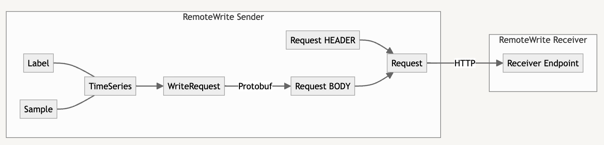

博主最近需要将 Kubernetes 事件（event）指标化并推送到 Prometheus，目的是为了配置事件告警。阿里有一个开源项目（kube-eventer），可以将事件导出到 MongoDB、InfluxDB 和 Kafka 等外部系统，但不支持导出到 Prometheus。因此，博主决定 fork 该项目并自行实现，项目地址：[kube-eventer](https://github.com/sq325/kube-eventer)。
<!--more-->

# Remote Write 介绍

众所周知 Prometheus 是一个基于 pull 模式获取指标的监控系统，但是在一些场景下，我们需要将指标 push 到 Prometheus，这时候就需要用到 Remote Write 了。
Remote Write 是 Prometheus 定义的一种规范，用于将指标数据推送到远程存储系统。其协议包含 Sender 和 Receiver 两部分，Sender 负责将指标数据序列化为 Protocol Buffers 格式，使用 Snappy 算法压缩并通过 HTTP 发送给 Receiver。

远程存储系统可以是任何支持 Remote Write Recevier 的系统，最典型的是 Prometheus 自身，通过  `--web.enable-remote-write-receiver` 标志可以开启 Remote Write 功能，此外还有其他系统，如 InfluxDB、Thanos、VictoriaMetrics 等。

[兼容 Remote Write 规范的系统](https://prometheus.io/docs/specs/remote_write_spec/#compatible-senders-and-receivers)：

- Prometheus (as both a "sender" and a "receiver")
- Avalanche (as a "sender") - A Load Testing Tool Prometheus - Metrics.
- Cortex (as a "receiver")
- Elastic Agent (as a "receiver")
- Grafana Agent (as both a "sender" and a "receiver")
- GreptimeDB (as a "receiver")
- InfluxData’s Telegraf agent. (as a sender, and as a receiver)
- M3 (as a "receiver")
- Mimir (as a "receiver")
- OpenTelemetry Collector (as a "sender" and eventually as a - "receiver")
- Thanos (as a "receiver")
- Vector (as a "sender" and a "receiver")
- VictoriaMetrics (as a "receiver")

## Remote Write 规范的具体内容

Remote Write 基于 HTTP，使用 Protocol Buffers 作为数据格式，数据压缩使用 Snappy。作为 Sender ，需要按照 Remote Write 规范来定义 HTTP Request 的 Header 和 Body。

### Request Header

remote write 规定 HTTP Request Header 包必须含以下字段：

```http
Content-Encoding: snappy
Content-Type: application/x-protobuf
User-Agent: <name & version of the sender>
X-Prometheus-Remote-Write-Version: 0.1.0
```

### Request Body

Protocol Buffers 定义的 Body（已编译） 如下：

```protobuf
type WriteRequest struct {
	Timeseries []*TimeSeries     `protobuf:"bytes,1,rep,name=timeseries,proto3" json:"timeseries,omitempty"`
}
```

```protobuf
type TimeSeries struct {
	Labels     []*Label     `protobuf:"bytes,1,rep,name=labels,proto3" json:"labels,omitempty"`
	Samples    []*Sample    `protobuf:"bytes,2,rep,name=samples,proto3" json:"samples,omitempty"`
}

type Label struct {
	Name  string `protobuf:"bytes,1,opt,name=name,proto3" json:"name,omitempty"`
	Value string `protobuf:"bytes,2,opt,name=value,proto3" json:"value,omitempty"`
}

type Sample struct {
	Value float64 `protobuf:"fixed64,1,opt,name=value,proto3" json:"value,omitempty"`
	Timestamp int64 `protobuf:"varint,2,opt,name=timestamp,proto3" json:"timestamp,omitempty"`
}
```

# 一个例子

步骤：

1. 生成 TimeSeries
2. 新建 http client
3. 发送 TimeSeries

```go
// 生成 TimeSeries
func NewTimeSeries() []*prompb.TimeSeries {
	var (
		timestamp int64   = time.Now().UnixMilli()
		metricName = "test_metric" // 指标名称
	)

  // 构建 labels
	var labels []*prompb.Label
	{
		labels = append(labels, &prompb.Label{Name: "__name__", Value: metricName})
		labels = append(labels, &prompb.Label{Name: "key1", Value: "val1"})
		labels = append(labels, &prompb.Label{Name: "key2", Value: "val2"})
	}

  // 构建samples
	var samples []*prompb.Sample
	{
		samples = append(samples, &prompb.Sample{Value: 1.0, Timestamp: timestamp})
	}

  // 生成TimeSeries
	var timeseries []*prompb.TimeSeries
	{
		series := &prompb.TimeSeries{
			Labels: labels,
			Samples: samples,		
		},
		timeseries = append(timeseries, series)
	}
	return timeseries
}
```

http client 代码如下：

```go
// 封装 http.Client
type Client struct {
	url    string
	client *http.Client
}

func NewClient(url string) *Client {
	dialTimeout := time.Duration(5 * time.Second) // 发送超时 timeout
	timeout := time.Duration(10 * time.Second) // 返回超时 timeout
	tr := &http.Transport{
		Proxy: http.ProxyFromEnvironment,
		DialContext: (&net.Dialer{
			Timeout: dialTimeout,
		}).DialContext,
		ResponseHeaderTimeout: timeout,
		MaxIdleConnsPerHost:   100,
	}
	httpclient := &http.Client{
		Transport: tr,
	}

	return &Client{
		url:    url,
		client: httpclient,
	}
}


func (c *Client) Send(series []*prompb.TimeSeries) error {
	req := &prompb.WriteRequest{
		Timeseries: series,
	}

	bys, err := proto.Marshal(req) //编译好 ProtoBuf 文件自动生成 Marshal 函数
	if err != nil {
		log.Printf("failed to marshal WriteRequest: %v", err)
		return err
	}
	if err := c.send(snappy.Encode(nil, bys)); err != nil { // snappy 算法压缩
		return err
	}
	return nil
}

func (c *Client) send(bys []byte) error {
	req, err := http.NewRequest("POST", c.url, bytes.NewReader(bys))
	if err != nil {
		log.Printf("failed to create request: %v", err)
		return err
	}
  
  // 设置 Remote Writer 规定的 Header 字段
	req.Header.Add("Content-Encoding", "snappy")
	req.Header.Set("Content-Type", "application/x-protobuf")
	req.Header.Set("User-Agent", "kube-eventer")
	req.Header.Set("X-Prometheus-Remote-Write-Version", "0.1.0")

  // 发送
	resp, err := c.client.Do(req)
	if err != nil {
		log.Println("push data with remote write request got error:", err, "response body:", string(bys))
		return err
	}
	if resp.StatusCode >= 400 {
		err = fmt.Errorf("push data with remote write request got status code: %v, response body: %s", resp.StatusCode, string(bys))
		return err
	}

	return nil
}
```

一切准备就绪，向 Receiver 发送数据：

```go
func main() {
	series := NewTimeSeries()
	client := NewClient("http://localhost:9090/api/v1/write")
	if err := client.Send(series); err != nil {
		log.Printf("failed to write: %v", err)
	}
}
```

# 参考

[Prometheus Remote-Write Specification](https://prometheus.io/docs/specs/remote_write_spec/)

[kube-eventer 原项目](https://github.com/AliyunContainerService/kube-eventer)

[kube-eventer with remote write](https://github.com/sq325/kube-eventer)
