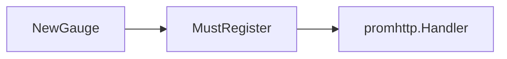
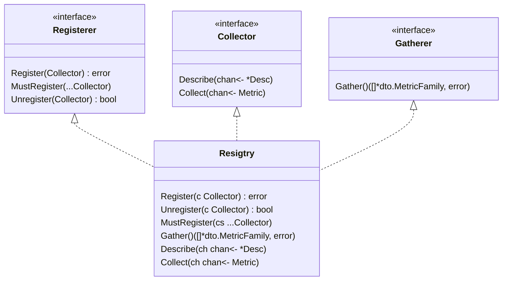
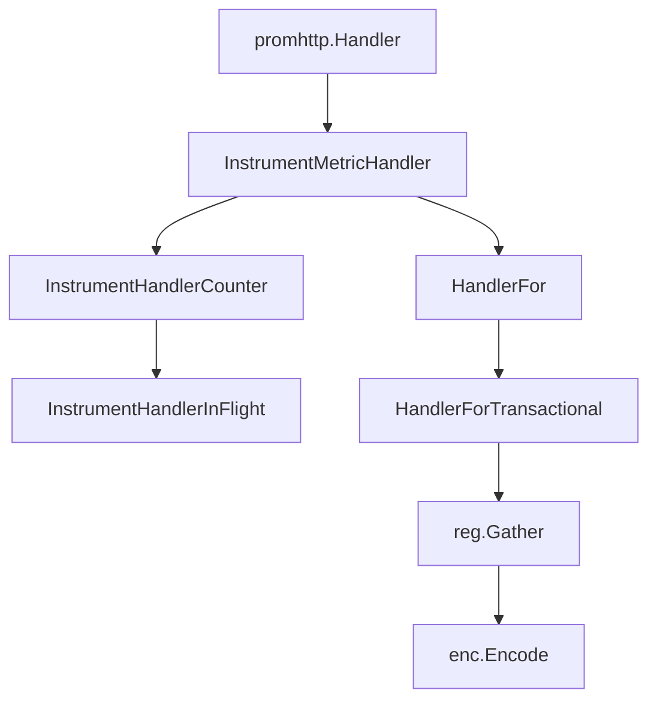
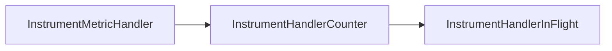
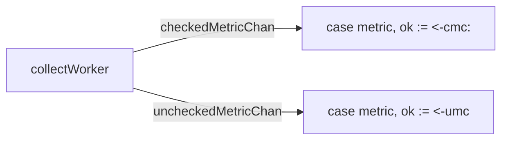

解析 Prometheus 官方仪表化库第一篇，聚焦指标的注册和收集。

<!--more-->

# 从一个简单的例子开始

Prometheus 是云原生领域内的标准监控工具，广泛应用于众多知名服务中。官方提供了多种语言的[仪表化库](https://prometheus.io/docs/instrumenting/clientlibs/)，简化应用的仪表化（Instrument）过程。Prometheus 的指标以文本格式呈现，通过 HTTP 协议暴露指标接口，**`Content-Type`** 为 `text/plain`。

本文从一个简单的仪表化例子开始，介绍仪表化的基本步骤，并详细解析指标注册和指标收集。

以 Go 语言为例，仪表化过程必要步骤如下：

1. 定义指标
2. 注册指标
3. 指标埋点
4. 注册 `http.Handler`

以 `cpu_temperature_celsius` 指标为例，完整代码如下：

```go
package main

import (
 "log"
 "net/http"

 "github.com/prometheus/client_golang/prometheus"
 "github.com/prometheus/client_golang/prometheus/promhttp"
)

// 1. 定义指标
var (
 cpuTemp = prometheus.NewGauge(prometheus.GaugeOpts{
  Name: "cpu_temperature_celsius",
  Help: "Current temperature of the CPU.",
 })
)

// 2. 注册指标
func init() {
 prometheus.MustRegister(cpuTemp) 
}

func main() {
 cpuTemp.Set(65.3) // 3. 指标埋点
 http.Handle("/metrics", promhttp.Handler()) // 4. 注册http handler
 log.Fatal(http.ListenAndServe(":8000", nil))
}
```

Prometheus 有四种指标类型。上面的例子定义了一个 Gauge 指标，用于表示 CPU 温度。定义完指标后，将其注册到仪表库提供的注册器（Register）中，完成仪表化准备。我们需要在适当位置获取CPU温度并提供给指标，最后通过HTTP接口暴露指标。访问`http://localhost:8080/metrics` 输出如下：

```text
# HELP cpu_temperature_celsius Current temperature of the CPU.
# TYPE cpu_temperature_celsius gauge
cpu_temperature_celsius 65.3
# HELP promhttp_metric_handler_requests_in_flight Current number of scrapes being served.
# TYPE promhttp_metric_handler_requests_in_flight gauge
promhttp_metric_handler_requests_in_flight 1
# HELP promhttp_metric_handler_requests_total Total number of scrapes by HTTP status code.
# TYPE promhttp_metric_handler_requests_total counter
promhttp_metric_handler_requests_total{code="200"} 0
promhttp_metric_handler_requests_total{code="500"} 0
promhttp_metric_handler_requests_total{code="503"} 0
```

上述就是仪表化应用的过程，接下来我们解析这一切的背后到底发生了什么。

# 指标如何被注册

注册指标的过程如下：



## 创建一个 Collector

首先，`NewGauge` 创建一个 Gauge 指标，同时也创建了一个 `Collector`。

```go
func NewGauge(opts GaugeOpts) Gauge {
 desc := NewDesc(
  BuildFQName(opts.Namespace, opts.Subsystem, opts.Name),
  opts.Help,
  nil,
  opts.ConstLabels,
 )
 result := &gauge{desc: desc, labelPairs: desc.constLabelPairs}
 result.init(result) 
 return result
}

// Gauge 是一个实现了 Collector 的接口
type Gauge interface {
	Metric
	Collector
  ...
}

// Collector 接口，用来收集 Metric
type Collector interface {
	Describe(chan<- *Desc)
	Collect(chan<- Metric)
}
```

Prometheus 原生有四种指标类型，分别是 Counter、Gauge、Histogram 和 Summary。这四种指标类型都实现了 `Collector` 接口。`Collector` 接口定义了两个方法：`Describe` 和 `Collect`。`Describe` 方法用于描述指标，`Collect` 方法用于收集指标。如果我们使用原生的指标类型，并且使用 `NewXXX` 函数创建指标，那么我们默认就创建了一个 `Collector`。

## 创建一个 Register

注册指标被定义在 `Registerer` 接口中，其中 `Register(Collector)` 方法表明其并不是注册指标本身，而是注册一个收集器（`Collector`）。

```go
type Registerer interface {
	Register(Collector) error
	MustRegister(...Collector)
	Unregister(Collector) bool
}
```

例子中我们并未显性创建 `Registry`，而是直接调用 `prometheus.MustRegister(cpuTemp)` 注册指标，这是因为 `MustRegister` 函数调用了默认注册器 `DefaultRegisterer` 的注册函数。`DefaultRegisterer` 是一个全局变量，其默认值是 `DefaultRegisterer = defaultRegistry`。`defaultRegistry` 是一个 `Registry` 结构体，实现了 `Registerer` 接口。

```go
func MustRegister(cs ...Collector) {
 DefaultRegisterer.MustRegister(cs...)
}

var (
 defaultRegistry              = NewRegistry()
 DefaultRegisterer Registerer = defaultRegistry
 DefaultGatherer   Gatherer   = defaultRegistry
)
```

## 将 Collector 注册到 Register

`Registry` 结构体是后续收集指标的核心，其实现了 `Collector`、`Gather` 和 `Registerer` 三个接口，其中最重要的是 `Gatherer` 接口。



这里补充一个小知识帮助区分 `Gatherer` 和 `Collector` 。两者都是接口，英文中 "collect" 和 "gather" 两个单词都有收集的意思，细微的分别在于 "collect" 通常涉及收集一组或同一个集合其中的一部分，而 gather 指从不同的来源汇聚到一起。`Collector` 用于收集一系列具有相同目的指标，如 Prometheus 中的一个指标，可以有不同的标签，但指标名不变。而 `Gatherer` 接口用于汇聚多个不同的 `Collector`，即收集不同名称的指标。举例来说，如果只是收集 `CpuTemp` 单个指标的数据，不管是 `CpuTemp{CPU="cpu1"}` 还是 `CpuTemp{CPU="cpu2"}`，都只能算是 "collect"，所以 `CpuTemp` 应该实现 `Collector` 接口。若需同时收集 `CpuTemp` 和 `MemUsage` 等不同指标数据，则属于 "gather"，需要用实现了 `Gatherer` 接口的 `Registry`。

让我们仔细看看 `Registry` 结构体的真容，其最核心的字段是 `collectorsByID`，用于储存注册了的 `Collector`。以下是 `Registry` 结构体的部分代码：

```go
func NewRegistry() *Registry {
 return &Registry{
  collectorsByID:  map[uint64]Collector{},
  descIDs:         map[uint64]struct{}{},
  dimHashesByName: map[string]uint64{},
 }
}

type Registerer interface {
 Register(Collector) error
 MustRegister(...Collector)
 Unregister(Collector) bool
}

type Registry struct {
 mtx                   sync.RWMutex
 collectorsByID        map[uint64]Collector // 已注册的收集器
 descIDs               map[uint64]struct{} // 描述符 ID
 dimHashesByName       map[string]uint64
 uncheckedCollectors   []Collector // 未经检查的收集器
 pedanticChecksEnabled bool // 是否启用详细检查
}
```

`Registry` 中的 `Register(c Collector)` 方法会把需要注册的 `Collector` 写入 `Registry` 相关属性。

```go
func (r *Registry) Register(c Collector) error {
 var (
  descChan           = make(chan *Desc, capDescChan)
  newDescIDs         = map[uint64]struct{}{}
  newDimHashesByName = map[string]uint64{}
  collectorID        uint64 // All desc IDs XOR'd together.
  duplicateDescErr   error
 )

 // 将描述符发送到 descChan 通道
 go func() {
  c.Describe(descChan)
  close(descChan)
 }()

 ... 
 
 for desc := range descChan {
  ...
  if _, exists := newDescIDs[desc.id]; !exists {
   // 获取新 descIds 和 collectorID
   newDescIDs[desc.id] = struct{}{}
   collectorID ^= desc.id // collectorID
  }
  ...
  // 获取新 DimHashes
  newDimHashesByName[desc.fqName] = desc.dimHash
  ...
 }

 ... 

 // 将新 descIds、collectorID、DimHashes 存储 register
 r.collectorsByID[collectorID] = c
 for hash := range newDescIDs {
  r.descIDs[hash] = struct{}{}
 }
 for name, dimHash := range newDimHashesByName {
  r.dimHashesByName[name] = dimHash
 }
 return nil
}
```

其中`collectorID` 是通过将所有描述符ID（`desc.id`） 进行异或操作得到的。这是一种创建唯一标识符的方法。异或操作（XOR）当两个比较位（bit）相同，结果为0，当两个比较位不同，结果为1：

1. 任何数和 0 做异或操作，结果仍然是原来的数。
2. 任何数和其自身做异或操作，结果是 0。
3. 异或操作满足交换律和结合律。

因此，无论描述符的 ID 以何种顺序出现，其异或结果（即 `collectorID`）都是一样的。这意味着，只要一个收集器产生的描述符 ID 集合不变，那么计算出的 `collectorID` 就会保持不变，从而可以作为该收集器的唯一标识符。

# 拉取指标的过程

每次通过 `/metrics` 拉取指标，都会触发一次 `gather`，执行所有 `Collector` 去收集指标。流程如下：



其中 `InstrumentXXX` 函数用于仪表化 /metrics 接口，HandlerFor 函数用于生成 http.Handler。

```go
// promhttp 的入口函数
func Handler() http.Handler {
 return InstrumentMetricHandler(
  prometheus.DefaultRegisterer, HandlerFor(prometheus.DefaultGatherer, HandlerOpts{}),
 )
}
```

## 仪表化http.Handler



`InstrumentMetricHandler` 中定义了两个指标，分别是：

1. `promhttp_metric_handler_requests_total` 已处理的请求总数
2. `promhttp_metric_handler_requests_in_flight`：处理中的请求数

```go
func InstrumentMetricHandler(reg prometheus.Registerer, handler http.Handler) http.Handler {
  
  // 定义并注册两个指标：
 // 1. promhttp_metric_handler_requests_total：处理的请求总数
 cnt := prometheus.NewCounterVec(
  prometheus.CounterOpts{
   Name: "promhttp_metric_handler_requests_total",
   Help: "Total number of scrapes by HTTP status code.",
  },
  []string{"code"},
 )
  ...
 // 2. promhttp_metric_handler_requests_in_flight：处理中的请求数
 gge := prometheus.NewGauge(prometheus.GaugeOpts{
  Name: "promhttp_metric_handler_requests_in_flight",
  Help: "Current number of scrapes being served.",
 })
 ...
 return InstrumentHandlerCounter(..., InstrumentHandlerInFlight(..., handler))
}
```

`InstrumentHandlerCounter` 和 `InstrumentHandlerInFlight` 可以看成是两个仪表化代理，具有相似的函数签名，作用是进行指标的埋点工作。每当拉取指标的请求到来时，这两个代理会记录并更新上面定义的两个指标。

```go
// promhttp_metric_handler_requests_total
func InstrumentHandlerCounter(counter *prometheus.CounterVec, next http.Handler, opts ...Option) http.HandlerFunc {
 ...
 return func(w http.ResponseWriter, r *http.Request) {
  next.ServeHTTP(w, r)
  ...
 }
}

// promhttp_metric_handler_requests_in_flight
func InstrumentHandlerInFlight(g prometheus.Gauge, next http.Handler) http.Handler {
 return http.HandlerFunc(func(w http.ResponseWriter, r *http.Request) {
  g.Inc()
  defer g.Dec()
  next.ServeHTTP(w, r)
 })
}

```

## 收集指标

真正触发 gather 是在 `HandlerForTransactional` 中。其中定义的 `http.Handler` `h` 会收集所有指标并编码，需要注意的是默认 `http.Handler` 是没有设置timeout，所以最好在采集指标的client端设置timeout。

```go
func HandlerFor(reg prometheus.Gatherer, opts HandlerOpts) http.Handler {
 return HandlerForTransactional(prometheus.ToTransactionalGatherer(reg), opts)
}

func HandlerForTransactional(reg prometheus.TransactionalGatherer, opts HandlerOpts) http.Handler {
 ...  
 // 未设置timeout
 h := http.HandlerFunc(func(rsp http.ResponseWriter, req *http.Request) {
  ... 
    // 收集指标
  mfs, done, err := reg.Gather()
  ... 
  w := io.Writer(rsp)
  ...
    // 编码指标
  enc := expfmt.NewEncoder(w, contentType)
  ...
  for _, mf := range mfs {
   if handleError(enc.Encode(mf)) {
    return
   }
  }
  ...
 })

  // 没有timeout，直接返回h
 if opts.Timeout <= 0 {
  return h
 }
 // 设置timeout
 return http.TimeoutHandler(h, opts.Timeout, fmt.Sprintf(
  "Exceeded configured timeout of %v.\n",
  opts.Timeout,
 ))
}
```

在 `registry.Gather` 中，Registry 会把已经注册的所有 `Collector` 放入 `checkedCollectors` 和 `uncheckedCollectors` 两个 channel 中，然后启动多个 goroutine 去收集指标。goroutine 的总数由 `goroutineBudget` 控制，`collectWorker` 函数会不断从 `checkedCollectors` 和 `uncheckedCollectors` 中取出 `Collector` 去收集指标，并把收集的指标存入 `checkedMetricChan` 和 `uncheckedMetricChan`。
collectWorker 为 `checkedMetricChan` 和 `uncheckedMetricChan` 的生产者，`checkedCollectors` 和 `uncheckedCollectors` 的消费者。`checkedMetricChan` 和 `uncheckedMetricChan` 会被消费者消费完后关闭，以此来通知生产者停止生产。




```go
func (r *Registry) Gather() ([]*dto.MetricFamily, error) {

 ...
 // 初始化完成 gather 所需的数据结构
 var (
  checkedMetricChan   = make(chan Metric, capMetricChan)
  uncheckedMetricChan = make(chan Metric, capMetricChan)
  metricHashes        = map[uint64]struct{}{}
  wg                  sync.WaitGroup
  errs                MultiError    
  registeredDescIDs   map[uint64]struct{}
 )
 goroutineBudget := len(r.collectorsByID) + len(r.uncheckedCollectors)
 metricFamiliesByName := make(map[string]*dto.MetricFamily, len(r.dimHashesByName))
 checkedCollectors := make(chan Collector, len(r.collectorsByID))
 uncheckedCollectors := make(chan Collector, len(r.uncheckedCollectors))
 for _, collector := range r.collectorsByID {
  checkedCollectors <- collector
 }
 for _, collector := range r.uncheckedCollectors {
  uncheckedCollectors <- collector
 }

 // 开始工作
 wg.Add(goroutineBudget)
 // collect 工作为串行
 collectWorker := func() {
  for {
   select {
   case collector := <-checkedCollectors:
    collector.Collect(checkedMetricChan)
   case collector := <-uncheckedCollectors:
    collector.Collect(uncheckedMetricChan)
   default:
    return
   }
   wg.Done()
  }
 }
 go collectWorker()
 goroutineBudget--

 // MetricChan释放channel
 go func() {
  wg.Wait()
  close(checkedMetricChan)
  close(uncheckedMetricChan)
 }()
 defer func() {
  if checkedMetricChan != nil {
   for range checkedMetricChan {
   }
  }
  if uncheckedMetricChan != nil {
   for range uncheckedMetricChan {
   }
  }
 }()

  // 在这段代码中，checkedMetricChan 被复制到 cmc 变量是为了在 select 语句中可以将其设置为 nil。在 Go 的 select 语句中，如果一个 case 对应的通道为 nil，那么这个 case 就会被忽略。
 cmc := checkedMetricChan
 umc := uncheckedMetricChan

 for {
  select {
  case metric, ok := <-cmc:
      if !ok {
        cmc = nil
        break
      }
   ... // 对metrics进行检查，确保指标的有效性和一致性。
  case metric, ok := <-umc:
   ...
  default: // collecter 收集指标速度慢，启动更多 goroutine
   // 所有 collector 都已经 collect 完毕，或者 goroutineBudget 用完
   if goroutineBudget <= 0 || len(checkedCollectors)+len(uncheckedCollectors) == 0 {
    select {
    case metric, ok := <-cmc:
     ...
    case metric, ok := <-umc:
     ...
    }
    break
   }

   // 还有 collector 未 collect，启动更多 goroutine 处理
   go collectWorker()
   goroutineBudget--
   runtime.Gosched()
  }
  ...
 }
 return internal.NormalizeMetricFamilies(metricFamiliesByName), errs.MaybeUnwrap()
}
```


# 使用自己定义的Register

根据[前文](#注册指标收集器 Collector)源码解析，如果 default registry 无法满足需求，有两种方式自定义 registry：

1. 需要 `promhttp_metric_handler_requests_total` 和 `promhttp_metric_handler_requests_in_flight` 指标

   ```go
   reg := prometheus.NewRegistry()
   reg.MustRegister(c) // 注册自己的collector
   h := promhttp.InstrumentMetricHandler(reg, promhttp.HandlerFor(reg, promhttp.HandlerOpts{}))
   http.Handle("/metrics", h)
   ```

2. 不需要仪表化指标

   ```go
   reg := prometheus.NewRegistry()
   reg.MustRegister(otherCollector) // 注册自己的collector
   h := promhttp.HandlerFor(reg, promhttp.HandlerOpts{})
   http.Handle("/metrics", h)
   ```

# 参考

[官方仪表化库](https://prometheus.io/docs/instrumenting/clientlibs/)

[Prometheus指标格式](https://prometheus.io/docs/instrumenting/exposition_formats/)
