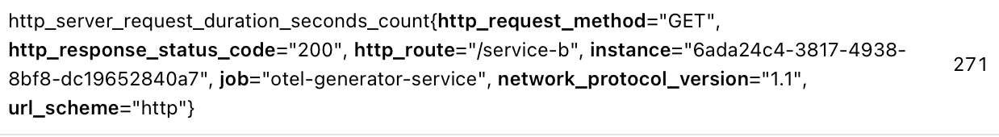

Prometehus 已经在 v3 版本中原生支持 OpenTelemetry（下称 OTEL） 指标的接受，通过 `--web.enable-otlp-receiver` 标志，可以启用对 OTEL 指标的接收和处理功能。但是 OTEL 的指标模型是分成设计的，与 Prometheus 的扁平化指标模型存在差异，本文探讨通过 OTLP receiver 接受到 OTEL 指标数据在内部是如何被转化为 Prometheus 指标模型的。
<!--more-->

# OTEL 与 Prometheus 指标模型对比

Prometheus 指标结构比较简单，采用一种扁平化设计，指标本质上就是一系列 Labels 加上数据点组成，指标名作为一种特殊的 Label，其中 Series 定义如下所示：

```go
type Series struct {
	Metric labels.Labels `json:"metric"`
	Points []Point       `json:"values"`
}

type Point struct {
	T int64
	V float64
}
```

OTEL 遥测数据模型是基于资源（Resource）、Scope 和 Signals 三层结构设计的，这么设计的好处是 Resource 和 Scope 可以被指标、trace 和 log 等多种数据类型共享，避免了重复定义和传输相同元数据。

其中 Resource 主要描述产生遥测数据对象本身信息，如主机名，服务名，进程信息，pod 名等；Scope 则更细化到具体的检测库或组件，如 Prometheus 客户端库、OpenTelemetry SDK 等。
OTEL 指标具体结构如下：

```protobuf
MetricsData (根对象)
  └── ResourceMetrics (按资源分组)
       ├── Resource (描述产生数据的源头，如主机、K8s Pod)
       └── ScopeMetrics (按检测范围/库分组)
              ├── Scope (描述检测库的信息，如库名、版本)
              └── Metric (具体的指标定义)
                    ├── 元数据 (Name, Description, Unit)
                    └── Data (实际数据，分为5种类型)
                          ├── Gauge
                          ├── Sum
                          ├── Histogram
                          ├── ExponentialHistogram
                          └── Summary
```

其中 Metric 一层和 Prometheus 指标结构相似，但是 Resource 和 Scope 两层是 Prometheus 所没有的，因此在将 OTEL 指标转换为 Prometheus 指标时，主要工作就是把 Resource 和 Scope 两层的信息融合到 Prometheus 指标的 Labels 中。

# OTEL 指标转换为 Prometheus 指标的具体过程

## Resource 和 Scope 的处理

> 核心原则就是选择性的将 Resource 和 Scope 中的属性转化为 Prometheus 指标中的 Labels。其他未转化的属性会通过新增的 `target_info` 指标进行暴露。
处理逻辑主要在 `storage/remote/otlptranslator` 中。

```go
func (c *PrometheusConverter) createAttributes(resource pcommon.Resource, attributes pcommon.Map, scope scope, settings Settings,
	ignoreAttrs []string, logOnOverwrite bool, meta Metadata, extras ...string,
) (labels.Labels, error) {
	resourceAttrs := resource.Attributes()
	serviceName, haveServiceName := resourceAttrs.Get(conventions.AttributeServiceName)
	instance, haveInstanceID := resourceAttrs.Get(conventions.AttributeServiceInstanceID)
	promoteScope := settings.PromoteScopeMetadata && scope.name != ""
  ...
  if promoteScope {
		var rangeErr error
		scope.attributes.Range(func(k string, v pcommon.Value) bool {
			name, err := labelNamer.Build("otel_scope_" + k)
			if err != nil {
				rangeErr = err
				return false
			}
			c.builder.Set(name, v.AsString())
			return true
		})
		if rangeErr != nil {
			return labels.EmptyLabels(), rangeErr
		}
		// Scope Name, Version and Schema URL are added after attributes to ensure they are not overwritten by attributes.
		c.builder.Set("otel_scope_name", scope.name)
		c.builder.Set("otel_scope_version", scope.version)
		c.builder.Set("otel_scope_schema_url", scope.schemaURL)
	}
  ...
```

首先从 Resource 中提取 `service.name` 和 `service.instance.id` 两个常用属性，分别映射为 Prometheus 的 `service` 和 `instance` 标签。 如果设置了 `promote_scope_metadata`，还会把 Scope 的名称和版本也映射为 `otel_scope_name` 和 `otel_scope_version` 标签，默认不转化。

对于 Resource 和 Scope 中的其他属性，Prometheus 会通过新增 target_info 指标进行暴露，Prometheus 的配置文件中可以通过 `otel_resource_attributes` 和 `otel_scope_metadata` 两个选项来控制 Resource 和 Scope 信息的映射行为，详细的配置项如下：

```yaml
otlp:
  [ promote_resource_attributes: [<string>, ...] | default = [ ] ] # 指定要转化prometheus指标label的resource属性列表，默认只包含service.name和service.instance.id
  [ promote_all_resource_attributes: <boolean> | default = false ] # 是否转化所有resource属性为prometheus指标label，默认false
  [ ignore_resource_attributes: [<string>, ...] | default = [] ] # 指定不转化为prometheus指标label的resource属性列表，默认空
  [ translation_strategy: <string> | default = "UnderscoreEscapingWithSuffixes" ] # OTLP到Prometheus指标label名称转换策略，支持以下几种策略：
  [ keep_identifying_resource_attributes: <boolean> | default = false ] # 是否在target_info中保留已经被转化到指标中的label，默认false
  [ convert_histograms_to_nhcb: <boolean> | default = false ] # 是否将OTLP直方图转换为Prometheus原生直方图（Native Histogram），默认false
  [ promote_scope_metadata: <boolean> | default = false ] # 是否转化scope元数据为prometheus指标label，默认false
  [ label_name_underscore_sanitization: <boolean> | default = true ] # 是否将OTLP属性名称中的非法字符替换为下划线，默认true
  [ label_name_preserve_multiple_underscores: <boolean> | default = true ] # 是否保留OTLP属性名称中的多个连续下划线，默认true
```

### target_info 指标

target_info 指标会携带 job 和 instance 标签，查询时可以通过 PromQL 的 on(job, instance) 语法将其与普通指标关联。
target_info 指标的示例如下：


```promql
target_info{container_id="cf8e759f39cdf7b44c8860928a937426c6bbdd4667b26004654d421dbc4482a9", host_arch="aarch64", host_name="otel-generator-6dd6c6cf85-9p6dv", instance="6ada24c4-3817-4938-8bf8-dc19652840a7", job="otel-generator-service", os_description="Linux 6.12.54-linuxkit", os_type="linux", process_command_args="[\"/usr/lib/jvm/java-17-amazon-corretto/bin/java\",\"-javaagent:/app/opentelemetry-javaagent.jar\",\"-jar\",\"/app/app.jar\"]", process_executable_path="/usr/lib/jvm/java-17-amazon-corretto/bin/java", process_pid="1", process_runtime_description="Amazon.com Inc. OpenJDK 64-Bit Server VM 17.0.17+10-LTS", process_runtime_name="OpenJDK Runtime Environment", process_runtime_version="17.0.17+10-LTS", telemetry_distro_name="opentelemetry-java-instrumentation", telemetry_distro_version="2.23.0", telemetry_sdk_language="java", telemetry_sdk_name="opentelemetry", telemetry_sdk_version="1.57.0"}
```

## 指标类型转化

OTEL 中指标类型分为 Gauge、Sum、Histogram、ExponentialHistogram 和 Summary 五种类型，其中 Gauge、Histogram 和 Summary 三种类型在 Prometheus 中都有对应的类型，可以直接转换，而 Sum 则需要根据是否为单调递增来决定转换为 Counter 还是 Gauge 类型，ExponentialHistogram 则可以选择转换为经典直方图 Histogram 或 Prometheus 原生直方图 Native Histogram，具体的转换规则如下表所示：

- **经典直方图**: 将一个 OTLP Histogram 拆解为多条 Prometheus 时间序列：
  - **Bucket Series**: `原名_bucket`，带有 `{le="边界"}` 标签。
  - **Sum Series**: `原名_sum`，记录总和。
  - **Count Series**: `原名_count`，记录总次数。
- **自定义 Bucket (NHCB)**: 如果启用了 `convert_histograms_to_nhcb`。

| OTEL 类型                | 条件                  | Prometheus 类型        | 说明                                            |
| ------------------------ | --------------------- | ---------------------- | ----------------------------------------------- |
| **Gauge**                | -                     | `Gauge`                | 直接映射                                        |
| **Sum**                  | `IsMonotonic = true`  | `Counter`              | 单调递增的 Sum 映射为 Counter                   |
| **Sum**                  | `IsMonotonic = false` | `Gauge`                | 非单调的 Sum 映射为 Gauge (如 UpDownCounter)    |
| **Histogram**            | -                     | `Histogram`            | 转化为经典直方图 (buckets + sum + count)        |
| **ExponentialHistogram** | -                     | `ExponentialHistogram` | 转化为 Prometheus 原生直方图 (Native Histogram) |
| **Summary**              | -                     | `Summary`              | 映射为 Summary                                  |
