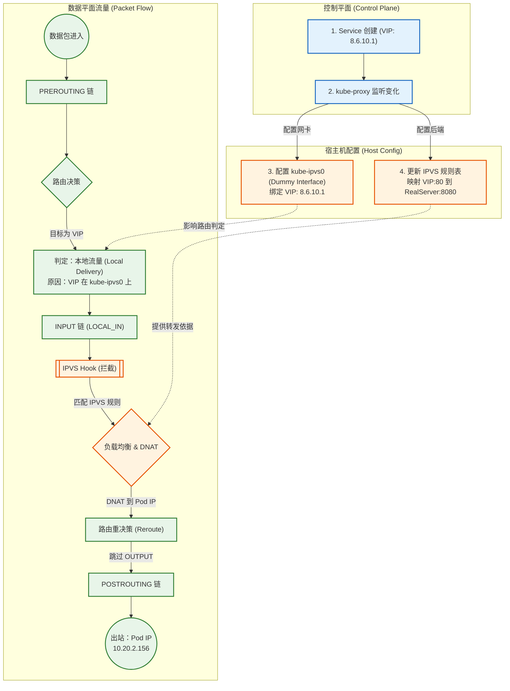

上篇介绍了一个[生产级 k8s 网络架构](../一个生产级k8s网络架构解析/)，其中详细介绍了underlay和overlay的实现方案。承接上文的架构，本文进一步介绍service的实现方式以及underlay和overlay访问service的原理。

<!--more-->

# service实现方式

早期 k8s service 实现方式是通过 iptables 规则，kube-proxy 会在集群 node 上为每个 service 维护 iptables 规则。内核 Netfilter 拦截每个发往 service 的数据包，进行 DNAT，把 target ip 设置成后端 pod ip。随着 service 数量增多，iptables 的规则数量也会增加，最终会影响性能。有测试表明，当 service 数量大于1000时，iptables 性能会低于 IPVS。

```bash
# iptables 实现的 service dnat 规则
iptables -t nat -L|grep -i dnat
DNAT       tcp  --  anywhere             anywhere             /* default/prometheus:prometheus */ tcp to:10.244.1.15:9090
DNAT       tcp  --  anywhere             anywhere             /* default/prometheus:prometheus */ tcp to:10.244.1.16:9090
DNAT       tcp  --  anywhere             anywhere             /* default/centos */ tcp to:10.244.2.34:80
```

当前主流的 k8s service 的主流方案是使用 IPVS，其是内核的一部分，实现了 NAT 和负载均衡的功能。工作原理如下：

1. 当 service 创建时，kube-proxy 会在kube-ipvs0这个 dummy 接口上配置cluster ip（`8.6.10.1:80`），配置 IPVS 虚拟服务器。
2. kube-proxy 会持续监听 service 后端 endpoint，并更新 IPVS 中对应的真实服务器（`10.20.2.156:8080`）。
3. 当需要访问cluster ip的网络包进入达主机网络协议栈，由于 cluster ip 在本地的kube-ipvs0接口上，根据 local 路由表，会发往ipvs0前的INPUT 链。
4. IPVS 在 INPUT 链有HOOK，拦截流量并进入IPVS 模块。
5. IPVS 会根据 cluster ip（`8.6.10.1:80`）和负载均衡算法在后端的真实服务器中选择一个（`10.20.2.156:8080`），并直接DNAT。
6. 数据包会跳过OUTPUT 链，重新路由决策后发送到POSTROUTING 链，出网络协议栈。

```bash
ipvsadm -Ln

IP Virtual Server version 1.2.1 (size=4096)
Prot LocalAddress:Port Scheduler Flags
  -> RemoteAddress:Port           Forward Weight ActiveConn InActConn
TCP  8.6.10.1:80 rr
  -> 10.20.2.156:8080             Masq    1      0          0
  -> 10.20.100.5:8080             Masq    1      0          0
TCP  10.186.152.109:31234 rr
  -> 10.20.2.156:8080             Masq    1      0          0
  -> 10.20.100.5:8080             Masq    1      0          0
UDP  8.6.0.10:53 rr
  -> 10.20.2.10:53                Masq    1      0          0
  -> 10.20.2.11:53                Masq    1      0          0

```



# Underlay 访问 Service

由于underlay 使用的是 ipvlan l2，ipvlan驱动会把网络包从 ipvlan子设备（pod中的网卡）移到master设备（vlan.1155），无需经过内核网络协议栈的。到达vlan.1155后，会打上vlan tag并进入内核的网络协议栈，此时匹配到PREROUTING链如下规则，打上0x200：

```bash
-A PREROUTING -s 10.186.155.0/27 -d 8.6.0.0/16 -i vlan.1155 -m comment --comment "send from ipvlan pod to service cidr" -j MARK --set-xmark 0x200/0x200
-A PREROUTING -s 10.186.156.0/27 -d 8.6.0.0/16 -i vlan.1156 -m comment --comment "send from ipvlan pod to service cidr" -j MARK --set-xmark 0x200/0x200
-A PREROUTING -s 10.186.157.0/27 -d 8.6.0.0/16 -i vlan.1157 -m comment --comment "send from ipvlan pod to service cidr" -j MARK --set-xmark 0x200/0x200
-A PREROUTING -s 10.186.155.128/27 -d 8.6.0.0/16 -i vlan.1155 -m comment --comment "send from ipvlan pod to service cidr" -j MARK --set-xmark 0x200/0x200
-A PREROUTING -s 10.186.158.0/27 -d 8.6.0.0/16 -i vlan.1158 -m comment --comment "send from ipvlan pod to service cidr" -j MARK --set-xmark 0x200/0x200
...
-A POSTROUTING -m comment --comment "send from ipvlan pod to service cidr" -m mark --mark 0x200/0x200 -j MASQUERADE
```

PREROUTING 链处理完成后会进行路由决策，由于所有的service cluster ip都被kube-proxy 配置在kube-ipvs0这个dummy 网络接口上，匹配到local 路由表，进入INPUT 链，发往kube-ipvs0。如上文所述，IPVS 模块会在INPUT 设置HOOK，拦截到流量后进行DNAT，把网络包的target ip 改成后端pod的ip，再次进入网络协议栈，执行路由决策。

如果后端underlay pod，由于本机没有相关路由，通过biz接口发送给默认路由（`default via 10.186.153.254 dev biz`）。由于之前打上了mark，此时会执行POSTROUTING的`--mark 0x200/0x200 -j MASQUERADE`规则，把src ip 改成biz网口的ip。最后发出的包`src: biz_ip`-`target: underlay_ip`（`10.186.153.103`-`10.186.155.6`)，此时流量和node节点直接访问underlay pod相同。

> 关键点：
>
> 1. 默认网关必须有到vlan 1155网关的路由信息，或者默认网关和vlan 1155网关是**同一台三层交换机**，否则无法访问。
> 2. **Hairpin**：如果 IPVS DNAT 后 underlay pod 在同node上，也需要出node，经过网关再发送回来。
> 3. 物理网关需要配置为支持将流量“发回”同一个物理接口

如果后端是overlay pod，根据路由规则（`10.20.0.0/25 via 10.20.0.0 dev vxlan.2 onlink`），会经过FORWARD->POSTROUTING后发送到`vxlan.2` 接口，经过封装重新进入网络协议栈（OUTPUT），同样在POSTROUTING链执行SNAT，由于访问overlay的流量会从ctl接口出（vxlan封装的node ip是ctl网段），src ip 会是ctl ip。最后发出的网络包`src: ctl_ip`-`target: other ctl_ip`。此时流量和node节点直接访问overlay pod 相同。

回程流量会进入宿主机网络协议栈的 PREROUTING，此时Conntrack介入，根据五元组识别这是之前的链接，执行De-SNAT 把target ip改回underlay pod的ip，再次进入路由决策，经过FORWARD（状态为 ESTABLISHED，放行）和POSTROUTING，在出协议栈前Conntrack会执行De-DNAT，把src IP改成 service ip （8.6.x.x）。物理网关收到后，把数据包发回node的biz接口，进入vlan.1155子接口时被ipvlan驱动拦截，被直接移进pod命名空间。

```bash
-A KUBE-FORWARD -m comment --comment "kubernetes forwarding conntrack rule" -m conntrack --ctstate RELATED,ESTABLISHED -j ACCEPT
```

**完整的流程如下：**

```mermaid
graph TD
    %% 定义样式类
    classDef pod fill:#e1f5fe,stroke:#01579b,stroke-width:2px;
    classDef kernel fill:#fff9c4,stroke:#fbc02d,stroke-width:2px;
    classDef net fill:#e0f2f1,stroke:#00695c,stroke-width:2px;
    classDef decision fill:#f3e5f5,stroke:#7b1fa2,stroke-width:2px;

    %% --- 1. 发送端 Pod ---
    subgraph Pod_NS ["发送端 Pod 命名空间"]
        StartNode(("Pod 发起请求")):::pod
        IPvlan_Sub["IPvlan 子接口 (eth0)"]:::pod
    end

    %% --- 2. 宿主机内核处理 ---
    subgraph Host_Kernel ["宿主机内核协议栈"]
        %% L2 阶段
        IPVlan_Driver["IPvlan 驱动处理<br/>(旁路协议栈直达 Master)"]:::kernel
        Master_Dev["Master 设备<br/>(vlan.1155)"]:::kernel

        %% Netfilter & 标记
        Enter_Stack["进入内核协议栈<br/>(打上 VLAN Tag)"]:::kernel
        Mangle_Pre["PREROUTING (Mangle)<br/>匹配规则：打标记 0x200"]:::kernel

        %% 第一次路由与 IPVS
        Route_1{{"路由决策 1<br/>Dst == ClusterIP ?"}}:::decision
        Local_In["Local 路由表 -> INPUT 链"]:::kernel
        IPVS_Hook["IPVS 模块 (HOOK)<br/>执行 DNAT：Dst 改为 PodIP"]:::kernel

        %% 第二次路由与分支
        Route_2{{"路由决策 2<br/>根据后端 Pod IP 类型"}}:::decision

        %% 分支 A: Underlay 后端
        subgraph Branch_Underlay ["路径 A: 后端为 Underlay Pod"]
            Route_Def["匹配默认路由<br/>Via 10.186.153.254 dev biz"]:::kernel
            SNAT_Und["POSTROUTING<br/>匹配 0x200 -> Masquerade<br/>Src 改为 biz_ip"]:::kernel
            Out_Biz["出接口：biz (物理口)"]:::kernel
        end

        %% 分支 B: Overlay 后端
        subgraph Branch_Overlay ["路径 B: 后端为 Overlay Pod"]
            Route_Vxlan["匹配 Overlay 网段<br/>Via 10.20.0.0 dev vxlan.2"]:::kernel
            Switch_Dev["转发至 vxlan.2 接口"]:::kernel
            Encap_Vxlan["VXLAN 封装<br/>Outer Header"]:::kernel
            SNAT_Ovr["POSTROUTING<br/>SNAT (Masquerade)<br/>Src 改为 ctl_ip"]:::kernel
            Out_Ctl["出接口：ctl (物理口)"]:::kernel
        end
    end

    %% --- 3. 物理网络 ---
    subgraph Physical_Net ["物理网络基础设施"]
        Phy_Switch["物理交换机 / 网关"]:::net
        Hairpin_Logic["Hairpin (发卡) 逻辑<br/>同 Node 需路由回送"]:::net
    end

    %% 连线关系
    StartNode --> IPvlan_Sub
    IPvlan_Sub --> IPVlan_Driver
    IPVlan_Driver --> Master_Dev
    Master_Dev --> Enter_Stack
    Enter_Stack --> Mangle_Pre
    Mangle_Pre -->|流量打上 0x200| Route_1
    Route_1 -->|是 Service IP| Local_In
    Local_In --> IPVS_Hook
    IPVS_Hook -->|再次进入协议栈| Route_2

    %% 分支 A 连线
    Route_2 -->|无直连路由| Route_Def
    Route_Def --> SNAT_Und
    SNAT_Und --> Out_Biz
    Out_Biz --> Phy_Switch

    %% 分支 B 连线
    Route_2 -->|匹配 Overlay CIDR| Route_Vxlan
    Route_Vxlan --> Switch_Dev
    Switch_Dev --> Encap_Vxlan
    Encap_Vxlan --> SNAT_Ovr
    SNAT_Ovr --> Out_Ctl
    Out_Ctl --> Phy_Switch

    %% 物理层连线
    Phy_Switch --> Hairpin_Logic
    Hairpin_Logic -->|最终转发| EndNode(("目标后端 Pod")):::net

```



# Overlay 访问 Service

# Q&A

## underlay pod 访问underlay pod 和 访问service (underlay endpoint)区别？

underlay pod直接访问 underlay pod因为都在同一个二层网络，不会经过宿主机的三层网络协议栈，也不会经过netfilter，直接转发给物理网关。

如果underlay 访问 service，因为不是二层可达，会在vlan.1155进入三层网络协议栈，执行后面一系列nat，最后等同于宿主机直接访问后端pod。
