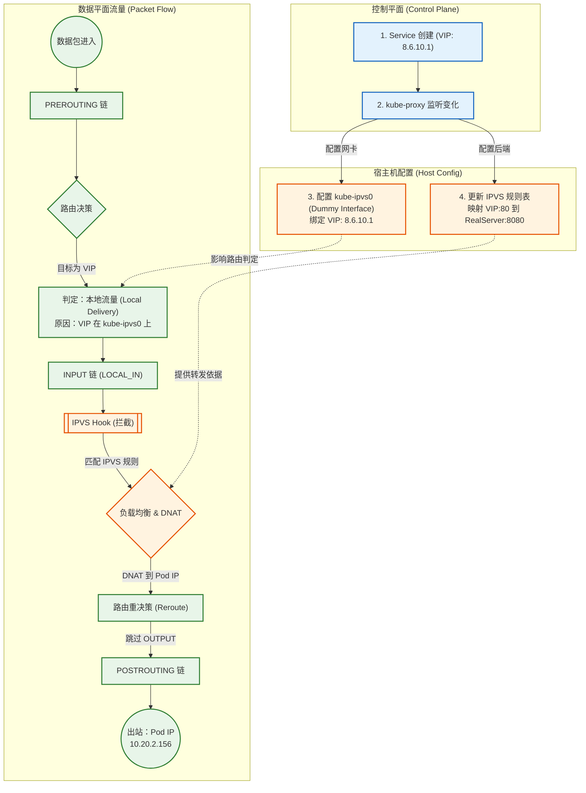
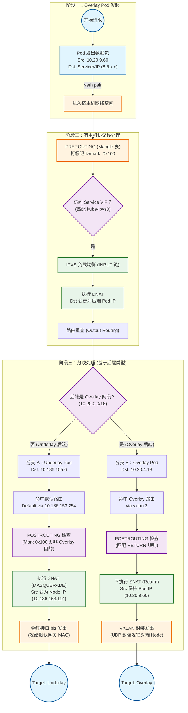

上篇介绍了一个[生产级 K8s 网络架构](../一个生产级k8s网络架构解析/)，其中详细介绍了 Underlay 和 Overlay 的实现方案。承接上文的架构，本文进一步介绍 Service 的实现方式以及 Underlay 和 Overlay 访问 Service 的原理。

<!--more-->

# Service 实现方式

早期 K8s Service 实现方式是通过 iptables 规则，kube-proxy 会在集群 Node 上为每个 Service 维护 iptables 规则。内核 Netfilter 拦截每个发往 Service 的数据包，进行 DNAT，把 Target IP 设置成后端 Pod IP。随着 Service 数量增多，iptables 的规则数量也会增加，最终会影响性能。有测试表明，当 Service 数量大于 1000 时，iptables 性能会低于 IPVS。

```bash
# iptables 实现的 service dnat 规则
iptables -t nat -L|grep -i dnat
DNAT       tcp  --  anywhere             anywhere             /* default/prometheus:prometheus */ tcp to:10.244.1.15:9090
DNAT       tcp  --  anywhere             anywhere             /* default/prometheus:prometheus */ tcp to:10.244.1.16:9090
DNAT       tcp  --  anywhere             anywhere             /* default/centos */ tcp to:10.244.2.34:80
```

当前主流的 K8s Service 的方案是使用 IPVS，其是内核的一部分，实现了 NAT 和负载均衡的功能。工作原理如下：

1. 当 Service 创建时，kube-proxy 会在 `kube-ipvs0` 这个 Dummy 接口上配置 Cluster IP（`8.6.10.1:80`），并配置 IPVS 虚拟服务器。
2. kube-proxy 会持续监听 Service 后端 Endpoint，并更新 IPVS 中对应的真实服务器（`10.20.2.156:8080`）。
3. 当访问 Cluster IP 的网络包进入主机网络协议栈时，由于 Cluster IP 配置在本地的 `kube-ipvs0` 接口上，根据 Local 路由表，流量会发往 INPUT 链。
4. IPVS 在 INPUT 链挂载了 Hook，拦截流量并进入 IPVS 模块。
5. IPVS 会根据 Cluster IP（`8.6.10.1:80`）和负载均衡算法在后端的真实服务器中选择一个（`10.20.2.156:8080`），并直接执行 DNAT。
6. 数据包会跳过 OUTPUT 链，重新路由决策后发送到 POSTROUTING 链，离开网络协议栈。

```bash
ipvsadm -Ln

IP Virtual Server version 1.2.1 (size=4096)
Prot LocalAddress:Port Scheduler Flags
  -> RemoteAddress:Port           Forward Weight ActiveConn InActConn
TCP  8.6.10.1:80 rr
  -> 10.20.2.156:8080             Masq    1      0          0
  -> 10.20.100.5:8080             Masq    1      0          0
TCP  10.186.152.109:31234 rr
  -> 10.20.2.156:8080             Masq    1      0          0
  -> 10.20.100.5:8080             Masq    1      0          0
UDP  8.6.0.10:53 rr
  -> 10.20.2.10:53                Masq    1      0          0
  -> 10.20.2.11:53                Masq    1      0          0

```



# Underlay 访问 Service

由于 Underlay 使用的是 IPvlan L2 模式，IPvlan 驱动会将网络包从子设备（Pod 中的网卡）移交到 Master 设备（`vlan.1155`）。当流量到达 `vlan.1155` 后，会进入宿主机内核网络协议栈（PREROUTING 链），此时匹配到如下规则，并打上 Mark `0x200`：

```bash
-A PREROUTING -s 10.186.155.0/27 -d 8.6.0.0/16 -i vlan.1155 -m comment --comment "send from ipvlan pod to service cidr" -j MARK --set-xmark 0x200/0x200
-A PREROUTING -s 10.186.156.0/27 -d 8.6.0.0/16 -i vlan.1156 -m comment --comment "send from ipvlan pod to service cidr" -j MARK --set-xmark 0x200/0x200
-A PREROUTING -s 10.186.157.0/27 -d 8.6.0.0/16 -i vlan.1157 -m comment --comment "send from ipvlan pod to service cidr" -j MARK --set-xmark 0x200/0x200
-A PREROUTING -s 10.186.155.128/27 -d 8.6.0.0/16 -i vlan.1155 -m comment --comment "send from ipvlan pod to service cidr" -j MARK --set-xmark 0x200/0x200
-A PREROUTING -s 10.186.158.0/27 -d 8.6.0.0/16 -i vlan.1158 -m comment --comment "send from ipvlan pod to service cidr" -j MARK --set-xmark 0x200/0x200
...
-A POSTROUTING -m comment --comment "send from ipvlan pod to service cidr" -m mark --mark 0x200/0x200 -j MASQUERADE
```

PREROUTING 链处理完成后会进行路由决策。由于所有的 Service Cluster IP 都被 kube-proxy 配置在 `kube-ipvs0` 这个 Dummy 接口上，匹配到 Local 路由表，进入 INPUT 链。如上文所述，IPVS 模块在 INPUT 链设置 Hook，拦截流量后进行 DNAT，把网络包的 Target IP 改成后端 Pod 的 IP，再次进入网络协议栈，执行路由决策。

如果后端是 Underlay Pod，由于本机没有相关路由，通过 `biz` 接口发送给默认网关（`default via 10.186.153.254 dev biz`）。由于之前打上了 Mark，此时会执行 POSTROUTING 的 `--mark 0x200/0x200 -j MASQUERADE` 规则，把 Src IP 改成 `biz` 网口的 IP。最后发出的包 `src: biz_ip` -> `target: underlay_ip`（`10.186.153.103` -> `10.186.155.6`），此时流量和 Node 节点直接访问 Underlay Pod 相同。

> 关键点：
>
> 1. 默认网关必须有到 `vlan 1155` 网关的路由信息，或者默认网关和 `vlan 1155` 网关是**同一台三层交换机**，否则无法访问。
> 2. **Hairpin**：如果 IPVS DNAT 后 Underlay Pod 在同 Node 上，也需要出 Node，经过网关再发送回来。
> 3. 物理网关需要配置为支持将流量“发回”同一个物理接口

如果后端是 Overlay Pod，根据路由规则（`10.20.0.0/25 via 10.20.0.0 dev vxlan.2 onlink`），会经过 FORWARD -> POSTROUTING 后发送到 `vxlan.2` 接口，经过封装重新进入网络协议栈（OUTPUT），同样在 POSTROUTING 链执行 SNAT。由于访问 Overlay 的流量会从 `ctl` 接口出（VXLAN 封装的 Node IP 是 `ctl` 网段），Src IP 会是 `ctl` IP。最后发出的网络包 `src: ctl_ip` -> `target: other ctl_ip`。此时流量和 Node 节点直接访问 Overlay Pod 相同。

回程流量会进入宿主机网络协议栈的 PREROUTING，此时 Conntrack 介入，根据五元组识别这是之前的连接，执行 De-SNAT 把 Target IP 改回 Underlay Pod 的 IP，再次进入路由决策，经过 FORWARD（状态为 ESTABLISHED，放行）和 POSTROUTING。在出协议栈前 Conntrack 会执行 De-DNAT，把 Src IP 改成 Service IP （`8.6.x.x`）。物理网关收到后，把数据包发回 Node 的 `biz` 接口，进入 `vlan.1155` 子接口时被 IPvlan 驱动拦截，被直接移进 Pod 命名空间。

```bash
-A KUBE-FORWARD -m comment --comment "kubernetes forwarding conntrack rule" -m conntrack --ctstate RELATED,ESTABLISHED -j ACCEPT
```

**完整的流程如下：**

```mermaid
graph TD
    %% 定义样式类
    classDef pod fill:#e1f5fe,stroke:#01579b,stroke-width:2px;
    classDef kernel fill:#fff9c4,stroke:#fbc02d,stroke-width:2px;
    classDef net fill:#e0f2f1,stroke:#00695c,stroke-width:2px;
    classDef decision fill:#f3e5f5,stroke:#7b1fa2,stroke-width:2px;

    %% --- 1. 发送端 Pod ---
    subgraph Pod_NS ["发送端 Pod 命名空间"]
        StartNode(("Pod 发起请求")):::pod
        IPvlan_Sub["IPvlan 子接口 (eth0)"]:::pod
    end

    %% --- 2. 宿主机内核处理 ---
    subgraph Host_Kernel ["宿主机内核协议栈"]
        %% L2 阶段
        IPVlan_Driver["IPvlan 驱动处理<br/>(旁路协议栈直达 Master)"]:::kernel
        Master_Dev["Master 设备<br/>(vlan.1155)"]:::kernel

        %% Netfilter & 标记
        Enter_Stack["进入内核协议栈<br/>(打上 VLAN Tag)"]:::kernel
        Mangle_Pre["PREROUTING (Mangle)<br/>匹配规则：打标记 0x200"]:::kernel

        %% 第一次路由与 IPVS
        Route_1{{"路由决策 1<br/>Dst == ClusterIP ?"}}:::decision
        Local_In["Local 路由表 -> INPUT 链"]:::kernel
        IPVS_Hook["IPVS 模块 (HOOK)<br/>执行 DNAT：Dst 改为 PodIP"]:::kernel

        %% 第二次路由与分支
        Route_2{{"路由决策 2<br/>根据后端 Pod IP 类型"}}:::decision

        %% 分支 A: Underlay 后端
        subgraph Branch_Underlay ["路径 A: 后端为 Underlay Pod"]
            Route_Def["匹配默认路由<br/>Via 10.186.153.254 dev biz"]:::kernel
            SNAT_Und["POSTROUTING<br/>匹配 0x200 -> Masquerade<br/>Src 改为 biz_ip"]:::kernel
            Out_Biz["出接口：biz (物理口)"]:::kernel
        end

        %% 分支 B: Overlay 后端
        subgraph Branch_Overlay ["路径 B: 后端为 Overlay Pod"]
            Route_Vxlan["匹配 Overlay 网段<br/>Via 10.20.0.0 dev vxlan.2"]:::kernel
            Switch_Dev["转发至 vxlan.2 接口"]:::kernel
            Encap_Vxlan["VXLAN 封装<br/>Outer Header"]:::kernel
            SNAT_Ovr["POSTROUTING<br/>SNAT (Masquerade)<br/>Src 改为 ctl_ip"]:::kernel
            Out_Ctl["出接口：ctl (物理口)"]:::kernel
        end
    end

    %% --- 3. 物理网络 ---
    subgraph Physical_Net ["物理网络基础设施"]
        Phy_Switch["物理交换机 / 网关"]:::net
        Hairpin_Logic["Hairpin (发卡) 逻辑<br/>同 Node 需路由回送"]:::net
    end

    %% 连线关系
    StartNode --> IPvlan_Sub
    IPvlan_Sub --> IPVlan_Driver
    IPVlan_Driver --> Master_Dev
    Master_Dev --> Enter_Stack
    Enter_Stack --> Mangle_Pre
    Mangle_Pre -->|流量打上 0x200| Route_1
    Route_1 -->|是 Service IP| Local_In
    Local_In --> IPVS_Hook
    IPVS_Hook -->|再次进入协议栈| Route_2

    %% 分支 A 连线
    Route_2 -->|无直连路由| Route_Def
    Route_Def --> SNAT_Und
    SNAT_Und --> Out_Biz
    Out_Biz --> Phy_Switch

    %% 分支 B 连线
    Route_2 -->|匹配 Overlay CIDR| Route_Vxlan
    Route_Vxlan --> Switch_Dev
    Switch_Dev --> Encap_Vxlan
    Encap_Vxlan --> SNAT_Ovr
    SNAT_Ovr --> Out_Ctl
    Out_Ctl --> Phy_Switch

    %% 物理层连线
    Phy_Switch --> Hairpin_Logic
    Hairpin_Logic -->|最终转发| EndNode(("目标后端 Pod")):::net

```



# Overlay 访问 Service

Overlay Pod 访问 Service，数据从 Veth Pair 到达宿主机网络空间，进入 PREROUTING 链，匹配规则（`-A PREROUTING -s 10.20.0.0/16 -m comment --comment "upcs vxlan mark" -j MARK --set-xmark 0x100/0x100`）打上 Mark，用于后续 SNAT。之后就和 Underlay 一样经过 IPVS DNAT 处理后再次路由决策。

如果后端是 Underlay Pod，会执行 SNAT，把 Target IP 设置为 `biz` 接口 IP（`10.186.153.103`），然后发送给默认网关。

如果后端是 Overlay Pod，不会执行 SNAT，会发往 `vxlan.2` 进行封装。

整体流程如下：



# Q&A

## Underlay Pod 访问 Underlay Pod 和 访问 Service (Underlay Endpoint) 的区别？

Underlay Pod 直接访问 Underlay Pod，因为都在同一个二层网络，不会经过宿主机的三层网络协议栈，也不会经过 Netfilter，直接转发给物理网关。

如果 Underlay 访问 Service，因为不是二层可达，会在 `vlan.1155` 进入三层网络协议栈，执行后面一系列 NAT，最后等同于宿主机直接访问后端 Pod。

## Ping Cluster IP 不通的原因

如果是传统 iptables 实现的 Service，由于没有 Cluster IP 的网络实体，Ping 是不通的。

如果是 IPVS，因为有 `kube-ipvs0` 这个网络实体，理论上是可以 Ping 通的，但是由于配置了 Netfilter 规则导致 Ping 不通。

在 INPUT 链中会执行 `KUBE-IPVS-FILTER`，其中白名单中的规则都是 IP+Port 类型，而 Ping 使用的 ICMP 协议没有 TCP/UDP 端口的概念，流量落入最后一条规则。因为 Service IP (`8.6.x.x`) 存在于 `KUBE-IPVS-IPS` (通常是 `hash:ip` 类型) 集合中，且 Ping 是新连接 (`NEW`)，所以防火墙直接执行 `REJECT`。

```bash
-A INPUT -m comment --comment "kubernetes ipvs access filter" -j KUBE-IPVS-FILTER

# 白名单
-A KUBE-IPVS-FILTER -m set --match-set KUBE-LOAD-BALANCER dst,dst -j RETURN
-A KUBE-IPVS-FILTER -m set --match-set KUBE-CLUSTER-IP dst,dst -j RETURN
-A KUBE-IPVS-FILTER -m set --match-set KUBE-EXTERNAL-IP dst,dst -j RETURN
-A KUBE-IPVS-FILTER -m set --match-set KUBE-EXTERNAL-IP-LOCAL dst,dst -j RETURN
-A KUBE-IPVS-FILTER -m set --match-set KUBE-HEALTH-CHECK-NODE-PORT dst -j RETURN

# 黑名单
-A KUBE-IPVS-FILTER -m conntrack --ctstate NEW -m set --match-set KUBE-IPVS-IPS dst -j REJECT --reject-with icmp-port-unreachable
```

`KUBE-IPVS-IPS`具体内容可通过`ipset list KUBE-IPVS-IPS`查看。
