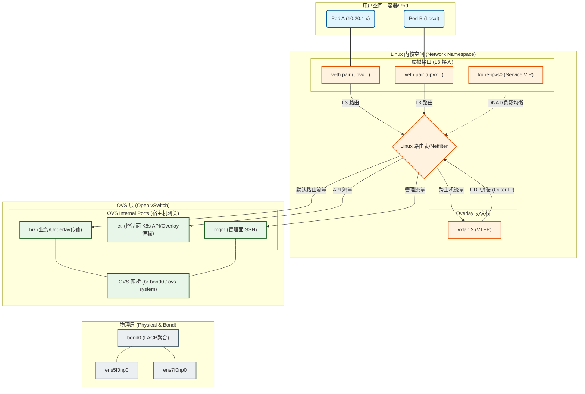
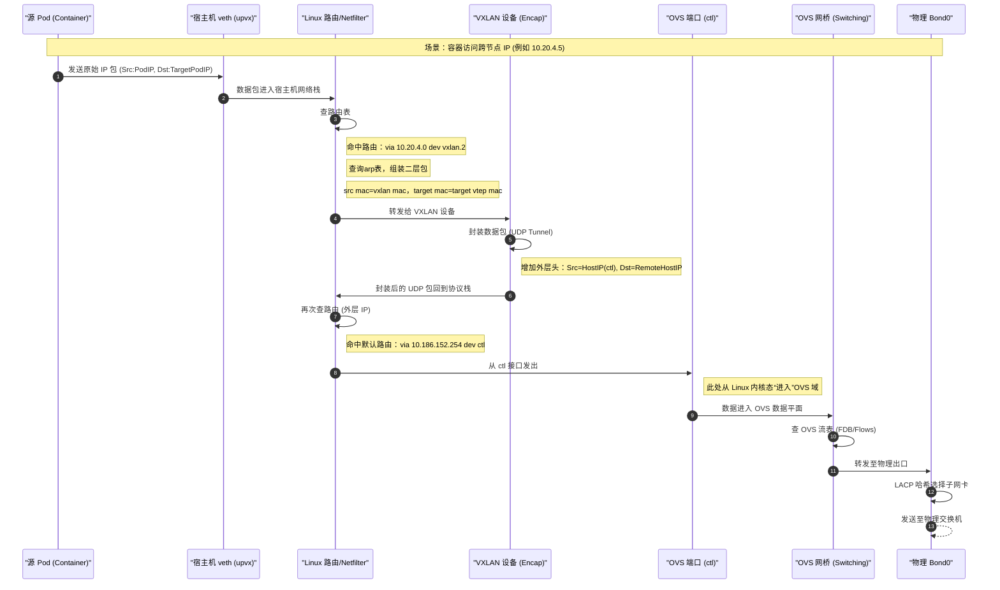
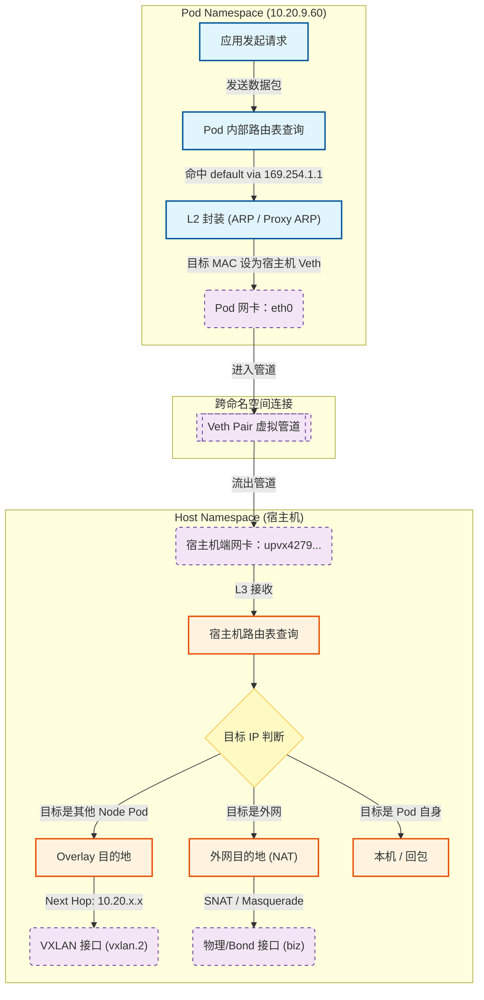
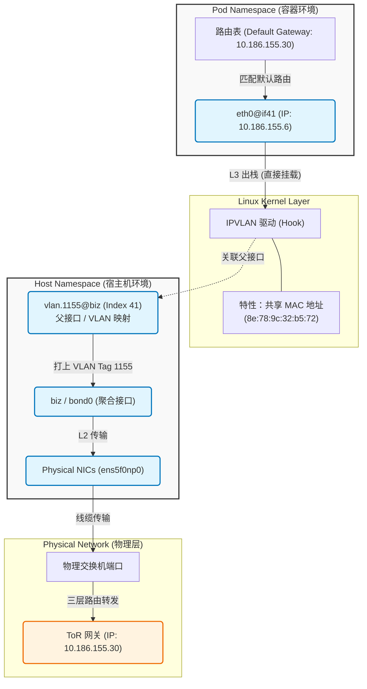
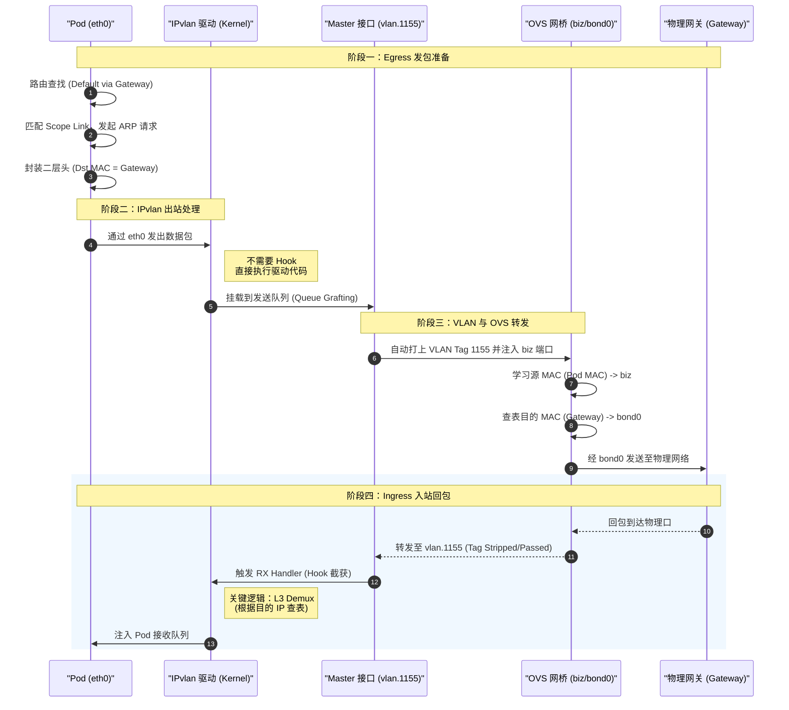

一个生产级的 K8s 网络架构既要考虑可靠性、性能和应用需求。本文以一个 VXLAN 的 Overlay + IPvlan 的 Underlay 网络架构为例，解析其架构和设计思路。
<!--more-->

# 背景介绍

K8s 网络架构要解决的是 Pod 这个虚拟网络实体的通讯问题。我们需要虚拟的 Pod 网络是因为 K8s 集群中的 Pod 是动态的，Pod 可被调度到集群中的任意节点上，为了确保 Pod 之间的通信不受物理网络拓扑的限制，Pod 的 IP 不能是物理 IP，因为物理 IP 受到物理网络拓扑的限制。解决方法是虚拟出来一个逻辑网络，Pod 在这个逻辑网络中可以自由通讯，不受物理网络的限制。
Overlay 和 Underlay 网络架构是从两个不同的思路来解决这个问题的。Overlay 的思路是通过把 Pod 之间的流量封装，封装后的流量可以在物理网络中传输，到达目标节点后再解封装。Underlay 的思路是不进行封装，通过路由配置让 Pod 流量可以直接在物理网络中传输，常见的就是 Calico 的 BGP 模式，还有本文将要介绍的 IPvlan L2 模式。
从上述介绍可以看出，Overlay 经过封装，会有性能损失，好处是不依赖物理网络设备的特性，物理网络就像在传输普通 Node 之间的流量一样。Underlay 的方案没有封装性能损失，但需要配置复杂的路由规则，或物理网络设备支持。
Overlay 和 Underlay 只实现了集群内 Pod 之间的通讯，如果 Pod 访问集群外，出向通常都没问题，入向必须在 Pod 出包时设置 SNAT。如果是集群外访问集群内的 Pod，因为集群网关没有 Pod 的路由信息，通常是无法访问。Overlay 由于 Pod IP 都是集群内部私有的虚拟 IP，所以外界无法访问 Pod。Underlay Pod IP 由于是集群内真实的 IP，如果网关有这些 IP 路由信息即可访问。

# 整体网络架构



这张图展示了一个典型的 VXLAN Overlay 网络架构。主要组件如下：

1. veth pair：Overlay Pod 和主机内核网络空间的连接接口，Pod 侧的 veth 接口分配 Pod IP 地址，主机侧的 veth 接口不分配 IP 地址。
2. kube-ipvs0：K8s 集群内 Service 的 VIP 接口，负责 Service 的负载均衡和 DNAT 功能。
3. vxlan.2：VXLAN 协议栈接口，负责 Pod 间流量的封装和解封装。
4. OVS 网桥：Open vSwitch 虚拟交换机，本文中是根据 MAC 地址进行转发，把 bond0 和三个内部网络接口连接在一起。
5. bond0：物理网卡聚合接口，负责物理网络的连接。
6. mgm、ctl、biz：分别负责管理面、控制面和业务面的流量隔离。
7. biz 分为多个 VLAN，用于隔离 Underlay 多个网段的流量，biz 为 Trunk 口，各个 biz.vlanid 为 Access 口。

> 从这个设计可以看出，对于 Underlay 网络的 Pod，即使是同主机互相访问，只要是处于不同 VLAN（网段不通），流量就需要出站到物理网络上的网关进行路由再回来。原因是 Node 在此架构中充当二层交换机角色（IPvlan L2），它无法处理跨 VLAN 路由，流量必须去往物理网关（三层核心交换机/路由器）进行路由再折返

# Overlay 网络设计

本文中的 Overlay 使用 VXLAN 方案。下文将重点介绍 Overlay 网络出站流程，明白了出站流程，入站就是出站的逆过程。

## Overlay Pod 出站流程分析

### Pod 网络命名空间 --> Node 网络命名空间

从 Pod 命名空间发出的包，和普通 Linux 内核处理数据包的流程一样，会先经过路由判断，因为 Pod IP 的子网掩码配置为 32，网段中没有别的 IP，所以必然会发送到默认网关，路由规则会给网关配置 `scope link`，如下所示：

```bash
# pod 内 route
default via 169.254.1.1 dev eth0 
169.254.1.1 dev eth0 scope link  # <--- 关键行

# pod ip
3: eth0@if91: <BROADCAST,MULTICAST,UP,LOWER_UP,M-DOWN> mtu 1450 qdisc noqueue 
    link/ether 3e:7c:ce:7d:a4:88 brd ff:ff:ff:ff:ff:ff
    inet 10.20.9.60/32 scope global eth0
       valid_lft forever preferred_lft forever
    inet6 fe80::3c7c:ceff:fe7d:a488/64 scope link 
       valid_lft forever preferred_lft forever
```

scope link 的作用是告诉内核，这个路由是直接连接的，不用管子网掩码。因为 Pod 和主机网络空间是通过 veth pair 连接的，veth pair 本质上是一个二层直连链路，所以需要配置 `scope link`。
反过来，Node 上配置的 Overlay veth 接口的路由规则也设置了 `scope link`，入站流量经过 VXLAN 解封装后通过路由直接发给 Pod 的 veth，如下所示：

```bash
10.20.9.41 dev upvx59cca7c21fa scope link 
10.20.9.60 dev upvx4279f78e5dc scope link 
10.20.9.72 dev upvx9e4d48a9851 scope link 
10.20.9.73 dev upvxa892bdffd39 scope link 
10.20.9.74 dev upvx7c566f2b768 scope link 
```

对于任何网络数据包，Linux 内核处理流程都是一样的，内核需要弄清楚两件事：1. 下一跳发往哪。2. 通过哪个网络接口发出。内核会先查路由表，根据子网掩码判断是否是同网段（二层可达），如果是同网段，下一跳就直接发给对方接口，所以会直接把 Target MAC 设置为目标 MAC 地址，然后根据路由的 dev 配置发往对应的接口。如果不是同网段，下一跳就丢给默认网关，内核会把 Target MAC 设置为网关 MAC 地址，然后发往网关对应的网络接口。过程中如果不知道下一跳的 MAC 地址，会通过 ARP 获取。

流量到达 Pod 内的 eth0@if91 网络接口，因为是 veth pair，流量会直接被发送到 Node 网络空间的 veth pair 另一端（vpvxxxx）。

### VXLAN 封装流程解析

到达 Node 网络命名空间后，根据 Node 路由信息，如果目标是其他 Node 的 Overlay Pod 的流量，会路由到 VXLAN 设备进行处理。如果需要访问的 Overlay Pod 就在本节点，路由规则会直接匹配到本节点的 Overlay veth 接口，流量不会经过 VXLAN 封装，直接发往本节点的 Overlay Pod。

Node 路由表如下所示：

```bash
# 其他 vtep 节点 overlay pod 路由
10.20.0.0/25 via 10.20.0.0 dev vxlan.2 onlink 
10.20.0.128/25 via 10.20.0.128 dev vxlan.2 onlink 
10.20.1.0/25 via 10.20.1.0 dev vxlan.2 onlink 
10.20.1.128/25 via 10.20.1.128 dev vxlan.2 onlink 
10.20.2.0/25 via 10.20.2.0 dev vxlan.2 onlink 
10.20.2.128/25 via 10.20.2.128 dev vxlan.2 onlink 
10.20.3.128/25 via 10.20.3.128 dev vxlan.2 onlink 
10.20.4.0/25 via 10.20.4.0 dev vxlan.2 onlink 
10.20.4.128/25 via 10.20.4.128 dev vxlan.2 onlink 
10.20.5.0/25 via 10.20.5.0 dev vxlan.2 onlink 
10.20.5.128/25 via 10.20.5.128 dev vxlan.2 onlink 
10.20.6.0/25 via 10.20.6.0 dev vxlan.2 onlink 
10.20.6.128/25 via 10.20.6.128 dev vxlan.2 onlink 
10.20.7.0/25 via 10.20.7.0 dev vxlan.2 onlink 
10.20.7.128/25 via 10.20.7.128 dev vxlan.2 onlink 
10.20.8.0/25 via 10.20.8.0 dev vxlan.2 onlink 

# 本节点 overlay pod 路由
10.20.9.41 dev upvx59cca7c21fa scope link 
10.20.9.60 dev upvx4279f78e5dc scope link 
10.20.9.72 dev upvx9e4d48a9851 scope link 
10.20.9.73 dev upvxa892bdffd39 scope link 
10.20.9.74 dev upvx7c566f2b768 scope link 
10.20.9.75 dev upvx2e08d01829e scope link 
10.20.9.101 dev upvx1cd518c52ac scope link 

# 本节点 vxlan interface
36: vxlan.2: <BROADCAST,MULTICAST,UP,LOWER_UP> mtu 1450 qdisc noqueue state UNKNOWN group default 
    link/ether 1a:71:2e:f8:db:6e brd ff:ff:ff:ff:ff:ff
    inet 10.20.9.0/32 scope global vxlan.2
       valid_lft forever preferred_lft forever
```

Node路由信息中配置了各个 Overlay 网段的 VTEP IP，本 Overlay 网络中，VTEP 就是各个节点上的 vxlan.2 网络接口。如 `10.20.7.0/25 via 10.20.7.0 dev vxlan.2 onlink` 这条路由规则，如果需要访问的对端 Overlay Pod IP 在 `10.20.7.0/25` 网段，对端的 VTEP IP 就是 `10.20.7.0`，通过本 Node 的 vxlan.2 接口发出。内核在把数据包发送到 vxlan.2 接口前，会根据对端的 VTEP IP，构建二层包头。其中 Target MAC 是根据下一跳的 VTEP IP，查询 ARP 表(`ip neigh show`)，对应的 MAC 地址，Src MAC 设置为 VXLAN 接口的 MAC 地址。vxlan.2 收到包后，需要在原始的二层包上封装 UDP 的三层包，首先会根据 Target MAC 地址，查询 VXLAN 的 FDB 表，查找到对端的 Node IP，外层 IP 头的 Src 是本节点 `ctl` 地址，Dst 对段 Node 的 `ctl` 地址。封装完成后，再次走根据路由，发往 `ctl` 接口进入 OVS 进行转发。

```bash
# node 节点 ctl 路由规则
10.186.152.0/24 dev ctl proto kernel scope link src 10.186.152.114
```

**上述过程网络包头结构处理流程如下：**

1. **Pod NS 中的原始包**

```plain
+---------------------------------------------------------------+
|                        IP Header (L3)                         |
+-----------------------+-----------------------+---------------+
| Src IP: 10.20.9.60    | Dst IP: 10.20.6.10    | Payload (TCP) |
+-----------------------+-----------------------+---------------+
```

1. **宿主机内核根据路由和 ARP 表，构建二层包**

```plain
 构建好的二层帧 (Inner Frame)
+=================================================================================+
|                              Ethernet Header (L2)                               |
+---------------------------+---------------------------+-------------------------+
| Dst MAC (Target MAC)      | Src MAC (VXLAN MAC)       | EtherType               |
| 66:66:66:66:66:66         | aa:aa:aa:aa:aa:aa         | 0x0800 (IPv4)           |
+---------------------------+---------------------------+-------------------------+
|                                                                                 |
|       +---------------------------------------------------------------+         |
|       |                        IP Header (L3)(Pod原始包)               |         |
|       +-----------------------+-----------------------+---------------+         |
|       | Src IP: 10.20.9.60    | Dst IP: 10.20.6.10    | Payload       |         |
|       +-----------------------+-----------------------+---------------+         |
|                                                                                 |
+=================================================================================+
```

1. **VXLAN 查询 FDB，封装后的三层包**

```plain
 VXLAN 封装后的完整报文
+=======================================================================================================================+
|                                              Outer IP Header (Underlay L3)                                            |
+-----------------------------------+-----------------------------------+-----------------------+-----------------------+
| Src IP: 10.186.152.114 (本机 ctl) | Dst IP: 192.168.152.101 (对端 Node) | Protocol: 17 (UDP)    | ...                   |
+-----------------------------------+-----------------------------------+-----------------------+-----------------------+
|                                                                                                                       |
|   +---------------------------------------+                                                                           |
|   |         UDP Header (L4)               |                                                                           |
|   +-------------------+-------------------+                                                                           |
|   | Src Port: Random  | Dst Port: 4789    |                                                                           |
|   +-------------------+-------------------+                                                                           |
|                                                                                                                       |
|       +---------------------------------------+                                                                       |
|       |           VXLAN Header                |                                                                       |
|       +-------------------+-------------------+                                                                       |
|       | Flags: 0x08       | VNI: 2            |                                                                       |
|       +-------------------+-------------------+                                                                       |
|                                                                                                                       |
|           +---------------------------------------------------------------------------------+                         |
|           |                          Inner Ethernet Frame (L2)(Node封装的原始二层包)           |                         |
|           +---------------------------+---------------------------+-------------------------+                         |
|           | Dst MAC (VTEP)            | Src MAC (VXLAN)           | Payload (Original IP)   |                         |
|           | 66:66:66:66:66:66         | aa:aa:aa:aa:aa:aa         | Src: 10.20.9.60 ...     |                         |
|           +---------------------------+---------------------------+-------------------------+                         |
|                                                                                                                       |
+=======================================================================================================================+
```

**FDB 和 ARP 表内容示例**

```bash
bridge fdb show dev vxlan.2
# target vtep mac -> target vtep ip 
xx:xx:xx:xx:xx:xx dst 10.186.152.107 self permanent
xx:xx:xx:xx:xx:xx dst 10.186.152.101 self permanent
xx:xx:xx:xx:xx:xx dst 10.186.152.111 self permanent
xx:xx:xx:xx:xx:xx dst 10.186.152.103 self permanent
...

ip -4 neigh show
# ip -> mac
10.20.5.128 dev vxlan.2 lladdr xx:xx:xx:xx:xx:xx PERMANENT
...

```

Overlay 的流量关键过程是 VXLAN 封装，其中涉及到路由表、ARP 表和 VXLAN 的 FDB 表的查询，总结如下：

| 阶段        | 查表名称   | 命令示例     | 输入 Key                     | 输出 Value                         | 作用                                        |
| ----------- | ---------- | ------------ | ---------------------------- | ---------------------------------- | ------------------------------------------- |
| **L3 路由** | 系统路由表 | `ip route`   | 目标 Pod IP (`10.20.6.10`)   | **下一跳 VTEP IP** (`10.20.6.0`)   | 确定走哪个虚拟接口 (`vxlan.2`) 和逻辑网关。 |
| **L2 解析** | ARP/邻居表 | `ip neigh`   | 下一跳 VTEP IP (`10.20.6.0`) | **对端 VTEP MAC** (`66:66:...`)    | 为内层数据帧填充目标 MAC 地址。             |
| **转发表**  | FDB 表     | `bridge fdb` | 对端 VTEP MAC (`66:66:...`)  | **对端 Node IP** (`192.168.1.200`) | 为外层 VXLAN 报文填充目标物理 IP。          |

### 出站完整流程



### SNAT 和 Conntrack

Overlay Pod 访问集群外网络，出去的流量不会经过 VXLAN 封装，路径和物理节点访问外网一样。唯一的问题是 Src IP 是 Overlay 的 IP，集群外没有这个 IP 的路由信息。为了解决这个问题，会对 Overlay Pod 访问非 Overlay 网段的流量做 SNAT，通常是 Masquerade，把 Src IP 改为节点的物理 IP。这样集群外的主机就能正确回复流量回到节点，节点再根据 Conntrack 表把流量转发回 Pod。
大致流程如下：

1. Overlay Pod 发送的流量到达节点内核网络空间，查询路由信息后获取下一跳的 IP 地址（不会经过 VXLAN）。
2. iptables 捕获包，根据规则判断包的 Src IP 是 Overlay 网段，目的 IP 不是 Overlay 网段，执行 SNAT，把 Src IP 改为节点物理 IP。
3. Conntrack 会记录这个连接的原始 Src IP 和 SNAT 后的 Src IP 映射关系，等到回复包回来时，根据这个映射关系把流量转发回 Pod。

```bash
# 在 *mangle 表中，来自 10.20.0.0/16（Overlay 网段）的报文被打上 0x100 标记
-A PREROUTING -s 10.20.0.0/16 ... -j MARK --set-xmark 0x100/0x100

# 在 *nat 表中，带有 0x100 标记的报文进入 UPCS-MASQUERADE 链处理
-A POSTROUTING -m mark --mark 0x100/0x100 -j UPCS-MASQUERADE 

# 如果目标ip是overlay网段，直接返回，不做snat，否则执行masquerade
# masquerade是一种动态 SNAT，它将数据包的源 IP (Pod IP) 修改为宿主机出口网卡的 IP 地址。
-A UPCS-MASQUERADE -d 10.20.0.0/16 ... -j RETURN
-A UPCS-MASQUERADE -j MASQUERADE
```

### 整体流程图



# Underlay 网络设计

## Underlay Pod 出站流程分析

### Pod 网络命名空间 --> Node 网络命名空间 --> biz 接口

**Pod 内网络协议栈：**

1. Pod 内部路由网关指向物理网关（10.186.155.30）。
2. Pod 内网络栈匹配到路由 `scope link`，意味着网关在二层直连网络上，发起 ARP 请求获取网关 MAC。
3. 封装好二层包头（Dst MAC=Gateway）后，通过 eth0 发出。

> eth0@if41 是 IPvlan 子设备，Pod 内网络协议栈会根据路由信息把所有流量都通过 eth0@if41发出

```bash
# underlay pod 容器内接口信息
2: eth0@if41: <BROADCAST,MULTICAST,UP,LOWER_UP,M-DOWN> mtu 1500 qdisc noqueue 
    link/ether 8e:78:9c:32:b5:72 brd ff:ff:ff:ff:ff:ff
    inet 10.186.155.6/27 brd 10.186.155.31 scope global eth0
# 路由信息
default via 10.186.155.30 dev eth0 
10.186.155.0/27 dev eth0 scope link  src 10.186.155.6 
```

**IPvlan + VLAN：**

1. eth0 作为 IPvlan 的子接口，其本身的核心操作函数被注册为 IPvlan 的驱动函数，所有发往 eth0 的流量都会被 IPvlan 驱动捕获。
2. IPvlan 驱动捕获该流量，直接将其挂载到 Master 接口 vlan.1155 的发送队列。
3. 由于 vlan.1155 是 biz 的 VLAN 子接口，Linux 内核在发包时会自动打上 VLAN Tag 1155，发送给 VLAN Master 接口（biz）。

> 出站时，IPvlan 无需对数据包做改动，直接把数据包从 Pod 命名空间递送给 Node 命名空间的 IPvlan Master 接口（vlan.1155)

```bash
# node节点 vlan 接口信息
39: vlan.1156@biz: <BROADCAST,MULTICAST,UP,LOWER_UP> mtu 1500 qdisc noqueue state UP group default qlen 1000
    link/ether 8e:78:9c:32:b5:72 brd ff:ff:ff:ff:ff:ff
40: vlan.1157@biz: <BROADCAST,MULTICAST,UP,LOWER_UP> mtu 1500 qdisc noqueue state UP group default qlen 1000
    link/ether 8e:78:9c:32:b5:72 brd ff:ff:ff:ff:ff:ff
41: vlan.1155@biz: <BROADCAST,MULTICAST,UP,LOWER_UP> mtu 1500 qdisc noqueue state UP group default qlen 1000
    link/ether 8e:78:9c:32:b5:72 brd ff:ff:ff:ff:ff:ff
98: vlan.1158@biz: <BROADCAST,MULTICAST,UP,LOWER_UP> mtu 1500 qdisc noqueue state UP group default qlen 1000
    link/ether 8e:78:9c:32:b5:72 brd ff:ff:ff:ff:ff:ff

```

**数据包结构示例：**

Pod 命名空间内，网络协议栈通过 ARP 获取物理网关的 MAC 地址，封装二层包头：

```plain
[ 原始二层以太网帧 (Untagged) ]
+---------------------+---------------------+-----------+-------------------------+
| Dst MAC             | Src MAC             | EtherType | L3 IP Header            |
| (Gateway MAC)       | (Shared Parent MAC) | IPv4      | Src: 10.186.155.6       |
| aa:bb:cc:dd:ee:ff   | 30:b9:30:3d:84:8d   | 0x0800    | Dst: 8.8.8.8            |
+---------------------+---------------------+-----------+-------------------------+
```

vlan.1155 打上 VLAN Tag 后：

```plain
[ 插入 VLAN Tag 的帧 (Tagged) ]
+---------------------+---------------------+===========+-----------+-------------+
| Dst MAC             | Src MAC             | 802.1Q    | EtherType | L3 IP Header|
| (Gateway MAC)       | (Shared Parent MAC) | VLAN ID   | IPv4      | (不变)      |
| aa:bb:cc:dd:ee:ff   | 30:b9:30:3d:84:8d   | 1155      | 0x0800    |             |
+---------------------+---------------------+===========+-----------+-------------+
                                                 ^
                                                 |
                                         Linux 内核自动插入
```

### OVS --> 物理网关

1. 已经被标记 VLAN Tag 的流量进入 OVS 的 biz 端口。
2. OVS 依据标准二层交换逻辑处理网络包：

     * 学习 Source MAC（Pod MAC）与 biz 端口的映射。
     * 查找 Destination MAC（Gateway MAC）。若表中存在（指向 bond0），则单播转发；若不存在，则泛洪。
3. 最终流量经由 bond0 上联物理网口发出。

> 数据包头在 OVS 中没有变化，OVS 中只转发

### Pod 的入站流程分析

1. 回包到达 vlan.1155（Master 设备）。

2. IPvlan 驱动作为 Master 设备上的 Hook 截获流量。

3. 读取网络包的三层头信息，获取 Target IP，查询内部是否有子接口匹配。

4. IPvlan 直接将包注入对应 Pod 的接收队列，完成 L3 到 L2 的分发。

**IPvlan 内部的映射关系示意图：**

| Key (Dst IP)    | Value (Target Device)     |
| --------------- | ------------------------- |
| `10.186.155.6`  | -> Pod A Namespace / eth0 |
| `10.186.155.32` | -> Pod B Namespace / eth0 |
| `10.186.155.33` | -> Pod C Namespace / eth0 |
| (No Match)      | -> Host (vlan.1155)       |

**数据包结构示例：**
vlan.1155 接收到回包，剥离 VLAN Tag 后，IPvlan 驱动捕获到这个包进行 L3 分流：

```plain
[ 入站的 VLAN 帧 ]
+---------------------+---------------------+===========+-----------+-------------------------+
| Dst MAC             | Src MAC             | 802.1Q    | EtherType | L3 IP Header            |
| (Shared Parent MAC) | (Gateway MAC)       | VLAN ID   | IPv4      | Src: 8.8.8.8            |
| 30:b9:30:3d:84:8d   | aa:bb:cc:dd:ee:ff   | 1155      | 0x0800    | Dst: 10.186.155.6 (Pod) |
+---------------------+---------------------+===========+-----------+-------------------------+


[ Hook 处理中的状态 (逻辑视角) ]
                                         (查看此处 IP 进行分流)
                                                  |
                                                  v
+---------------------+---------------------+-----------+-------------------------+
| Dst MAC             | Src MAC             | EtherType | L3 IP Header            |
| ...                 | ...                 | 0x0800    | Dst: 10.186.155.6       |
+---------------------+---------------------+-----------+-------------------------+


[ Pod 内收到的最终标准帧 (Untagged) ]
+---------------------+---------------------+-----------+-------------------------+
| Dst MAC             | Src MAC             | EtherType | L3 IP Header            |
| (Shared Parent MAC) | (Gateway MAC)       | IPv4      | Src: 8.8.8.8            |
| 30:b9:30:3d:84:8d   | aa:bb:cc:dd:ee:ff   | 0x0800    | Dst: 10.186.155.6       |
+---------------------+---------------------+-----------+-------------------------+
```

**整体流程如下：**



## 出站和入站时序图

出站：



## 网络层面的二层架构

使用 IPvlan L2 模式，配合 vlan 和 OVS，实现了一个扁平化的大二层 Underlay 网络。其中 Node 节点本身担任交换机角色，作用是把调度到本 Node 上的 Pod 接入这个多 vlan 的二层网络。从网络层面看，此 Underlay 网络如下图所示：

```mermaid
flowchart TB
  %% --- 样式定义 ---
  classDef phySwitch fill:#cfd8dc,stroke:#37474f,stroke-width:3px,color:#000;
  classDef nodeBox fill:#eceff1,stroke:#607d8b,stroke-width:2px,stroke-dasharray: 0;
  classDef nicLayer fill:#b0bec5,stroke:#455a64,stroke-width:2px,color:#000;
  classDef podNode fill:#fff,stroke:#333,stroke-width:1px;
  
  %% VLAN 颜色定义 (用于区分 VLAN 域)
  classDef vlan1155 fill:#e3f2fd,stroke:#1565c0,stroke-dasharray: 5 5;
  classDef vlan1156 fill:#fff3e0,stroke:#ef6c00,stroke-dasharray: 5 5;
  classDef vlan1157 fill:#e8f5e9,stroke:#2e7d32,stroke-dasharray: 5 5;
  classDef vlan1158 fill:#f3e5f5,stroke:#7b1fa2,stroke-dasharray: 5 5;

  %% --- 顶层物理设备 ---
  CoreSwitch["Gateway / Physical Switch<br/>(Core)"]:::phySwitch

  %% --- Node 1 ---
  subgraph Node1 ["k8s-node-01"]
    direction TB
    N1_NIC["Node1 Adapter<br/>(IPVlan Master / Trunk)"]:::nicLayer
    
    %% Node1 内部的 VLAN 划分
    subgraph N1_V1155 ["VLAN 1155 (Subnet .155.x)"]
      N1_P1(Pod A1):::podNode
      N1_P2(Pod A2):::podNode
    end
    subgraph N1_V1156 ["VLAN 1156 (Subnet .156.x)"]
      N1_P3(Pod B1):::podNode
    end
    subgraph N1_V1157 ["VLAN 1157 (Subnet .157.x)"]
      N1_P4(Pod C1):::podNode
    end
    subgraph N1_V1158 ["VLAN 1158 (Subnet .158.x)"]
      N1_P5(Pod D1):::podNode
    end
    
    %% 连接关系
    N1_NIC ==> N1_V1155 & N1_V1156 & N1_V1157 & N1_V1158
  end

  %% --- Node 2 ---
  subgraph Node2 ["k8s-node-02"]
    direction TB
    N2_NIC["Node2 Adapter<br/>(IPVlan Master / Trunk)"]:::nicLayer
    
    subgraph N2_V1155 ["VLAN 1155"]
      N2_P1(Pod A3):::podNode
    end
    subgraph N2_V1156 ["VLAN 1156"]
      N2_P3(Pod B2):::podNode
      N2_P4(Pod B3):::podNode
    end
    subgraph N2_V1157 ["VLAN 1157"]
       N2_P5(Pod C2):::podNode
    end
    subgraph N2_V1158 ["VLAN 1158"]
       N2_P6(Pod D2):::podNode
    end

    N2_NIC ==> N2_V1155 & N2_V1156 & N2_V1157 & N2_V1158
  end

  %% --- Node 3 ---
  subgraph Node3 ["k8s-node-03"]
    direction TB
    N3_NIC["Node3 Adapter<br/>(IPVlan Master / Trunk)"]:::nicLayer

    subgraph N3_V1155 ["VLAN 1155"]
       N3_P1(Pod A4):::podNode
    end
    subgraph N3_V1156 ["VLAN 1156"]
       N3_P2(Pod B4):::podNode
    end
    subgraph N3_V1157 ["VLAN 1157"]
       N3_P3(Pod C3):::podNode
       N3_P4(Pod C4):::podNode
    end
    subgraph N3_V1158 ["VLAN 1158"]
       N3_P5(Pod D3):::podNode
    end

    N3_NIC ==> N3_V1155 & N3_V1156 & N3_V1157 & N3_V1158
  end
  
  %% --- 物理链路 (Trunk) ---
  CoreSwitch <== Trunk ==> N1_NIC & N2_NIC & N3_NIC

  %% 应用样式到 Subgraph (VLAN)
  class N1_V1155,N2_V1155,N3_V1155 vlan1155;
  class N1_V1156,N2_V1156,N3_V1156 vlan1156;
  class N1_V1157,N2_V1157,N3_V1157 vlan1157;
  class N1_V1158,N2_V1158,N3_V1158 vlan1158;
  class Node1,Node2,Node3 nodeBox;
```



# Overlay 和 Underlay 的互通分析

## Overlay --> Underlay

Overlay Pod 访问 Underlay Pod，由于 Underlay Pod 的 IP 网段是 10.186.15(5|6|7|8)，Node 节点没有对应的路由规则，所以会发往默认网关，如果默认网关有去 10.186.15(5|6|7|8) 的路由规则，则去向可以通，如果没有路由规则，则无法访问。

```bash
# node 节点默认网关路由
default via 10.186.153.254 dev biz 
```

至于回程流量，因为 Overlay Pod 访问非 Overlay 网络都会 SNAT，所以可以通。

## Underlay --> Overlay

由于本文介绍的 Underlay 是一个用 IPvlan 实现的大二层方案，物理网关一定没有 Overlay 的路由信息，所以 Underlay 访问 Overlay 一定不通。

# Q&A

Q：IPvlan 的作用是什么，为什么要用 IPvlan 实现 Underlay 网络？

A：本文介绍的方案中，IPvlan 的作用是让 Node 上的多个 Pod 可以共享同一个 MAC 地址，同时能有自己的 IP。好处是不需要在 Node 上设置多个虚拟网络接口，如果不用 IPvlan，每个 Pod 都需要在 Node 上配置一个虚拟网路接口。

---

Q：Linux 中网络接口的本质是什么？

A：Linux 中，网络接口本质是内核网络协议栈的入口，有着自己的网络元数据。

---

Q：IPvlan 和 BGP 比，优势和劣势是什么？

A：

IPvlan 优点：

1. 直接的优势是性能。BGP 模式，Node 节点相当于一个路由器，而使用 IPvlan，Node 节点相当于一个交换机，相当于绕过了 Node 的三层网络栈，主要是 iptables/Netfilter（尤其是 NAT 表）。
2. BGP 模式会在宿主机上为每个 Pod 创建 veth pair，宿主机的网络接口会很多，而 IPvlan 直接把流量从 Pod 命名空间搬运到宿主机命名空间，网络接口列表干净
3. IPvlan 共享同一个 Node MAC，交换机的 MAC 表干净。

IPvlan 劣势：

1. 需要在物理交换机上划分 VLAN 网段。
2. Node 和本 Node 上的 Pod 访问需要绕到网关。
3. 由于绕过 iptables/Netfilter，kube-proxy 的流量劫持失效，需要另外配置。
4. 排障困难，不如 BGP 模式的路由规则直观。
