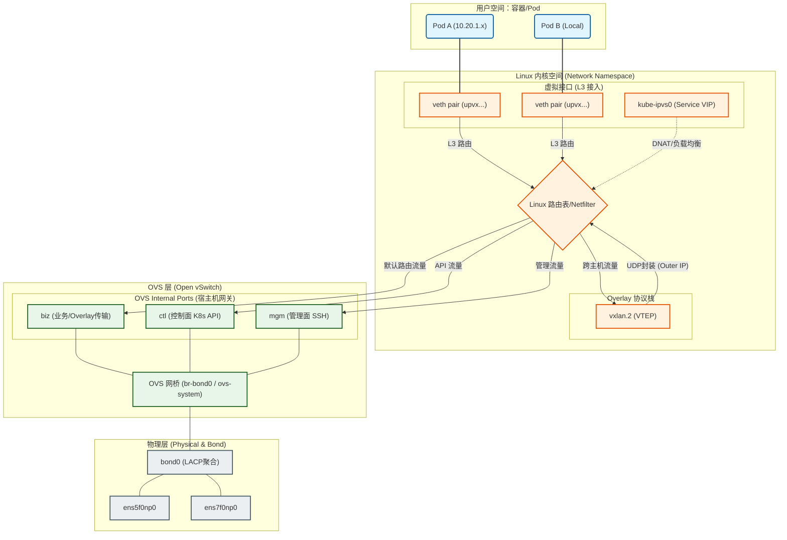

一个生产级的 k8s 网络架构既要同时考虑可靠性、性能和应用需求。本文以一个 vxlan 的 underlay + ipvlan 的 overlay 网络架构为例，解析其架构和设计思路。
<!--more-->

# 背景介绍

k8s 网络架构要解决的是 pod 这个虚拟网络实体的通讯问题。之所以需要虚拟pod的网络，是因为k8s集群中的pod是动态创建和销毁的，且pod可被调度到集群中的任意节点上运行，为了确保pod之间的通信不受物理网络拓扑的限制，pod的ip不能是物理ip，因为物理ip受到物理网络拓扑的限制。解决方法是虚拟出来一个逻辑网络，pod在这个逻辑网络中可以自由通讯，不受物理网络的限制。
overlay和underlay网络架构是从两个不同的思路来解决这个问题的。overlay的思路是通过把pod之间的流量封装，封装后的流量可以在物理网络中传输，到达目标节点后再解封装。underlay的思路是不进行封装，通过路由配置让pod流量可以直接在物理网络中传输，常见的就是calico的bgp模式，还有本文将要介绍的ipvlan L2模式。
从上述介绍可以看出，overlay经过封装，会有性能损失，好处是不依赖物理网络设备的特性，物理网络就像在传输普通node之间的流量一样。underlay的方案没有封装性能损失，但需要配置复杂的路由规则。
overlay和underlay只实现了集群内pod之间的通讯，如果pod访问集群外，出向通常都没问题，入向必须在pod出包时设置snat。如果是集群外访问集群内的pod，因为集群网关没有pod的路由信息，通常是无法访问。overlay由于pod ip都是集群内部私有的虚拟 ip，所以外界无法访问pod。underlay pod ip由于是集群内真实的ip，如果网关有这些ip路由信息即可访问。

# Overlay 网络设计

overlay使用vxlan模式，架构如下：

这张图展示了一个典型的 vxlan overlay 网络架构。我们逐一分析各个组件：
**pod网络空间**

1.

**node网络空间**
2.

# Underlay 网络设计

# 和集群外网络的互通
