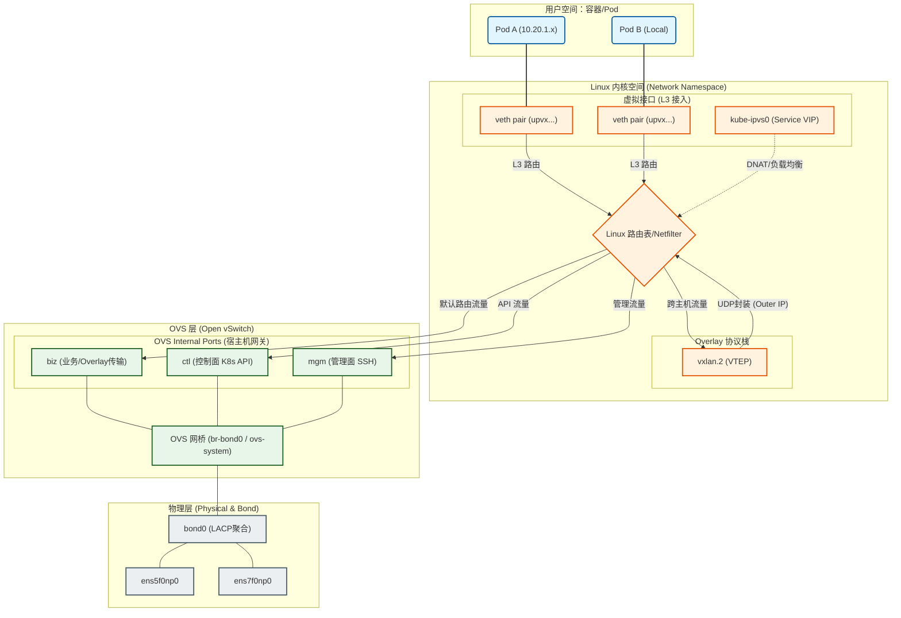
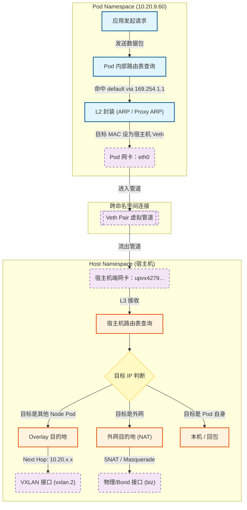
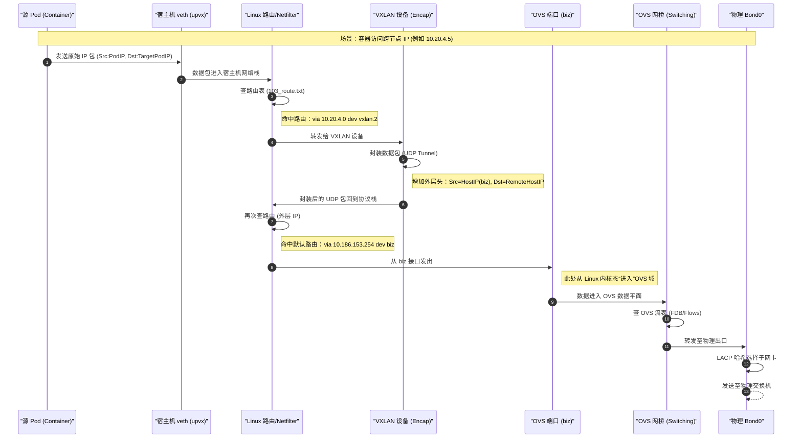

一个生产级的 k8s 网络架构既要同时考虑可靠性、性能和应用需求。本文以一个 vxlan 的 underlay + ipvlan 的 overlay 网络架构为例，解析其架构和设计思路。
<!--more-->

# 背景介绍

k8s 网络架构要解决的是 pod 这个虚拟网络实体的通讯问题。之所以需要虚拟pod的网络，是因为k8s集群中的pod是动态创建和销毁的，且pod可被调度到集群中的任意节点上运行，为了确保pod之间的通信不受物理网络拓扑的限制，pod的ip不能是物理ip，因为物理ip受到物理网络拓扑的限制。解决方法是虚拟出来一个逻辑网络，pod在这个逻辑网络中可以自由通讯，不受物理网络的限制。
overlay和underlay网络架构是从两个不同的思路来解决这个问题的。overlay的思路是通过把pod之间的流量封装，封装后的流量可以在物理网络中传输，到达目标节点后再解封装。underlay的思路是不进行封装，通过路由配置让pod流量可以直接在物理网络中传输，常见的就是calico的bgp模式，还有本文将要介绍的ipvlan L2模式。
从上述介绍可以看出，overlay经过封装，会有性能损失，好处是不依赖物理网络设备的特性，物理网络就像在传输普通node之间的流量一样。underlay的方案没有封装性能损失，但需要配置复杂的路由规则。
overlay和underlay只实现了集群内pod之间的通讯，如果pod访问集群外，出向通常都没问题，入向必须在pod出包时设置snat。如果是集群外访问集群内的pod，因为集群网关没有pod的路由信息，通常是无法访问。overlay由于pod ip都是集群内部私有的虚拟 ip，所以外界无法访问pod。underlay pod ip由于是集群内真实的ip，如果网关有这些ip路由信息即可访问。

# 整体网络架构



这张图展示了一个典型的 vxlan overlay 网络架构。主要组件如下：

1. veth pair：overlay pod和主机内核网络空间的连接接口，pod侧的veth接口分配pod ip地址，主机侧的veth接口不分配ip地址。
2. kube-ipvs0：k8s集群内service的vip接口，负责service的负载均衡和dnat功能。
3. vxlan.2：vxlan协议栈接口，负责pod间流量的封装和解封装。
4. OVS网桥：open vswitch虚拟交换机，本文中是根据mac地址进行转发，把bond0和三个内部网络接口连接在一起。
5. bond0：物理网卡聚合接口，负责物理网络的连接。
6. mgm、ctl、biz：分别负责管理面、控制面和业务面的流量隔离。
7. biz分为多个vlan，用于隔离underlay多个网段的流量，biz为trunk口，各个biz.vlanid为access口。

> 从这个设计可以看出，就算是同主机的pod互相访问，只要是网段不通，都会走网关，所以流量会出站到物理网络再回来。在本机路由表没有打通 Overlay 和 Underlay 网段的情况下，这种跨平面的流量会冲向物理网关。

# Overlay 网络设计

本overlay使用vxlan方案，另外，为了overlay pod 可以访问外界非overlay网络，需要配合SNAT + conntrack实现。下文将分析 overlay pod 出站和入站的流量流程。

## overlay pod 出站流程分析

**pod网络空间到主机网络空间**
从pod命名空间发出的包，同样会先经过路由判断，因为pod ip的子网掩码配置为32，所以必然会发送到网关，路由规则会给网关配置scope link，如下所示：

```bash
# pod 内 route
default via 169.254.1.1 dev eth0 
169.254.1.1 dev eth0 scope link  # <--- 关键行

# pod ip
3: eth0@if91: <BROADCAST,MULTICAST,UP,LOWER_UP,M-DOWN> mtu 1450 qdisc noqueue 
    link/ether 3e:7c:ce:7d:a4:88 brd ff:ff:ff:ff:ff:ff
    inet 10.20.9.60/32 scope global eth0
       valid_lft forever preferred_lft forever
    inet6 fe80::3c7c:ceff:fe7d:a488/64 scope link 
       valid_lft forever preferred_lft forever
```

scope link的作用是告诉内核，这个路由是直接连接的，不需要经过arp解析，不用管子网掩码。因为pod和主机网络空间是通过veth pair连接的，veth pair本质上是一个二层直连链路，arp解析没有意义，所以需要配置scope link。
反过来，node上配置的overlay veth 接口的路由规则也设置了scope link，流量经过vxlan解封装后通过路由直接发给pod的veth，如下所示：

```bash
10.20.9.41 dev upvx59cca7c21fa scope link 
10.20.9.60 dev upvx4279f78e5dc scope link 
10.20.9.72 dev upvx9e4d48a9851 scope link 
10.20.9.73 dev upvxa892bdffd39 scope link 
10.20.9.74 dev upvx7c566f2b768 scope link 
```

完成的流程图如下所示：



overlay pod -> overlay pod 出站流程如下图：



1. -> vxlan: pod 通过 veth pair 出来的流量根据路由规则，如果是访问其他overlay的pod，会发往 vxlan 设备进行封装。
2. vxlan -> biz: 封装后的流量根据路由规则发往 biz 接口，进入 OVS 网桥进行转发。
3. biz -> bond0: OVS 网桥根据流表把流量发往物理网卡。


# Underlay 网络设计

# 和集群外网络的互通
