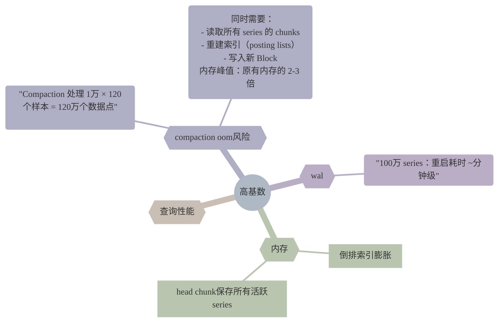

最近在实践中发现有一个prometheus agent实例经常被oom kill，容器设置的memory.limit 为 2GB。agent模式只转发指标，不会提供任何查询与持久化的功能，理论上对内存的需求并不高，但是指标基数过高还是会导致内存占用上升。本文将分析高基数指标对 Prometheus 的影响，其中涉及 TSDB 在内存中的形态，探究 agent 模式内存高的原因。

<!--more-->

# 内存占用

# 查询压力

# 

